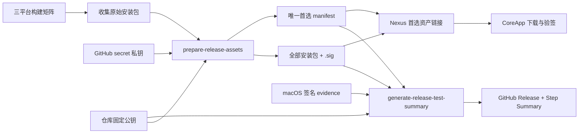

# 技术设计：发布阻断与自动报告

## 1. 边界

本任务只改动发布构建、资产准备、发布完整性验证、Nexus 发布元数据和固定公钥读取。业务运行时、更新协议字段名和既有用户下载 URL 语义保持不变。

## 2. 发布数据流

### 2.1 `scripts/prepare-release-assets.mjs`

职责：

1. 扫描 `release-assets/` 中的 CoreApp 安装包。
2. 依据文件名推断 `platform/arch`，对同一 pair 进行稳定优选。
3. 读取私钥和固定公钥；比较 DER 公钥指纹，防止错 key 发布。
4. 对每个将随 Release 发布的安装包生成 RSA-SHA256 detached signature，并立即用固定公钥回验。
5. 只把每个 pair 的首选项写入 manifest，附带 `signature: "<name>.sig"`。

选择顺序：

- win32：`*-setup.exe`；拒绝普通 exe。
- darwin：dmg > `*.app.zip` > zip。
- linux：AppImage > deb > snap。
- 同分时按文件名字典序，保证确定性；出现无法识别或仍不可唯一判定的关键 pair 时失败，而不是随机选择。

### 2.2 Manifest contract

`artifacts` 中每个 CoreApp 条目必须有：

- `component: "core"`
- `name`
- `platform`
- `arch`
- `sha256`
- `signature`

`platform/arch` 全局唯一。sidecar 文件不进入 `artifacts`。validator 接受现有 Actions runner 前缀命名（`windows-2022-*`、`macos-latest-*`、`ubuntu-latest-*`）以及 canonical `tuff-core-*` 命名，但仍验证 version/platform/arch 一致性。

### 2.3 `scripts/generate-release-test-summary.mjs`

该脚本不是“格式化已有结果”，而是发布前最后一道独立验证：

- 重新读取 manifest；
- 检查 pair 唯一；
- 对 manifest 首选资产重新计算 SHA-256；
- 验证 manifest 指定 sidecar；
- 检查目录内每个可发布安装包都有有效 sidecar；
- 读取 macOS JSON evidence：`developer-id` 模式要求 codesign、Developer ID、TeamIdentifier、Gatekeeper 与 notarization 全通过；`waived` 模式要求明确的 `apple-developer-not-configured` 原因并保留实际检查结果；
- 完整性或 `developer-id` 信任检查失败时先写 fail summary 再非零退出；合法 `waived` evidence 生成 pass summary，但 `macosNativeTrust` 字段保持 `waived`，不得写成 true。

输出：`release-test-summary.json` 与 `release-test-summary.md`。JSON 是审计契约；Markdown 是双语简报并写入 `$GITHUB_STEP_SUMMARY`。

## 3. macOS 原生可信链

### 3.1 模式与凭据

workflow 解析两个模式：

- `waived`（默认）：用户尚未配置 Apple Developer。证书与 notarization secrets 必须全部为空；构建使用现有 ad-hoc 兼容路径，发布证据标记风险豁免。
- `developer-id`（显式启用）：要求 `CSC_LINK`、`CSC_KEY_PASSWORD`，以及 Apple API key 三元组（`APPLE_API_KEY`、`APPLE_API_KEY_ID`、`APPLE_API_ISSUER`）或 Apple ID 三元组（`APPLE_ID`、`APPLE_APP_SPECIFIC_PASSWORD`、`APPLE_TEAM_ID`）。

任一凭据组只配置一部分时 fail closed。只有证书与完整 notarization 组同时存在才进入 `developer-id`。在用户明确说明已经配置 Apple Developer 之前，不把缺失凭据当作发布阻断。

### 3.2 electron-builder

基础配置移除 `sign: false` 与 `identity: null`，保留 electron-builder 的签名能力。仅 `developer-id` 模式设置 `TUFF_OFFICIAL_RELEASE_BUILD=true`，由 `build-target.js` 追加 `mac.forceCodeSigning=true`、`mac.hardenedRuntime=true` 与 `mac.notarize=true`；`waived` 模式不追加这些硬门禁。

### 3.3 postprocess 与 evidence

- `developer-id`：postprocess 跳过权限改写和 ad-hoc 重签，只验证 electron-builder 产物并用 `ditto` 创建保留元数据的 ZIP。evidence 必须通过 `codesign --verify --deep --strict`、Developer ID Authority、TeamIdentifier、`spctl --assess` 与 notarization/staple。
- `waived`：保留权限修复、quarantine 清理和 ad-hoc 兼容签名；验证器仍执行同一组探针，但输出 `status: "waived"`、`mode: "waived"`、`policyReason: "apple-developer-not-configured"`，检查失败不导致 job 失败。

两种 evidence 都只保存非敏感布尔结果与标识，不保存证书、私钥、Apple credential 或原始命令输出。

## 4. Nexus 边界

### 4.1 公钥

`/api/releases/signing-key` 优先读取 Cloudflare binding/env，缺省使用源码内固定 PEM。固定 PEM 与 CoreApp/Nexus resource PEM 保持字节/公钥等价，并由定向检查验证。

### 4.2 资产同步

Nexus 同步不再遍历所有 GitHub Release 文件并猜测 pair，而是遍历已验证 manifest 的 CoreApp 条目：

1. 按 `artifact.name` 在 GitHub assets 中查主文件；
2. 按 `artifact.signature` 找 sidecar；
3. 构造包含 `sha256`、`downloadUrl`、`signatureUrl` 的 `link-github` payload；
4. 缺主文件或 sidecar立即失败。

因此 deb/AppImage 不会再互相覆盖，同一 pair 只写一次，`.sig` 不会被误建为下载资产。

## 5. Release notes

保留现有 `generate-release-notes.mjs` 作为唯一生成器。本任务补充 `v2.4.13-beta.14` 的双语手工覆盖文件，workflow 仍根据同渠道 tag 区间生成 GitHub body 与 PR 清单。手工 notes 只陈述本次实测通过项和明确未通过项。

## 6. 兼容与回滚

- 不改 CoreApp 读取字段：仍消费 `sha256`、`signatureUrl` 和 signing-key endpoint。
- 不改既有主资产文件名，不破坏 updater metadata 引用。
- detached signature、manifest、SHA-256 或 Nexus 资产检查失败时 Release 不创建；Apple 原生可信链仅在 `developer-id` 模式是硬门禁，`waived` 模式作为已接受风险记录。
- Nexus 资产 upsert 发生在 GitHub Release 创建后；manifest 驱动使重跑保持同一 pair 的确定结果。
- 已发布 `v2.4.13-beta.14` 不会被自动替换；其报告继续保留 fail 证据。
