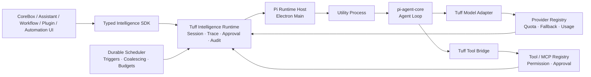
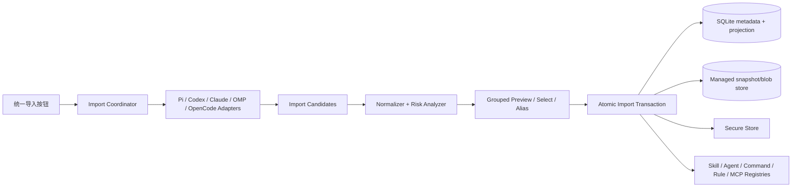

# AI 调度与跨 CLI 配置导入技术设计

> 状态：已实现并验证
> 范围：Pi 中央调度、durable automation、跨 CLI 导入、MCP 治理与 clean cutover

## 1. 设计结论

- Tuff 保留控制面：durable session、scheduler、权限、审批、trace、usage、quota、audit、通知和 SQLite 状态。
- `@earendil-works/pi-agent-core` 是唯一 Agent loop，随 Tuff 锁版本打包，在 Electron `utilityProcess` 中运行。
- Pi 不拥有 provider、secret、工具、MCP 生命周期或持久化；这些能力全部通过 Tuff typed adapter 注入。
- 用户系统中的 Pi CLI、Codex、Claude Code、OMP、OpenCode不参与任务执行，只是配置导入来源。
- 导入由用户点击统一按钮触发；扫描、预览、选择、确认后才原子写入并启用，不后台同步。
- 首批导入 Skills、MCP、Agents、Commands、Rules/Instructions；保留类型触发语义。
- Pi 可规划子 Agent，但交互任务必须先展示委派计划并由用户确认；后台任务只能使用 automation policy 预批准的 profiles 与预算。
- Pi 切换完成后删除 DeepAgent 与 legacy Agent loop，不永久双轨。

## 2. 总体架构



### 2.1 边界职责

| 层 | 拥有 | 不拥有 |
|---|---|---|
| Tuff Intelligence Runtime | session identity、事件序列、终态、审批、trace、usage、恢复 | Agent 内部推理循环 |
| Durable Scheduler | 触发、single-flight、coalesce、预算、暂停/恢复、通知 | LLM/tool 执行 |
| Pi Runtime Host | utility process 生命周期、typed IPC、Agent 实例映射、崩溃检测 | 业务真相源 |
| `pi-agent-core` | prompt/steer/follow-up、Agent loop、tool-call event、stream event | provider 凭据、工具副作用、持久化、权限 |
| Model Adapter | 将 Pi stream request 映射到现有 Intelligence SDK | 独立 provider/auth 设置 |
| Tool Bridge | tool schema 与请求/结果归一 | 权限决策和真实执行 |
| Tool/MCP Registry | 工具执行、权限、审批、超时、取消、审计、MCP 连接 | Agent 决策 |
| Config Import Hub | 外部配置发现、解析、预览、导入、来源追踪 | 调用外部 CLI 执行任务 |

## 3. Pi Runtime Host

### 3.1 进程模型

首版使用一个由 Electron main 监管的 `utilityProcess`，内部维护 `sessionId -> Agent` 映射：

- utility process 只加载锁定版本的 `pi-agent-core` 与 Tuff runtime adapter。
- Agent 并发由 Tuff Scheduler 的配置决定，不在 utility process 内创建第二套队列。
- 进程退出时，所有 active run 标记为 `interrupted`；非幂等 tool call 不自动重放。
- 进程按有界退避重启；恢复时由 Tuff snapshot/event projection 重建 Agent state。
- utility process 不接收 provider secret、MCP secret 或完整 secure-store 数据。

后续只有在实测表明单进程存在明显隔离或吞吐问题时，才演进为分片 utility-process pool；对上层协议不变。

### 3.2 Typed IPC

内部协议使用 discriminated union，至少覆盖：

- `session.create` / `session.dispose`
- `run.prompt` / `run.steer` / `run.followUp` / `run.abort`
- `agent.event`
- `model.request` / `model.event` / `model.abort`
- `tool.request` / `tool.update` / `tool.result` / `tool.cancel`
- `runtime.ready` / `runtime.health` / `runtime.fatal`

所有消息携带 `sessionId`、`runId`、`turnId`；tool call 额外携带稳定 `callId`。未知版本/事件 fail closed，不降级成文本。

## 4. Provider 与工具接入

### 4.1 Model Adapter

Pi 使用自定义 stream function 调用现有 Tuff Intelligence SDK：

- model/provider 选择来自 Tuff Provider/Capability routing。
- provider 调用前继续执行 permission 与 quota guard。
- delta、reasoning、usage、provider/model、traceId、latency、typed failure 映射回 Pi event。
- retry/fallback 沿用 Tuff 现有 commit boundary；Pi 不再叠加 provider retry。
- Pi 的模型设置字段不对用户暴露，也不读取 `~/.pi` provider/auth 配置。

### 4.2 Tool Bridge

Pi 只看到 Tuff 生成的 `AgentTool` proxy：

1. Pi 发出 tool call。
2. utility process 将规范化请求发给 Electron main。
3. Tuff 根据 caller、session、automation policy、scope、tool metadata 做授权与审批。
4. Tuff Tool Registry 或 MCP Registry 执行。
5. 结构化进度与结果回到 Pi；敏感字段在边界清洗。

外部 Agent 配置中的 tool allowlist 只与 Tuff 已授权工具取交集，不能授予新权限。

### 4.3 Agent Delegation Gate

Pi 可以提出结构化 delegation plan，但不能直接创建隐藏子 Agent：

```ts
interface DelegationPlan {
  planId: string
  parentRunId: string
  nodes: Array<{
    nodeId: string
    profileId: string
    objective: string
    dependsOn: string[]
    requestedTools: string[]
    requestedMcpServers: string[]
    estimatedBudget: { maxSteps: number; maxCost?: number }
  }>
  maxConcurrency: number
}
```

- 交互任务：计划持久化并展示；用户确认后，Tuff 才为每个 node 创建 child run/session。
- 后台任务：计划只允许引用 automation policy 预批准 profiles、tools、MCP 和预算；越界即 `pending_approval`。
- child run 继承父 run 的 workspace/scope/permission 上限，不能扩大权限。
- 并发与依赖由 Tuff Scheduler 执行；Pi 不在 utility process 内自建不可见任务队列。
- 子 Agent 结果以结构化 handoff 回到父 run，并保留 parent/child trace 关系。


## 5. Durable Session 与恢复

Tuff 是唯一真相源。Pi Agent state 是可重建投影：

- 持久化：用户/助手消息、上下文摘要引用、turn/run 状态、tool call start/result、审批、usage、active profiles、Skill/Rule revision、队列事件。
- 不持久化为第二真相源：Pi session 文件、Pi provider auth、Pi tool implementation。
- provider stream 中断：标记 interrupted，不猜测丢失内容。
- unfinished tool call：默认写入 interrupted result；只有工具显式声明 retry-safe/idempotent 才允许自动重试。
- 已完成 tool call 通过稳定 `callId` 去重，防止崩溃恢复后重复副作用。
- pending approval 保持 pending，但审批策略版本变化后必须重新确认。

## 6. 后台自动化

### 6.1 触发与重叠

- 支持用户触发、现有 Workflow、cron、开机、文件/事件触发。
- 默认每个 automation single-flight。
- 运行中、休眠或退出期间的重复触发合并成一个 pending run，记录 `missedCount`、时间范围和最新 payload。
- 当前 run 完成或应用恢复后只补跑一次。
- 高级策略允许 `skip` 或有界 `replay`，但必须配置队列、运行次数和成本上限。

### 6.2 无人值守审批

启用 automation 时固化版本化 policy：

- 允许的工具/MCP
- 文件路径与 workspace roots
- 网络域/目标
- 每 run 和周期成本预算
- 最大步骤、超时、重试和并发

策略内自动执行；越界时持久化 `pending_approval`、释放并发槽并通知用户。拒绝、过期、automation 版本变化进入明确终态。
- 后台委派计划只能引用 policy 中预批准的 Agent profiles、最大并发与子任务预算；新增 profile 或预算提升按越界审批处理。

## 7. Config Import Hub



### 7.1 Source Adapter

```ts
interface ConfigSourceAdapter {
  readonly id: 'pi' | 'codex' | 'claude' | 'omp' | 'opencode'
  detect(context: ScanContext): Promise<DetectedRoot[]>
  scan(root: DetectedRoot, signal: AbortSignal): Promise<SourceScanResult>
}
```

约束：

- adapter 只读，不执行 CLI，不运行配置中的 command/hook/script，不联网解析 remote instruction。
- 每个 adapter 独立失败；一个来源损坏不阻塞其他来源。
- 路径先 canonicalize；拒绝 symlink escape、无限递归、超限文件/目录和非普通文件。
- 原始值解析为 `unknown`，在 adapter 边界验证。

### 7.2 首批来源矩阵

| 来源 | User/Global | Project/Workspace | 首批映射 |
|---|---|---|---|
| Pi CLI | `~/.pi/agent/skills`, `~/.agents/skills`, `~/.pi/agent/prompts`, settings 中显式 resource paths | `.pi/skills`, `.agents/skills`, `.pi/prompts`, project instructions | Skill、Command、Instruction；没有标准原生 MCP/Agent 定义时显示 N/A，不伪造 |
| Codex | `~/.codex/config.toml`, `~/.codex/skills`, `~/.codex/commands`, `~/.codex/prompts`, `~/.codex/AGENTS.md` | `.codex/config.toml`, `.codex/skills`, `.codex/commands`, `.codex/prompts`, workspace `AGENTS.md` | MCP、Skill、Command、Instruction；Agent 只在已安装版本有可验证定义时导入 |
| Claude Code | `~/.claude.json`, `~/.claude/skills`, `~/.claude/commands`, `~/.claude/agents`, `~/.claude/CLAUDE.md`, `~/.claude/rules` | `.mcp.json`, `.claude/skills`, `.claude/commands`, `.claude/agents`, `CLAUDE.md`, `.claude/rules` | MCP、Skill、Command、Agent、Rule/Instruction |
| OMP | `~/.omp/agent/{mcp.json,skills,commands,agents,rules,instructions}`, `AGENTS.md`, `RULES.md`；识别 named profile | `.omp/{mcp.json,skills,commands,agents,rules,instructions}`, `AGENTS.md`, `RULES.md` | 全部首批类型 |
| OpenCode | `~/.config/opencode/opencode.json[c]`, `skills`, `commands`, `agents`, `AGENTS.md` | `opencode.json[c]`, `.opencode/{skills,commands,agents}`, workspace `AGENTS.md` | MCP、Skill、Command、Agent、Rule/Instruction |

实现时必须以用户已安装 CLI 版本及其官方 schema/文档验证路径和字段；adapter 返回版本诊断，不因未来格式变化静默猜测。

### 7.3 统一导入模型

```ts
type ImportedConfigKind = 'skill' | 'mcp' | 'agent' | 'command' | 'rule' | 'instruction'

type ImportedConfigIdentity = {
  source: 'pi' | 'codex' | 'claude' | 'omp' | 'opencode'
  sourceScope: 'user' | 'project'
  targetScope: 'global' | 'workspace'
  kind: ImportedConfigKind
  sourceKey: string
  canonicalRootId: string
}
```

每个 candidate 包含：

- stable identity 与 display name
- source path 的受控展示值
- raw snapshot/blob refs
- normalized projection
- content hash、adapter version、scan time
- mapped/ignored/blocking fields
- requested tools/MCP/paths/network
- secret field descriptors 与 secret fingerprints
- collision/default-alias 状态

内部 canonical id 使用 `source/scope/type/name` 语义并附稳定 root identity，避免同名覆盖。

### 7.4 类型语义

- Skill：只将 name/description 元数据暴露给 Pi；完整内容由 host-owned `skill.read` 按需加载。
- Agent：成为具名 profile/可委派角色；模型字段映射到 Tuff model role，无法映射时继承并告警；工具权限只收紧。
- Command：explicit-only。参数模板由 Tuff 展开；动态 shell/file injection 转成受治理 tool/context request，绝不在导入阶段执行。
- Rule：按 glob/scope 条件注入；always-on 仅对来源明确声明且用户确认的规则成立。
- Instruction：按 global/workspace scope 进入基础上下文；远程 URL 默认不自动抓取。
- MCP：注册定义与 authRefs；首次 tool call 惰性连接，空闲释放。

### 7.5 原始快照与本地副本

- 导入项为只读 snapshot；保存凭据清洗后的完整 source 结构与规范化 projection，明文 secret 不进入 blob/SQLite。
- 用户修改时“复制为 Tuff 本地配置”，产生新 identity。
- 重新导入只更新相同 source identity。
- 外部项消失时标记 `source-missing`，不自动删除/停用已验证 snapshot。
- raw snapshot 用于审计、重解析和未来 adapter 升级，不直接参与运行。

### 7.6 MCP Secret 事务

用户在确认页授权后：

1. renderer 只提交 candidate id 和选择，不接触 secret value。
2. Electron main 在受信边界重新读取源配置。
3. env/header/token/client secret 等值直接写 secure store。
4. 普通 projection 只保存 `authRef` 和 fingerprint。
5. 全部 secret 与配置写入成功后，才提交 imported item 并启用 MCP。
6. 任一步失败则回滚新 authRefs/配置，不产生半启用 server。

外部工具封装在自身 keychain/DB 中且无法安全导出的 OAuth refresh token不能伪造迁移成功；该 candidate 标记 `reauth-required`，定义仍可导入，但启用前必须在 Tuff 完成授权。

## 8. UI 流程

设置页单入口：“从其他 AI 工具导入”。

1. 选择目标 workspace（若当前没有 workspace）。
2. 只读扫描全部来源，按 CLI/source scope/type 分组。
3. 展示 added/changed/unchanged/source-missing/invalid。
4. 展示字段映射、风险、requested permissions、MCP command/URL、secret 字段名与 masked fingerprint。
5. 用户勾选，解决同名默认别名，必要时调整 target scope。
6. 明确确认 secret 迁移与启用。
7. 原子导入；逐项展示成功、失败和恢复动作。

每个来源卡片提供单独重扫；仍只有一个统一导入工作流。

## 9. 存储与真相源

遵循项目约束：SQLite 是本地业务真相源。

- SQLite：source roots、scan records、import item metadata、normalized projection、aliases、enabled state、revision、diagnostics、automation policy/run state。
- Managed blob store：按内容 hash 保存大型 raw snapshot、Skill assets/scripts；SQLite 保存引用与大小/类型。
- Secure store：MCP env/header/token/OAuth client secret；SQLite 只存 authRef/fingerprint。
- 外部 CLI 文件：只读输入，不是 Tuff runtime 真相源。

## 10. 迁移与回滚

### 10.1 迁移顺序

1. 建立共享 contracts、storage 和 Pi host adapter。
2. 让现有 Tuff runtime 在内部 feature flag 下调用 Pi。
3. 迁移 CoreBox/Assistant/Workflow/Plugin/Automation 调用方。
4. 完成恢复、审批、quota、audit 与 packaged smoke。
5. 删除 DeepAgent/legacy Agent loop 和重复 scheduler/executor。
6. 独立启用 Config Import Hub 与导入 UI。

### 10.2 回滚

- 迁移期内部 flag 可切回旧 loop，仅用于验证窗口。
- 数据 schema 必须向后安全：旧 runtime 忽略新增 Pi/import metadata。
- 一旦完成 clean cutover 并删除旧代码，回滚依赖版本回退，不保留运行时双轨。
- Config import 可逐项 disable/delete snapshot；不删除外部源文件和独立本地副本。

## 11. 风险与防线

| 风险 | 防线 |
|---|---|
| Pi 依赖拥有进程权限 | 只用 `pi-agent-core`；utility process 不持有 secrets；实际工具回到 Tuff |
| 导入 Skill/Command 包含恶意指令 | raw/projection 分离、风险预览、显式选择、工具权限仍由 Tuff 控制 |
| MCP 配置启动任意本地命令 | 不在扫描/导入时执行；首次 tool use 前再次校验 scope/policy |
| Secret 泄漏 renderer/log | main-only 读取与 secure-store 写入，其他层只见 authRef/fingerprint |
| 双日志恢复漂移 | Tuff 单一 durable source；Pi state 可丢弃重建 |
| 后台唤醒任务风暴 | single-flight + default coalesce + bounded replay |
| 旧新 Agent loop 长期分叉 | 迁移 flag 有时限，最终删除旧路径 |
| 第三方格式升级 | adapter version + diagnostics + explicit unsupported fields；禁止静默猜测 |

## 12. 外部依据

- Pi Agent Core：https://github.com/earendil-works/pi/tree/main/packages/agent
- Pi Skills：https://github.com/earendil-works/pi/blob/main/packages/coding-agent/docs/skills.md
- Pi Settings：https://github.com/earendil-works/pi/blob/main/packages/coding-agent/docs/settings.md
- Claude Code Skills：https://code.claude.com/docs/en/skills
- Claude Code MCP：https://code.claude.com/docs/en/mcp
- Claude Code Agents：https://code.claude.com/docs/en/sub-agents
- OpenCode Skills：https://opencode.ai/docs/skills/
- OpenCode Config：https://opencode.ai/docs/config/
- OpenCode MCP：https://opencode.ai/docs/mcp-servers/
- OMP Config Discovery：https://github.com/can1357/oh-my-pi/blob/main/docs/config-usage.md
- OMP MCP：https://github.com/can1357/oh-my-pi/blob/main/docs/mcp-config.md
