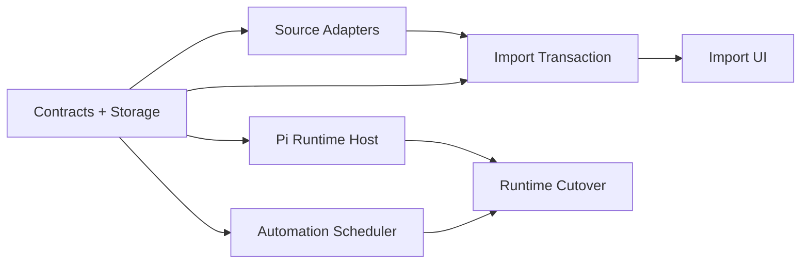

# AI 调度与跨 CLI 配置导入实施计划

> 状态：已完成（2026-07-18）
> 质量门：focused/full-scope tests、node/web typecheck、lint、SDK/CoreApp build、真实 utility-process 与 Electron UI smoke 均通过

## 1. 建议任务拆分

当前目录作为父任务，负责总需求、共享 contract、跨子任务验收和最终 clean cutover。批准后再创建以下子任务：

1. **Intelligence contracts and storage**
   - 统一 Pi IPC、import candidate、normalized projection、automation policy/run schema。
   - SQLite migration、managed snapshot/blob refs、secure-store authRef contract。
2. **Pi runtime host**
   - 引入锁定版本 `pi-agent-core`。
   - Electron utility process、typed IPC、Model Adapter、Tool Bridge、session rebuild。
3. **Durable automation scheduler**
   - user/background trigger、single-flight、coalesce、preauthorization、pending approval、wake recovery。
4. **CLI config source adapters**
   - Pi、Codex、Claude、OMP、OpenCode detect/scan/normalize/diagnostics。
   - raw snapshot、unsupported-field report、MCP secret extraction plan。
5. **Import transaction and registries**
   - preview selection、namespace/default alias、atomic secure-store import、read-only snapshot、clone-local、lazy MCP registration。
6. **Renderer import experience**
   - unified import button、grouped scan、diff/risk/secret preview、selection、result/recovery UI。
7. **Runtime cutover**
   - migrate CoreBox、Assistant、Workflow、Plugin AI、Automation callers。
   - remove DeepAgent/legacy Agent loop and duplicate scheduling paths after smoke passes。

### 依赖关系



## 2. 执行步骤

### Step 1：锁定共享契约

- 定义 Pi utility-process request/event union，携带 session/run/turn/call identity 与协议版本。
- 定义 ImportSource、ImportCandidate、RawSnapshotRef、NormalizedProjection discriminated union。
- 定义 automation definition/policy/trigger/run/pending-approval 数据模型。
- 定义 DelegationPlan、DelegationNode、plan approval 与 parent/child run/trace contract。
- 明确 runtime decoder、错误码、终态和恢复规则；所有跨层 payload 在共享 owner 中归一。
- 通过 LSP references 确认现有 Intelligence、Agent、Workflow、Plugin、Automation 调用面，再决定文件落点。

**完成证据**：共享 contract 能表达设计中的全部流；现有调用方映射表无遗漏。

### Step 2：建立持久化基础

- 增加 SQLite source/item/alias/scan/automation/run/revision 数据结构。
- 增加 managed snapshot/blob store，所有 blob 由 hash 和 SQLite ref 管理。
- 扩展 secure-store authRef，用于 MCP env/header/token/client secret 原子写入。
- 为 import transaction、source-missing、clone-local、rollback 建立明确状态转换。

**完成证据**：一次导入事务可以 commit/rollback；失败后 SQLite、blob、secure store 不出现半状态。

### Step 3：接入 Pi Runtime Host

- 在目标包锁定 `@earendil-works/pi-agent-core` 版本；验证 Electron/Node 24/打包产物兼容。
- 建立 utility-process entry 与 Tuff typed IPC，不暴露 raw Electron channel。
- 实现 session map、health、abort、fatal、bounded restart。
- 实现 Model Adapter 到现有 Intelligence SDK。
- 实现 host-owned AgentTool proxy 到 Tool/MCP Registry。
- 将 Pi event 归一为现有 runtime trace/session event。
- 实现结构化 delegation plan 输出；交互任务确认前不得创建 child run，确认后由 Tuff Scheduler 按依赖和并发预算启动。

**最小运行实验**：启动应用侧 host，创建一条 Tuff session，通过 Pi 完成一次 provider-backed 文本 turn；观察真实 stream、usage、trace 和终态。

### Step 4：完成恢复与审批闭环

- 从 Tuff snapshot/event projection 重建 Agent messages、system context、active profiles 与 tool set。
- unfinished provider request 标记 interrupted。
- unfinished non-idempotent tool call 不重放；idempotent call 根据 metadata 决定。
- pending approval 跨 utility-process/app restart 保留。
- utility process crash 后重建并继续新的 turn，不依赖 Pi session 文件。
- 验证 delegation plan 与用户确认状态跨重启保持一致；未确认计划不得在恢复时自动执行。

**最小运行实验**：在流式回复、tool call 前后、pending approval 三个边界终止 utility process，重启后验证无重复副作用且状态可解释。

### Step 5：接管 durable automation

- 将 cron/startup/file/event trigger 写入现有 scheduler owner，而不是 utility process timer。
- 实现 single-flight 与默认 coalesce pending run。
- 实现 versioned preauthorization policy、budget、越界暂停和通知。
- 将预批准 Agent profiles、child-run concurrency 与委派预算纳入 automation policy；越界计划进入 pending approval。
- 实现 sleep/wake、app restart、missedCount 与 bounded replay。

**最小运行实验**：应用退出期间制造多次触发，重启后只产生一个带 missedCount 的补跑；越权 tool call 或未预批准 Agent 委派进入 pending approval 并释放执行槽。

### Step 6：实现 source adapters

按独立 adapter 完成：Pi、Codex、Claude Code、OMP、OpenCode。

每个 adapter 必须：

- 只读 detect user/project roots。
- 解析 Skills、MCP、Agents、Commands、Rules/Instructions 中该来源真实支持的类型。
- 返回 adapter/version、canonical source identity、raw snapshot、normalized candidate、warnings/blockers。
- 隔离错误并应用路径/大小/递归/symlink 限制。
- 不执行 command、hook、script，不获取 remote instruction URL。
- 对 installed-version schema 不认识的字段显式降级。

**最小运行实验**：用隔离 fixture home/workspace 同时放置五类来源；一次扫描返回分组候选，一个损坏来源不影响其余四个。

### Step 7：实现原子导入

- 生成 namespace identity 与 default alias 冲突选择。
- 保存 raw snapshot/blob 与 normalized projection。
- Electron main 在确认后重新读取 MCP secret，直接写 secure store。
- transaction commit 后才启用 item/MCP definition。
- 外部封闭 OAuth credential 以 `reauth-required` 结束，不声称已迁移。
- 实现 re-import diff、source-missing、disable/delete、clone-local。
- MCP 仅注册，首次 tool use 惰性启动；空闲释放。

**最小运行实验**：导入一个 Skill、Agent、Command、Rule 和带 secret 的 stdio/HTTP MCP；确认 renderer/trace/log 无明文，MCP 首次使用前没有进程/连接。

### Step 8：实现统一导入 UI

- 设置页单入口扫描全部来源。
- 按 CLI/scope/type 分组并显示 added/changed/unchanged/source-missing/invalid。
- 显示字段映射、unsupported、风险、请求权限、MCP command/URL 和 masked secret fingerprint。
- 支持逐项选择、target scope、default alias、确认和逐项结果。
- 支持 per-source rescan、clone-local、disable/delete、reauth recovery。

**最小运行实验**：在真实 Electron 设置页完成一次跨来源导入，并立即从 Pi 任务中调用导入 Skill/Agent/Command/Rule 与 MCP。

### Step 9：迁移正式入口并 clean cutover

- 将 CoreBox、Assistant、Workflow、Plugin AI、Automation 全部切到统一 Pi runtime contract。
- 逐入口验证 provider routing、permission、quota、audit、usage 与 typed failure 未回退。
- 所有入口 smoke 通过后，删除 DeepAgent/legacy Agent loop、重复 scheduler/executor、旧调用方和运行依赖。
- 不保留兼容 alias、永久 feature flag 或入口级分流。

**完成证据**：代码中只剩一个 Agent loop；所有正式 AI/automation 入口均能追溯到同一 Tuff session/run/trace。

## 3. 关键风险文件与边界

预计影响范围，实施前必须通过 Serena/LSP 再确认 symbol references：

- `packages/tuff-intelligence/src/runtime/*`
- `packages/tuff-intelligence/src/registry/*`
- `packages/tuff-intelligence/src/adapters/*`
- `packages/utils/transport/**` 与共享 intelligence/agent types
- `apps/core-app/src/main/modules/ai/tuff-intelligence-runtime.ts`
- `apps/core-app/src/main/modules/ai/intelligence-deepagent-orchestration.ts`
- `apps/core-app/src/main/modules/ai/agents/**`
- `apps/core-app/src/main/modules/ai/intelligence-mcp-registry.ts`
- `apps/core-app/src/main/modules/ai/intelligence-module.ts`
- CoreApp typed storage/secure-store/transport owners
- Renderer Intelligence settings 与导入 UI owning module

风险最高的切换点：

1. provider stream commit/retry boundary
2. plugin verified caller 与 autonomous permission boundary
3. tool call crash recovery/idempotency
4. MCP secret transaction 与 renderer redaction
5. app sleep/wake trigger coalescing
6. 删除 legacy loop 前的调用方完整性

## 4. 验证策略

先证明行为可运行，再进入最后的永久契约加固与清理。

### 4.1 运行验证

- Pi utility process provider-backed streaming turn。
- Host-owned tool approval、cancel、timeout、progress。
- utility-process crash/restart/session rebuild。
- background missed-trigger coalesce 与 pending approval。
- 五来源导入、跨来源同名 alias、source-missing、clone-local。
- MCP secret 自动迁入 secure store、renderer/log redaction、lazy start。
- packaged Electron 设置页导入后立即在真实 Pi task 中可用。
- CoreBox、Assistant、Workflow、Plugin、Automation 逐入口 smoke。

### 4.2 现有命令候选

具体命令需在实现时根据 touched package 收窄；当前仓库可用基线：

```bash
corepack pnpm -C "packages/tuff-intelligence" run build
corepack pnpm -C "apps/core-app" run typecheck
corepack pnpm lint:changed
```

任何 focused test 命令必须针对最终变更后的真实 contract 选择，不用 mock/dry-run 代替 packaged Electron 体验。

### 4.3 清理门禁

只有上述 smoke 证明请求端到端可用后，才进入 workflow Cleanup：补充缺失的高信号永久契约测试、移除迁移 scaffolding/旧依赖、执行最小相关 lint/typecheck/full-scope gate。当前讨论阶段不预先编写测试或清理项。

## 5. 回滚点

- Storage migration：向前新增，旧 runtime 可忽略；事务失败不提交。
- Pi host：迁移期内部 flag 可暂时切回旧 loop。
- Config import：每个 imported snapshot 可独立 disable/delete，外部源不改写。
- MCP secret：import transaction 失败删除本次新建 authRefs；已有 authRefs 不覆盖。
- Clean cutover：只在所有入口 smoke 通过后删除旧 loop；删除后回滚使用版本回退，不在运行时保留双轨。

## 6. 事实核验结论

- 锁定 `@earendil-works/pi-agent-core@0.80.10` 与 `@earendil-works/pi-ai@0.80.10`；Node 24 typecheck、Electron utility-process 真实 smoke 与 `electron-vite` 构建均通过。
- 五个来源路径/schema 已通过隔离 fixture 与真实只读扫描验证；不支持/未知字段进入 N/A、ignored 或 blocking，而非猜测执行。
- CoreApp secure-store 的 purpose-scoped `authRef`、读/写/删除原语可支撑 import transaction；失败恢复行为已有回归。
- `AiAutomationScheduler` 是 trigger/single-flight/coalesce/recovery owner；`AiCliOrchestrator` 是唯一执行 owner，不再保留 legacy scheduler/executor。
- Renderer owner 为 `IntelligenceLocalSkills.vue`，通过 typed Intelligence SDK 的 orchestrator import events 访问 Electron main。

## 7. 实施完成记录

- Step 1–2：共享 contracts、SQLite migration、content-addressed blob、secure-store authRef 与原子 rollback 已落地。
- Step 3–5：锁定 `@earendil-works/pi-agent-core`，独立 utility process、Tuff model/tool bridge、稳定 tool-call 去重、一次性审批、启动恢复、委派预算与 durable automation 已落地。
- Step 6–8：Pi/Codex/Claude/OMP/OpenCode user/project 扫描、边界限制、TOML/YAML/JSON(C) MCP、secret/reauth、source-missing 版本、clone/enable/delete、Rule glob、Command 参数及统一设置页已落地。
- Step 9：CoreBox/Assistant/Workflow/Plugin/Automation 正式入口统一到 `AiCliOrchestrator`；DeepAgent、legacy executor/scheduler 与 `deepagents` 依赖已删除，无兼容双轨。
- 永久回归：13 个相关 Vitest 文件共 128 tests 通过；node/web typecheck、changed lint、SDK/UI Kit/CoreApp 构建通过。
- 运行证据：真实 Pi worker 成功 turn、model failure、unknown-cost fail-closed smoke 通过；隔离 Electron 设置页完成五来源扫描与导入管理 UI 视觉验收。
- 工作区代码仍未提交；按用户约束，本轮不创建 git commit，也不归档 Trellis 任务。
