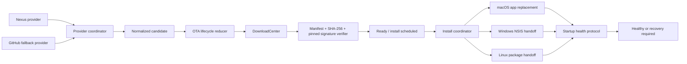

# 技术设计：统一 OTA 更新链路

## 1. 决策与边界

本设计固定以下产品决策：

- 第一阶段采用“平台原生可靠交付”，不自研跨平台静默安装器。
- 官方更新发现以 Nexus 为主，Nexus 发生可回退的瞬态故障时自动查询 GitHub Releases。
- 平台矩阵固定为 `win32/x64`、`darwin/arm64`、`linux/x64`。
- 自动检查、自动下载保持默认开启；已验证更新默认在用户主动正常退出时安装，用户可关闭 `installOnNormalQuit`，也可选择“立即安装”。
- macOS 自有 `.app` 替换脚本保留 detached signature 门禁；native trust 由 typed official-build verification status 投影，官方 attested package 才显示 `pass`。
- 三平台统一恢复契约，不承诺三平台都能原子、无交互回滚。
- 本地始终保留一个上一版本恢复资产；自动安装 release 必须保证 N-1 数据向后兼容。
- 第一阶段只有普通可忽略更新；不含强制更新、灰度发布、增量更新、renderer override 或 extension 更新。

## 2. 当前问题

1. `ReleaseFetchService`、`UpdateSystem` 和 renderer provider 分别包含版本/资产处理逻辑，存在多个事实来源。
2. macOS 同时存在 `MacAutoUpdaterAdapter` 与 DownloadCenter + `macos-apply-update.sh`；前者依赖 `app-update.yml`，而当前 `dir` 构建及 workflow 清理没有闭环 updater metadata。
3. 发布流水线已强制 manifest + SHA-256 + detached signature，但 Runtime 对缺失 signature URL 仍默认放行，发布契约和安装门禁不一致。
4. `UpdateGetStatusResponse` 只暴露若干布尔值和 task id，无法表达验证、退出安装、健康确认、恢复等状态。
5. `app_update_records` 只适合保存 release 展示/忽略/稍后提醒决策；DownloadCenter 只拥有字节下载进度。当前没有持久化的安装尝试与恢复状态源。
6. Windows 的 `autoInstallDownloadedUpdates` 是“下载完成立即启动安装器”的平台特例，与本次“正常退出时安装”的决策冲突。

## 3. 目标数据流



所有 renderer、transport、通知、设置页和诊断视图只消费 lifecycle snapshot，不再自行拼接 download task、pending version 与平台分支。

## 4. 共享契约

共享类型放在 `packages/utils/types/update.ts`，transport 映射继续由 `packages/utils/transport/events/types/update.ts` 与 SDK domain 持有。

### 4.1 Provider 结果

```ts
type UpdateProviderOutcome =
  | { kind: 'candidate'; candidate: UpdateCandidate }
  | { kind: 'none'; source: 'nexus' | 'github'; authoritative: boolean }
  | { kind: 'transient-failure'; source: 'nexus' | 'github'; reason: string }
  | { kind: 'policy-block'; source: 'nexus'; reason: string }

interface UpdateCandidate {
  source: 'nexus' | 'github'
  channel: AppPreviewChannel
  tag: string
  version: string
  releaseNotes: string
  publishedAt: number
  manifest: UpdateReleaseManifest
  asset: {
    name: string
    platform: 'win32' | 'darwin' | 'linux'
    arch: 'x64' | 'arm64'
    url: string
    sha256: string
    signatureUrl: string
  }
  rollbackFromVersion: string
}
```

只有 provider adapter 解析外部响应。进入 `UpdateCandidate` 后，后续层不再区分 Nexus/GitHub payload，也不再按文件名猜测缺失字段。

### 4.2 Lifecycle snapshot

```ts
type UpdateLifecyclePhase =
  | 'idle'
  | 'checking'
  | 'available'
  | 'downloading'
  | 'verifying'
  | 'ready'
  | 'install-scheduled'
  | 'handoff-started'
  | 'awaiting-health'
  | 'healthy'
  | 'recovery-required'
  | 'recovering'
  | 'recovered'
  | 'failed'

interface UpdateLifecycleSnapshot {
  attemptId: string | null
  revision: number
  phase: UpdateLifecyclePhase
  currentVersion: string
  targetVersion: string | null
  source: 'nexus' | 'github' | null
  channel: AppPreviewChannel
  platform: NodeJS.Platform
  arch: 'x64' | 'arm64'
  taskId: string | null
  installMode: 'mac-app-replace' | 'windows-nsis' | 'linux-package' | null
  installOnNormalQuit: boolean
  recoveryAvailable: boolean
  previousVersion: string | null
  error: { code: string; message: string; retryable: boolean } | null
  updatedAt: number
}
```

`revision` 是 UI 丢弃旧 snapshot 的唯一顺序依据。所有状态迁移由一个 exhaustive reducer/command dispatcher 持有；renderer 不复制迁移逻辑。

## 5. 持久化所有权

- `app_update_records`：继续拥有 release 展示状态、忽略、稍后提醒和 source/channel 缓存映射。
- `download_tasks` / `download_chunks`：继续拥有下载进度和文件位置。
- 新增 `app_update_attempts`：拥有一次从 candidate 到 healthy/recovered/failed 的生命周期、目标版本、task id、install mode、错误、health deadline、recovery asset 引用和 revision。
- 新增或扩展 recovery 元数据时，以 SQLite 为业务真源。外部 helper 使用的 attempt marker/health ack 是进程间协调文件，不是第二业务真源；内容必须包含 attempt id、目标版本和随机 token，且只允许写入 update storage root。

每次迁移必须在事务中同时更新 attempt phase、revision 与时间戳。非法前序状态直接拒绝，不做“尽量继续”。

## 6. Provider 协调与回退

固定顺序：

1. 命中新鲜的 source/channel 缓存时直接返回。
2. 请求 Nexus。
3. Nexus 返回有效 `none` 或 policy block 时结束；不得回退。
4. Nexus 网络不可达、超时、429 或 5xx 时请求 GitHub。
5. GitHub 也失败时，才允许返回仍满足完整校验契约的 stale verified cache；否则返回明确失败。

GitHub fallback 必须固定官方仓库，并下载 `tuff-release-manifest.json`。manifest 缺失、pair 不唯一、当前 pair 缺失、SHA-256/signature 缺失都不是“旧格式兼容”，而是不可安装结果。

缓存键必须至少包含 `source + channel`。切换渠道或 provider 时不能复用另一来源的 ETag、Last-Modified、cooldown 或 release 列表。

## 7. 下载与安全门禁

下载完成后必须依次执行：

1. 解析并验证 manifest schema、release identity、channel、当前 platform/arch 唯一性。
2. 对文件使用流式 SHA-256，避免 `fs.readFile` 全量占用安装包大小的内存。
3. 下载 detached signature，并只使用包内固定公钥验证。
4. signature URL 缺失、固定公钥缺失、签名下载失败或验证失败时进入 `failed`；不得进入 `ready`，不得打开文件。
5. 网络公钥 fallback、`signatureKeyUrl` 和 `TUFF_UPDATE_REQUIRE_SIGNATURE` 条件门禁全部移除。

只有 verifier 成功提交 `verifying -> ready` 后，通知与 UI 才能展示安装动作。

## 8. 单一安装协调器

新增一个 main-process install coordinator，统一处理立即安装、普通退出安装、平台 handoff 和 recovery。

### 8.1 退出时机

- `installOnNormalQuit` 替换 `autoInstallDownloadedUpdates`，默认 `true`。
- “立即安装”只设置明确的 update quit intent，然后调用现有 quit 流程；不绕过 `BEFORE_APP_QUIT`。
- `BEFORE_APP_QUIT` 阶段完成 attempt 持久化、helper plan 写入与所有业务 flush。
- `WILL_QUIT` 阶段只执行已准备好的同步/不可失败 handoff 启动，不再做网络、hash、数据库迁移或大文件复制。
- crash、SIGKILL、操作系统 shutdown/restart、重复实例退出、startup guard 退出都没有 user-normal/update quit intent，因此不安装。

需要把退出原因从局部日志字符串提升为 typed `QuitIntent`，由唯一入口设置；不能根据 `isQuitting` 猜测。

### 8.2 平台 adapter

- macOS：第一阶段删除/停用 `MacAutoUpdaterAdapter`，所有更新走 DownloadCenter + `macos-apply-update.sh`。脚本继续支持普通权限与管理员权限替换，但不得把 ad-hoc/native-trust waived 报告为可信签名。
- Windows：复用已有 NSIS 选择与 detached handoff；handoff 后允许 UAC/安装器接管，不声称无人值守成功。
- Linux：按 manifest 选定 AppImage 或 deb；打开/启动包管理交接后记录 `handoff-started`，不能仅凭 `openPath` resolve 就标记安装完成。

第一阶段不保留“macOS 若有 `app-update.yml` 就改走 electron-updater”的隐式分支。未来 Developer ID/notarization 配置完成后，如需重新采用 electron-updater，应单独规划并用同一 lifecycle contract 接入。

## 9. 健康确认与恢复

### 9.1 健康确认

新版本启动时读取 pending attempt。以下条件全部成立后才写 health ack 并提交 `awaiting-health -> healthy`：

- 运行版本等于 attempt target version；
- foreground modules 加载完成；
- `TouchApp.waitUntilInitialized()` 成功；
- database/update repository 可读写；
- renderer 初始化健康检查通过（silent start 可使用等价的 main-process readiness，不要求窗口可见）。

现有 `Startup health check passed` 边界可作为主进程基线，但必须补 attempt/version 校验。health ack 必须幂等。

### 9.2 恢复

- 始终只保留一个 previous recovery asset。
- macOS helper 在替换前保留旧 `.app`；新版本 health ack 前不得删除。超时或异常退出时可自动恢复。
- Windows 保留上一版已验证 NSIS；失败时 recovery helper/当前可运行版本启动上一版安装器，允许 UAC 与用户确认。
- Linux 保留上一版已验证 AppImage/deb；AppImage 可直接启动 previous，deb 通过系统包管理器交接。
- 每个 attempt 最多自动发起一次 recovery；再次失败进入 `recovery-required`，防止启动/回滚循环。
- 首次采用新机制、尚无 previous asset 时必须显式 `recoveryAvailable=false`，不得伪造恢复能力。

## 10. 数据迁移兼容

manifest schema 升级，release 元数据增加精确的 `rollbackFromVersion`。发布门禁必须验证它等于同渠道 N-1 版本，并执行兼容性场景：

1. N-1 profile 升级到 N；
2. N 完成 startup health 并写入代表性数据；
3. N-1 重新打开该 profile；
4. 读取和基础写入成功，且没有破坏性 schema/config 降级。

不通过时，该 release 不得标记为 `rollback-compatible`，也不得启用退出自动安装。第一阶段不通过恢复旧 profile 来换取 app rollback，避免静默丢弃新版本期间的用户数据。

## 11. Renderer 与交互

设置页和更新弹窗按 lifecycle phase 显示：

- `available`：版本与 release notes，可忽略/下载。
- `downloading`：进度与取消。
- `verifying`：禁止安装按钮。
- `ready/install-scheduled`：显示“立即安装”以及“正常退出时将安装”；允许关闭后者。
- `handoff-started/awaiting-health`：只展示事实，不提前报成功。
- `recovery-required`：展示上一版本、恢复动作、是否需要 UAC/包管理器确认。
- `failed`：展示稳定 error code、可重试性和诊断入口。

macOS native trust 只读取 typed build verification status：official attestation + pinned key + 无验证失败为 `pass`，其余为 `unverified` 风险；不得再显示已退役 waiver。

## 12. 发布与验收

- Release manifest、Nexus metadata、GitHub fallback 解析与 Runtime 使用同一 shared validator/normalizer；禁止 workflow、Nexus、CoreApp 各自维护资产选择规则。
- 由于第一阶段移除 electron-updater 分支，macOS Runtime 不再依赖 `app-update.yml/latest-mac.yml`；workflow 只需稳定发布当前 manifest、dmg/app zip 与 signature sidecar。
- 每个平台需要真实宿主验收：检查 → 下载 → hash/signature → 正常退出 handoff → 新版本 health → previous recovery 场景。
- 非宿主平台只能生成 static-only 证据。
- 发布门禁新增 N/N-1 数据兼容场景和 manifest `rollbackFromVersion` 验证。

## 13. 兼容与切换

- `autoInstallDownloadedUpdates` clean cutover 为 `installOnNormalQuit`；迁移现有值一次，不保留双字段或长期 alias。
- 已完成但缺 manifest/signature 的旧下载任务不能升级为 `ready`，必须清理或重新下载。
- 旧 `pendingInstallVersion` 只用于一次性迁移到新 attempt；迁移后删除旧设置字段。
- 删除 macOS 双路径后，同时删除无调用的 adapter、测试和 `electron-updater` 依赖；若仍有真实调用则先迁移完再删除。

## 14. 主要风险

- 三平台 recovery 不是同一种物理动作，契约只能统一状态、证据和恢复入口。
- Windows/Linux 恢复可能需要用户权限确认；UI 不得宣称完全自动。
- N-1 数据兼容会约束未来 schema/config 设计；破坏性 migration 必须显式降级为手动更新。
- macOS waived 模式仍不具备 Apple native trust；detached signature 只能证明发布者完整性，不能替代 Developer ID/Gatekeeper。
- 外部 helper 与主进程通过 marker 协调时必须防路径注入、旧 attempt 重放和无限回滚循环。
