# 插件发布与 TuffEx 供应链 - Design

## Architecture

```mermaid
flowchart LR
  S[Canonical plugin source] --> B[Clean build + source audit]
  B --> P[Package policy]
  P --> X[Security scan]
  X --> PS[Publisher signature]
  PS --> N[Nexus admission + review]
  N --> A[Nexus attestation]
  A --> E[Eligibility projection]
  E --> U[Store/download]
  U --> I[CoreApp verify/install]
  I --> R[Strict release evidence]
```

The immutable `.tpex` SHA-256 is the join key across every child. Human-readable plugin name or version is never sufficient to join reports.

## Child Ownership

| Child | Owns | Must not own |
| --- | --- | --- |
| Package Policy | Manifest/archive/inventory/limit contract | Malicious-code verdict, trust keys |
| Security Scan | Versioned rules and findings | Manual approval, signature identity |
| Source Package Audit | Clean source-to-artifact orchestration | Remote upload |
| Nexus Display Gate | Eligibility and public endpoint filtering | Scan implementation |
| Real Upload | Deployed end-to-end acceptance | Product implementation |
| Signing Trust Chain | Publisher/platform signatures and trust roots | Package policy rules |
| Release Evidence | Evidence schema and strict verification | Runtime business state |
| CLI Shim Retirement | Clean cutover to canonical CLI | Vite plugin removal |

## Shared Cross-Child Contract

Every machine-readable record carries:

- `contractVersion`
- `pluginId`, `pluginName`, `version`, `channel`
- `artifactSha256`, `artifactSize`
- producing tool/rule/policy version
- `sourceRevision` when produced from source
- stable decision/status code
- timestamp and optional upstream record identifiers

The artifact digest is calculated from final package bytes exactly once per boundary. Downstream records compare it; they do not rewrite it from Manifest fields.

## Dependency DAG

1. Package Policy defines normalized identity and archive inventory.
2. Security Scan and Signing consume the normalized package contract.
3. Source Package Audit orchestrates build -> policy -> scan -> sign for official source targets.
4. Nexus persists policy/scan/signature outcomes and computes display eligibility.
5. Real Upload proves the deployed path.
6. Release Evidence closes the cross-system contract.
7. CLI Shim Retirement removes compatibility surfaces after all callers use the canonical path.

## Persistence Boundaries

- CLI/build reports are local machine-readable artifacts and are not authoritative for Nexus admission.
- Nexus server re-runs authoritative policy, scan and signature verification and stores summaries beside the immutable version record.
- D1 owns metadata/status/timeline; R2 owns package bytes and report objects where configured.
- CoreApp trusts downloaded bytes only after digest and attestation validation; it does not trust CLI-local reports.

## Failure and Rollback

- Each boundary fails closed and keeps the prior eligible version available.
- New pending/rejected versions never mutate the previous public latest pointer.
- Policy/scanner/signing contract versions are stored with results so rollout can run old/new evaluation in shadow mode before cutover.
- Rollback changes the active evaluator version or eligibility projection; it never rewrites historical reports or signatures.
- Revocation is append-only and invalidates eligibility without deleting audit history.

## Integration Review Gate

The parent closes only when all child strict checks agree on the same artifact digest and the deployed real-upload evidence proves Store/download/install behavior. Focused tests alone cannot close this parent.
