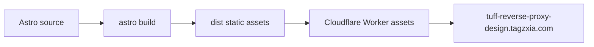

# Technical Design

## Architecture

Create a standalone Astro static site in `apps/reverse-proxy-design/`. Astro renders one content-led page into `dist/`; an app-local Wrangler configuration deploys that directory as Cloudflare Worker static assets. The root Nexus app and root `wrangler.toml` remain untouched.

## Content Contract

The page has seven narrative layers:

1. Executive verdict: current strategy is layered but not a unified anti-reverse-proxy boundary.
2. Current request path: internet, Cloudflare edge, canonical origin, API surfaces, D1-backed controls.
3. Evidence matrix: implemented, partial, disabled, and gap states with source references.
4. Control details: origin/CORS, device authorization, Turnstile, telemetry, docs, administrator control plane.
5. Threat scenarios: simple host pass-through proxy, header spoofing, shared proxy egress, direct API automation, and control-plane misuse.
6. Repository-declared production posture: exact boolean state without claiming unobserved Cloudflare Dashboard overrides.
7. Remediation roadmap: trusted IP resolver, server-side login challenge, unified ban enforcement, defense-mode semantics, and edge-origin hardening.

All conclusions are derived from repository source/configuration. No `.env` values, credentials, private logs, or tokens are rendered.

## Visual System

- Register: brand-style long-form technical publication.
- Theme: dark only, intentionally locked for control-plane legibility.
- Palette: graphite `#0B0D10`, slate `#15181D`, steel `#2A313B`, off-white `#E6E8EB`, warning orange `#FF8A00`, info blue `#4C8DFF`, critical red `#D64545`, implemented green `#2E7D5A`.
- Typography: broad system neo-grotesque display stack, Chinese-aware sans body stack, system mono only for file paths and configuration keys. No remote fonts.
- Shape: mostly sharp geometry with one consistent 10px surface radius; controls may be pill-shaped only when semantics require a compact status token.
- Signature motif: clipped trust-boundary perimeter with network routes entering, stopping, or bypassing the perimeter.
- Motion: one hero route-trace entrance and restrained disclosure transitions. Everything remains visible without JavaScript and motion collapses under `prefers-reduced-motion`.

The confirmed palette board at `/Users/talexdreamsoul/.codex/generated_images/tuff-reverse-proxy-palette.png` is the north-star artifact. The unlicensed font name shown in that generated board is not copied into production.

## Page Structure

- Sticky single-line navigation with section anchors and a compact status legend.
- Hero split between verdict copy and a semantic HTML/CSS network-boundary figure.
- Current-state topology rendered with semantic nodes and connectors, not a rasterized fake dashboard.
- Evidence matrix using a real accessible table on desktop and labeled grouped rows on narrow screens.
- Threat scenarios presented as an ordered flow, because sequence carries meaning.
- Control deep dives use varied layouts: matrix, split evidence list, architecture band, and compact disclosure groups.
- Production posture uses explicit source and inference labels.
- Roadmap closes with ordered P0/P1/P2 actions and verification outcomes.

## Accessibility

- One `h1`, ordered heading hierarchy, `header/nav/main/section/footer` landmarks.
- Skip link, visible focus ring, 44px touch targets, no hover-only information.
- Statuses always include text and shape, never color alone.
- Table headers and captions remain available to assistive technology.
- Body text at least 1rem with 65-75ch reading measure.
- Reduced motion disables route tracing and reveal choreography.

## Deployment

`apps/reverse-proxy-design/wrangler.toml` owns:

- a unique Worker name;
- current compatibility date;
- `[assets] directory = "./dist"`;
- `[[routes]] pattern = "tuff-reverse-proxy-design.tagzxia.com"` and `custom_domain = true`.

Deployment runs from the app directory with the workspace Wrangler binary. The custom domain makes the Worker the origin and Cloudflare manages the DNS record.

## Operational Safety

- No edits to root `wrangler.toml` or existing Nexus deployment.
- Run a production build and local HTTP smoke before deployment.
- Inspect the live custom domain after deployment; do not equate local browser evidence with production evidence.
- If deployment or live verification fails, stop further mutation and preserve the previous Worker version/domain state. Roll back through Cloudflare Worker version management rather than changing Nexus routing.
