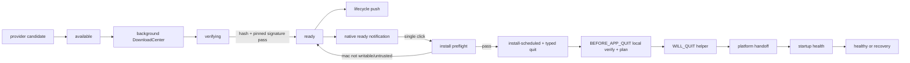

# 技术设计：OTA 一键预下载与 macOS 严格无感更新

## 1. 决策与边界

- 保留现有 Nexus/GitHub provider、DownloadCenter、manifest v2、SHA-256、pinned detached signature、SQLite lifecycle、typed quit、health/recovery 链路。
- 不重新引入 `electron-updater` 或 Electron `autoUpdater`。当前统一链路已经拥有下载、安全校验、rollback compatibility 和恢复状态；重新引入会制造第二下载器、第二状态源和发布元数据路径。
- `ready` 是唯一可通知、可安装状态；DownloadCenter `completed` 只表示字节完成。
- macOS 采用严格零权限弹窗：只支持当前用户可原位替换的 `.app`。权限不足时保持 `ready`，不退出、不调用 AppleScript 管理员授权。
- Windows/Linux 同步收敛为 ready 后一次点击进入真实平台 handoff，但不虚假承诺静默安装。

## 2. 目标数据流



## 3. Lifecycle publication

`UpdateAttemptRepository` 增加可选的 commit observer：

```ts
interface UpdateAttemptRepositoryOptions {
  onCommitted?: (snapshot: UpdateLifecycleSnapshot) => void;
}
```

`createChecking()` 与 `transition()` 先等待 SQLite transaction 完整提交，再调用 observer。observer 不参与事务、不能让通知失败回滚业务状态。

`UpdateService` 是 publication owner：

1. repository observer 调用 `publishLifecycleSnapshot(snapshot)`。
2. 通过新增 typed `UpdateEvents.lifecycleChanged` 广播完整 snapshot。
3. renderer `useUpdateRuntime` 通过现有 `shouldAcceptUpdateLifecycleSnapshot` 接收。
4. `ready` 进入 `maybeShowReadyNotification(snapshot)`；其余 phase 只同步状态。
5. startup restore 完成后主动 publish 当前 active/latest snapshot，使跨进程恢复出的 `ready` 可再次提醒。

不在 renderer、DownloadCenter 或 NotificationService 内重建 phase。

## 4. Ready 通知所有权

`NotificationService` 将 raw-completion API clean cutover 为 ready API：

```ts
showUpdateReadyNotification(options: {
  version: string
  platform: NodeJS.Platform
  onClick: () => void
}): boolean
```

- 通知点击闭包直接回到 main `UpdateService`，调用唯一的 `installWithCenterLifecycle(taskId)`。
- 不广播 `download:push:notification-clicked` 作为 OTA 安装 RPC；普通下载通知仍保留现有行为。
- 同一进程内用 `Set<attemptId>` 去重 ready 通知。该 Set 只控制打扰，不是 lifecycle 真源。
- 用户关闭通知后 attempt 保持 `ready`；设置页仍可安装，兼容 release 仍可 normal-quit 安装。
- ready 点击失败时不改变 attempt；主进程记录稳定错误并通过 lifecycle/status 响应让 UI 展示。

`UpdateSystem.setupDownloadCompletionListener()` 及其 app-update ready 通知删除。下载完成后的唯一动作由 `UpdateService.monitorDownloadLifecycle()` 驱动 `verifying -> ready`。

## 5. Renderer 交互

新增 `UpdateSdk.onLifecycleChanged(handler)`。

`useUpdateRuntime`：

- setup 时订阅 lifecycle push，并注册 cleanup。
- `autoDownload=true` 时，`UpdateEvents.available` 只同步 release/snapshot，不展示阻塞式 `AppUpgradationView`。
- `autoDownload=false` 时保留人工下载入口，但按钮文案改为“下载更新”，不叫“立即更新”。
- `ready` 的 native notification 是主入口；设置页继续基于 snapshot 展示平台安装按钮。
- native notification 不可用或被系统禁用时，renderer 可在主窗口内展示一次 ready 提示；动作直接调用 `installDownloadedUpdate(taskId)`，不再先走下载。

## 6. macOS 严格零弹窗 preflight

### 6.1 安装前检查

在 `UpdateInstallCoordinator.scheduleInstallNow()` 修改 lifecycle 前执行轻量 preflight：

```ts
type UpdateInstallPreflightResult =
  | { ok: true }
  | {
      ok: false;
      code:
        | "MAC_UPDATE_DESTINATION_NOT_WRITABLE"
        | "MAC_UPDATE_BUILD_UNTRUSTED";
      message: string;
    };
```

macOS 必须同时满足：

- packaged build verification 已完成；
- `isOfficialBuild=true`；
- `verificationFailed=false`；
- `hasOfficialKey=true`；
- 当前 `.app` bundle 与其父目录允许当前进程完成原位替换；
- 下载资产仍是 verified task，完整二次校验继续留在 BEFORE_APP_QUIT。

preflight 失败时：

- 不执行 `ready -> install-scheduled`；
- 不设置 `update-now`；
- 不调用 `app.quit()`；
- 返回稳定错误码；
- 保持 package 和 attempt `ready`，允许用户修复安装位置后重试。

### 6.2 Helper 与脚本

`macos-apply-update.sh` 删除：

- `run_as_admin()`；
- `install_with_admin()`；
- 所有 `osascript ... with administrator privileges` 分支。

脚本只执行 direct path：

1. 等待父进程退出；
2. 解包到 attempt stage；
3. 复制当前 app 到 backup；
4. 原位替换；
5. 失败则恢复 backup 并重新打开旧 app；
6. 成功则打开新 app。

`macos-restore-update.sh` 同样删除管理员提权。恢复不可写时保留 marker 与 backup，报告 `recovery-required`，不弹密码框。

preflight 与脚本仍存在 TOCTOU，因此脚本必须保留失败恢复，不能把 preflight 当作安装成功证明。

## 7. Windows 与 Linux

- Windows ready 点击复用 coordinator；NSIS 保持交互式 `args=[]`，MSI 保持 `msiexec /i`。点击只证明 handoff，不证明安装成功。
- Linux AppImage 直接启动 verified package；deb 使用 `xdg-open`。不把 opener resolve 当 healthy。
- 三平台都使用同一 ready 通知、task match、typed quit、helper 去重、health 与 recovery 状态。

## 8. 错误与文案

新增稳定错误：

- `MAC_UPDATE_DESTINATION_NOT_WRITABLE`
- `MAC_UPDATE_BUILD_UNTRUSTED`
- `UPDATE_READY_NOTIFICATION_FAILED`

用户文案：

- available + auto download：后台准备，不打断。
- ready macOS：`更新已准备好，点击后 Tuff 将快速重启并完成更新。`
- ready Windows：`更新已准备好，点击后退出并启动安装器。`
- ready Linux：`更新已准备好，点击后退出并打开更新包。`
- macOS 不可写：明确建议将官方 Tuff.app 放到当前用户可管理的 Applications 位置或重新安装；不请求密码。

## 9. 并发与幂等

- repository CAS/revision 继续拒绝 stale transition。
- ready notification 按 attemptId 去重。
- notification 双击与设置页同时点击最终只有第一次 `ready -> install-scheduled` 成功。
- helper 继续按 attemptId/token 和 `helperStartedForAttempt` 去重。
- observer callback fire-and-forget，但捕获并记录错误，不能形成 unhandled rejection。

## 10. 验证策略

- shared transport：event/SDK round-trip 与 snapshot type。
- repository：observer 只在 transaction commit 后调用；CAS 失败不调用。
- service：available 自动下载不弹窗；raw completion 不通知；verified ready 通知一次；startup ready 再提醒。
- notification：单击只 schedule 一次，stale task fail closed。
- mac preflight：official+writable pass；untrusted/non-writable 保持 ready 且不 quit。
- scripts：源码与执行 smoke 均不得包含/触发 AppleScript 管理员授权；direct success、restore-on-failure、relaunch。
- renderer：auto download available suppress、manual download prompt、lifecycle revision guard、ready fallback action。
- packaged macOS：官方 attested app，预下载到 ready，单击后无权限弹窗，15 秒内新版本进程启动并完成 health ack。

## 11. 回滚点

- lifecycle push 可独立回退，不改变 DB schema。
- ready notification owner 切换必须与 raw completion notification 删除同批完成，避免双通知。
- mac admin fallback 删除后不得通过 alias/环境变量恢复；若 preflight 覆盖率不足，只能回退整个本任务版本，不保留隐式提权旁路。
