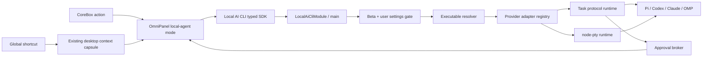

# 本机 AI CLI 快速调用 — Technical Design

## Design Summary

实现一个 macOS-only、环境变量门控、用户二次启用的本机代理运行边界。Tuff 不把四个 CLI 转换成 Intelligence provider，也不读取 import store；main 直接解析并启动用户设备上的 executable。

统一快捷体验复用 OmniPanel：CoreBox 动作与全局快捷键都打开同一面板；现有 `DesktopContextCapsule` 提供选中文本、剪贴板文本、当前应用和窗口标题。普通问答使用机器协议流式展示；高级模式使用真实 PTY 展示 CLI TUI。



## Decisions

| Area | Decision |
| --- | --- |
| Product surface | Extend OmniPanel instead of creating a second floating window. |
| CoreBox entry | Add a semantic input action in CoreBox’s `actions` area; do not add an always-matching search provider. |
| Global entry | Register a dedicated main shortcut through `ShortcutModule`; use a new id, not retired `core.box.aiQuickCall`. |
| Execution owner | New main-process `LocalAiCliModule`; existing `TerminalModule` remains unchanged and is not reused. |
| Task transport | Provider-specific machine protocols behind one normalized stream contract. |
| Interactive transport | `node-pty` launches the executable directly, never through a user-authored shell string. |
| Context | Reuse `OmniPanelModule.buildDesktopContextCapsule()` and `DesktopContextCapsule`; force `ocrText` absent for this surface. |
| Default cwd | `LocalAiCliModule` owns an isolated `workspace` subdirectory under its module directory. |
| History | CLI-native sessions only; Tuff keeps session ids and output in memory for the active panel lifecycle. |
| Approvals | One Tuff approval broker; adapter capability decides whether write mode is available. No textual TUI scraping. |
| Rollout | `process.platform === 'darwin' && process.env.TUFF_ENABLE_LOCAL_AI_CLI === '1'`; user setting remains independently false by default. |

## Shared Contracts

Types belong in `packages/utils` because they cross renderer/main and must not depend on the existing import runtime.

```ts
type LocalAiCliProviderId = Extract<
  AiCliProviderId,
  'pi' | 'codex' | 'claude' | 'oh-my-pi'
>

type LocalAiCliMode = 'task' | 'terminal'
type LocalAiCliAccess = 'answer-only' | 'workspace-read' | 'workspace-write'

type LocalAiCliTaskChunk =
  | { type: 'session'; callId: string; provider: LocalAiCliProviderId; nativeSessionId?: string }
  | { type: 'text-delta'; callId: string; text: string }
  | { type: 'status'; callId: string; status: 'starting' | 'running' | 'waiting-approval' }
  | { type: 'approval'; callId: string; approval: LocalAiCliApprovalRequest }
  | { type: 'complete'; callId: string; text: string }
  | { type: 'failed'; callId: string; code: LocalAiCliErrorCode; recoverable: boolean }
  | { type: 'cancelled'; callId: string }
```

The public start request contains only:

- canonical provider id;
- editable prompt;
- selected context items from the existing capsule;
- task/terminal mode;
- access profile;
- optional opaque main-issued workspace reference.

It never contains executable paths, raw environment variables, shell text, arbitrary cwd, native session paths, provider arguments or approval result ids selected by renderer.

Use the typed transport stream API for task chunks. PTY uses a separate owner-bound session contract:

- `create(provider, access, workspaceRef?, nativeSessionId?)`;
- `write(sessionId, data)`;
- `resize(sessionId, cols, rows)`;
- `kill(sessionId)`;
- server stream: raw ANSI `data` plus one terminal `exit` event.

Every session binds to the originating host `WebContents`. Cross-window, stale, completed or plugin-originated writes/resizes/kills fail closed.

## Main-Process Architecture

### `LocalAiCliModule`

New owner under `apps/core-app/src/main/modules/local-ai-cli/`.

Responsibilities:

1. Evaluate immutable startup Beta availability.
2. Read authoritative normalized app settings before every start.
3. Create the isolated Tuff AI workspace through the module directory boundary.
4. Resolve executable status and provider capability.
5. Own task, PTY and approval session maps.
6. Register host-only status and execution handlers.
7. Drain every process, PTY and approval during `onDestroy`/quit.

The environment gate controls availability, not persistence. Renderer receives only a typed availability boolean and stable reason. Raw environment values never cross transport.

### Settings shape

Add a typed default and main normalization:

```ts
localAiCli: {
  enabled: false,
  providers: {
    pi: { enabled: false, executableOverride?: string },
    codex: { enabled: false, executableOverride?: string },
    claude: { enabled: false, executableOverride?: string },
    'oh-my-pi': { enabled: false, executableOverride?: string },
  },
  defaultProvider: null,
}
```

Executable overrides are produced only by a main-owned file dialog and validated before persistence. Renderer never sends an arbitrary path string. The existing main storage normalizer must fill malformed/missing fields fail-closed rather than relying on the current catch-all index signature.

### Executable discovery

Resolution order, all in main:

1. validated persisted override;
2. current process `PATH`;
3. bounded macOS well-known roots (`/opt/homebrew/bin`, `/usr/local/bin`, `~/.local/bin`, `~/.bun/bin`, mise shims);
4. one fixed, timeout-bounded login-shell `command -v <fixed-command>` probe;
5. user “Locate executable” dialog.

For every candidate:

- resolve symlinks and require a regular executable file;
- run the adapter’s bounded `--version` probe;
- verify provider-specific output shape;
- cache only the validated path/version in memory;
- never log full home-relative paths outside local diagnostic UI.

No user string is interpolated into the login-shell command. The only accepted command names come from the fixed provider registry.

### Provider adapter interface

```ts
interface LocalAiCliAdapter {
  readonly id: LocalAiCliProviderId
  probe(executable: string): Promise<ProviderProbeResult>
  startTask(request: NormalizedTaskRequest, sink: TaskSink): Promise<TaskController>
  startPty(request: NormalizedPtyRequest, sink: PtySink): Promise<PtyController>
  resumeArgs(nativeSessionId: string, access: LocalAiCliAccess): readonly string[] | null
  capabilities(version: string): ProviderCapabilities
}
```

Each adapter owns its argument list, native event decoding, session id extraction, approval request/response mapping and stable error projection. Generic runtime code never switches on provider-native event fields.

### Provider protocol matrix

| Provider | Task/control protocol | Native session | Tuff approval path | PTY |
| --- | --- | --- | --- | --- |
| Pi | `pi --mode rpc` JSONL over stdin/stdout | RPC session event/id | Read-only immediately. Workspace-write requires a bundled per-run extension that blocks before tool execution and emits RPC `extension_ui_request`; unsupported versions remain read-only. | Direct `pi` via `node-pty`; write mode only when the approval bridge is proven for that mode/version. |
| OMP | `omp acp` JSON-RPC/ACP | ACP session id | ACP permission requests map to the approval broker. | Direct `omp` via `node-pty`; write mode requires a verified ACP/extension bridge, otherwise read-only. |
| Codex | `codex app-server --stdio` | app-server thread id | `approvalPolicy: untrusted` forces non-trusted/write commands through `item/commandExecution/requestApproval`; permission/file approval requests also map to allow-once/decline. `on-request` is forbidden here because the model may execute in-workspace writes without pausing. | Direct `codex resume <thread>` via `node-pty`; raw TUI is read-only until an external approval bridge is proven. |
| Claude Code | `@anthropic-ai/claude-agent-sdk` `query()` with `pathToClaudeCodeExecutable` set to the discovered user binary | Claude session id | `canUseTool` waits on the approval broker and returns allow/deny. The SDK’s bundled binary is never selected. | Direct `claude --resume <session>` via `node-pty`; raw TUI is read-only unless a PermissionRequest bridge is proven. |

The capability status is per provider *and per mode*. UI may show `taskWriteApproval: supported` while `terminalWriteApproval: unavailable`. This is not an error or unsafe fallback.

### Access profiles

- `answer-only`: no tools; default for ordinary quick reply/explain/summarize/rewrite.
- `workspace-read`: only fixed read/search tools and a canonical workspace; no write or arbitrary command tool.
- `workspace-write`: explicit per-call confirmation plus per-tool approval. Exact tool allowlists are adapter-owned.

An adapter must not construct a bypass/auto-approve flag. If native control cannot pause before execution, `workspace-write` is unavailable.

### Approval broker

`LocalAiCliApprovalBroker` owns `{ approvalId, callId, providerRequestId, ownerWebContentsId, expiresAt }`.

Rules:

- one response, exact owner, exact live call;
- decisions are only `allow-once` or `deny` in Beta;
- renderer cannot amend tool input or grant session-wide permission;
- bounded, redacted projection only: tool name, operation class, canonical workspace label and safe argument summary;
- timeout, stream cancellation, window destroy and app quit deny and release the native request;
- no approval object, arguments or decision enters ordinary logs or persistence.

### Process and PTY lifecycle

Task processes use direct `spawn` with `shell: false`, bounded stdout/stderr and incremental JSONL decoding. Prompts go through stdin/control messages, not argv or environment.

PTY uses official `node-pty` APIs: direct executable spawn, `onData`, `write`, `resize`, `onExit`, `kill`. Sessions have bounded dimensions and owner-checked input. Cancellation sends graceful termination first, then escalates after a short deadline and verifies the process group is gone.

`node-pty` is a native module. CoreApp currently sets `npmRebuild: false`; packaging must therefore:

- add `node-pty` to CoreApp runtime dependencies and runtime-module manifest;
- verify its `prebuilds/darwin-arm64`/native binding is copied;
- rely on the existing `**/*.node` `asarUnpack` rule;
- add an unpacked/package runtime `require('node-pty')` + spawn/resize/kill smoke.

The existing deprecated `xterm` dependency is reused for this Beta; migrating to `@xterm/xterm` is a separate change.

## Renderer and UX

### Settings

Add `SettingLocalAiCli.vue` under the existing Settings owner and mount it as `data-settings-section="local-ai-cli"` only when main reports Beta availability.

The section shows:

- Beta label and master switch;
- four provider rows: enabled, detected version/path label, read/write capability, refresh/locate action;
- default provider selection;
- global shortcut status and route to existing shortcut editing UI.

First-use navigation uses the existing `/setting?section=...` scroll convention. A pending draft is memory-only; enabling returns to the still-live OmniPanel state, but does not run it.

### OmniPanel

Add a local-agent mode/component rather than extending the synchronous `AiPreviewState` with more provider-specific fields.

The component owns:

- free-form prompt and four localized templates;
- context chips from `DesktopContextCapsule`, each removable;
- provider and access selectors;
- streamed Markdown/text result;
- stop, retry, copy, explicit paste-back and terminal-continuation actions;
- approval sheet rendered above the running result;
- expandable terminal surface using xterm.

The current context owner already captures exactly the approved text context. `ocrText` is dropped and cannot be reintroduced by renderer.

### CoreBox and shortcut

- CoreBox renders a semantic “交给本机代理” action beside existing input actions when the main status says Beta is available. It sends current query text to OmniPanel; disabled user settings route to first-use setup.
- A new shortcut id (for example `local-ai-cli.quick-open`) is registered through `ShortcutModule` only on macOS Beta. It is configurable through existing shortcut storage; callback opens OmniPanel with selection capture enabled.
- Do not reuse retired `core.box.aiQuickCall`.

### Copy and paste-back

Copy is explicit. Paste-back reuses the existing clipboard/auto-paste capability boundary:

1. keep the pre-panel active-app identity in the context capsule;
2. user clicks paste-back;
3. main verifies the call/result is live, writes the selected result to clipboard, hides OmniPanel, restores/focuses the original target when possible, and invokes the existing simulated-paste capability;
4. target mismatch, missing Accessibility permission or stale context returns a stable failure without typing elsewhere.

No automatic paste occurs on completion.

## Compatibility and Rollback

- Missing env gate: no settings surface, CoreBox action, shortcut or execution capability.
- Unsupported OS: status only reports unavailable; no native runtime load.
- Missing `node-pty`: task mode may remain available in development diagnostics, but terminal capability is unavailable; packaged acceptance must fail before release.
- Unsupported provider version: provider remains visible with a diagnostic; read-only and write capabilities are negotiated independently.
- Rollback is removal/disablement of the environment variable. Persisted user choices are inert while the gate is closed and do not start processes.

## Key Risks

1. **Approval parity**: provider control protocols differ. Write capability must be capability-gated per version/mode; “looks like an approval prompt in ANSI” is not proof.
2. **GUI executable discovery**: login-shell probing can execute user shell startup. Keep it fixed, bounded and after deterministic paths; manual locate remains the final path.
3. **Native packaging**: `node-pty` can work in dev and be absent in packaged runtime because `npmRebuild` is disabled. Packaged native smoke is mandatory.
4. **Paste target drift**: OmniPanel changes focus. Paste-back must bind to captured target identity and fail rather than paste into an unknown app.
5. **Sensitive content**: selection/clipboard and agent output must remain operation-local and absent from logs, telemetry and Tuff history.
