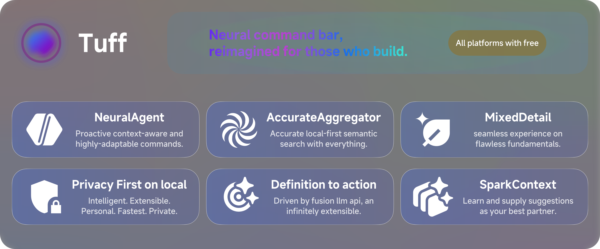
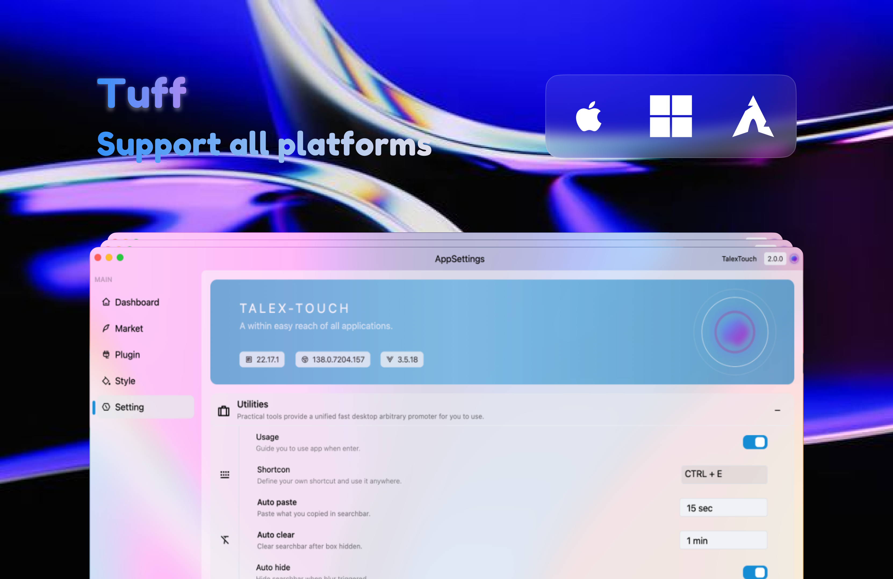

---

  
  
  
   
  English | [简体中文](./README.zh-CN.md)

## 📌 What is tuff?

## 🔷 Introduction

Tuff (formerly TalexTouch) is a local-first, AI-native, and infinitely extensible desktop command center built with ai-native. It's designed to be a seamless extension of your workflow, helping you find anything and execute any command, faster.

> Due to developer schedule reasons, it will no longer be actively compatible with Linux, and the Windows version testing will be delayed by two months compared to macos. (Sorry!!!)

### Search all apps on device.

### Search files immediately.

### Plugin translate.

### Manage plugins on your own.

### Settings page

## 🚀 Background

**We believe your most powerful tool should be as adaptable as you are. Tuff is a new kind of command center—a foundational, open-source layer for your OS, crafted to anticipate your intent and seamlessly integrate with your unique workflow. Hackable to its core and open by design, it’s ready to be shaped by you.**

## 🦋 Beautiful UI Design

The design style of Tuff is inspired by TDesignS, which is simple and elegant. The themes, fonts, and icons have been carefully adjusted to provide users with a better experience.

### The best than ever UI design

### The fantastic animation design

> Some animations have been removed in the latest version.

#### New but not the latest

#### Out of date

## 🗻 Rich Functionality

Tuff integrates a variety of practical functions to make your desktop smarter and more efficient.
- **Core Utilities:** Supports multiple windows, shortcuts, clipboard management, screenshots, timers, and more.
- **AI-Powered Search:** Understands natural language to find files, apps, and actions.
- **Contextual Intelligence:** Proactively suggests commands based on your current context.
- **Extensible:** Supports custom plugins ("Capabilities") to extend its functionality.
- **Direct preview calculation:** Inline arithmetic/unit/currency/time queries now render instant cards, including scientific constants, so results are copy-ready.
- **Bring Your Own LLM:** Allows you to connect to your own private cloud or any self-hosted Large Language Model for ultimate privacy and control.
- **Unified Download Center:** Centralized download management with progress tracking, resume support, and automatic updates.

## 🍀 Simple and Easy-to-Use Operations

The operation of Tuff is very simple and user-friendly, allowing users to easily complete various tasks. You only need to open the required function through the menu or shortcut keys to enjoy the convenience brought by Tuff.

## 🔐 Secure and Reliable

We attach great importance to the security and privacy of our users. We guarantee that user data will not be leaked or abused and provide multiple security mechanisms to protect user usage safety.

If you are looking for a cross-platform and beautifully designed desktop software that is easy to use, Tuff is your best choice. It not only provides rich functionality but also has a good user experience with an open community ecology. Welcome to use Tuff and experience a new desktop experience!

## 🤝 License

This project is open-sourced under the **MIT License**.

## ⁉️ Issue

> Any issues not match `issue template` will be closed directly!

Please keep in mind that developers are under no obligation to solve your Issue even in this project, as well as open source and maintenance are based on the free time of developers.

## ❤️ Contribution

#### [Click here to learn more](./.github/docs/contribution/CONTRIBUTING.md)

### Who works with us

<!-- readme: collaborators,contributors -start -->
<table>
<tr>
    <td align="center">
        <a href="https://github.com/TalexDreamSoul">
            
             
            <b>TalexDreamSoul</b>
        </a>
    </td>
    <td align="center">
        <a href="https://github.com/lorsque-sir">
            
             
            <b>Lorsque</b>
        </a>
    </td>
    <td align="center">
        <a href="https://github.com/fossabot">
            
             
            <b>Fossabot</b>
        </a>
    </td></tr>
</table>
<!-- readme: collaborators,contributors -end -->

## Star History

<a href="https://www.star-history.com/#talex-touch/tuff&Date">
 <picture>
   <source media="(prefers-color-scheme: dark)" srcset="https://api.star-history.com/svg?repos=talex-touch/tuff&type=Date&theme=dark" />
   <source media="(prefers-color-scheme: light)" srcset="https://api.star-history.com/svg?repos=talex-touch/tuff&type=Date" />
   
 </picture>
</a>

## ✉️ Contact

Through email (TalexDreamSoul@Gmail) or open an issue.

Copyright © 2022-PRESENT TalexDreamSoul
