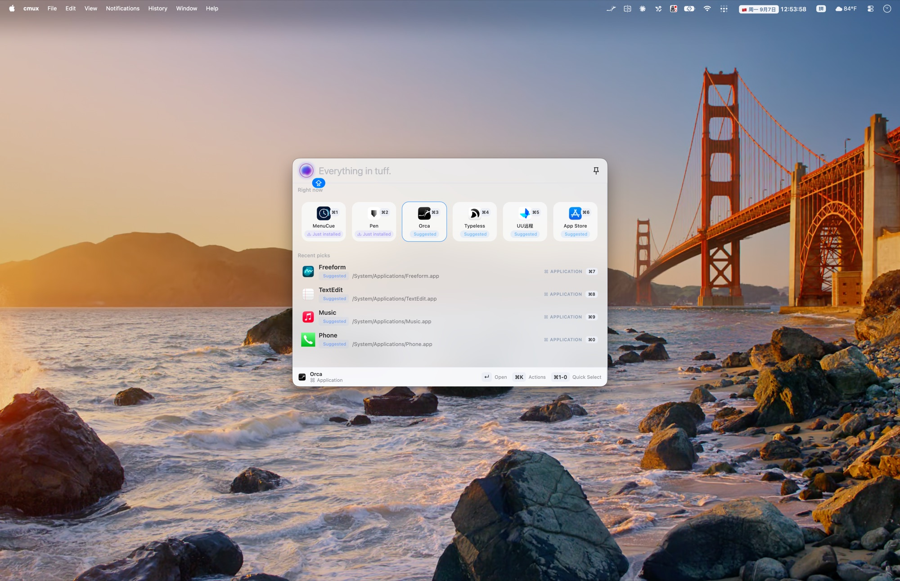

<div align="center">

  

  <h1>Tuff</h1>

  <p><b>The command center, reimagined for creators.</b></p>

  [](https://github.com/talex-touch/tuff/releases)
  [](https://github.com/talex-touch/tuff/releases)
  [](https://github.com/talex-touch/tuff/issues)
  [](./LICENSE)
  [](https://linux.do)

  [Website](https://tuff.tagzxia.com) · [Download](https://github.com/talex-touch/tuff/releases) · [Docs](https://tuff.tagzxia.com/docs) · [Plugin store](https://tuff.tagzxia.com/store)

  English | [简体中文](./README.zh-CN.md)

</div>



## What is Tuff?

Tuff (formerly TalexTouch) is a local-first, AI-native, extensible desktop command center. It helps you find applications and files, run commands, automate workflows, and connect governed AI providers from one keyboard-first surface.

Press <kbd>⌘</kbd> <kbd>E</kbd> (<kbd>Ctrl</kbd> <kbd>E</kbd> on Windows and Linux) from anywhere to open CoreBox.

## ⬇️ Download

Prebuilt packages for all three platforms are published on the [Releases page](https://github.com/talex-touch/tuff/releases).

| Platform | Packages |
| --- | --- |
| macOS | `.dmg` / `.zip`, Apple Silicon and Intel |
| Windows | `.exe` installer (x64) |
| Linux | `.deb` (recommended) / `.AppImage` |

On Ubuntu 24.04 and later, install from the `.deb` rather than the AppImage. 24.04 restricts
unprivileged user namespaces by default, which Electron's sandbox needs; the `.deb` registers an
AppArmor profile granting `userns` during installation, and an AppImage has no install step in
which to do that. If you must use the AppImage, either allow it for that session with
`sudo sysctl -w kernel.apparmor_restrict_unprivileged_userns=0`, or use the `.deb`. Tracked in
[#213](https://github.com/talex-touch/tuff/issues/213), which is still waiting on a report that
says which of the two was used.

## 📌 Release and platform status

The latest stable build and the current pre-release are both listed on the [Releases page](https://github.com/talex-touch/tuff/releases); the in-development version is whatever the [root package manifest](./package.json) and [CoreApp package manifest](./apps/core-app/package.json) declare. Exact version numbers are deliberately not repeated in this README, so it cannot drift away from them.

The `2.4.14` public-release gate is intentionally strict: macOS, Windows, and Linux must each pass real installation, N→N+1 update, startup health, and recovery evidence before release. Stable launch/search and individually verified official plugins are the initial public scope; AI and unfinished UI surfaces remain explicitly Beta or unavailable. See the [current stabilization plan](./docs/plan-prd/TODO.md) and the [cross-platform audit](./.trellis/tasks/07-13-search-crossplatform-audit/prd.md).

A stable source version does not imply identical maturity on all three platforms: per-platform capability and fallback boundaries follow that platform's own acceptance evidence.

## 🚀 Background

**We believe your most powerful tool should be as adaptable as you are. Tuff is a new kind of command center—a foundational, open-source layer for your OS, crafted to anticipate your intent and seamlessly integrate with your unique workflow. Hackable to its core and open by design, it’s ready to be shaped by you.**

## 🗻 Features

- **Universal search** — applications, files, plugin actions, calculations, units, currencies, and time, all from CoreBox.
- **AI-powered search** — natural language queries over files, apps, and actions.
- **Contextual intelligence** — proactively suggests commands based on what you are doing.
- **Inline previews** — arithmetic, unit, currency, time, and scientific-constant queries render instant, copy-ready cards.
- **Extensible** — permission-gated plugins ("Capabilities") and typed SDKs extend the host.
- **Bring your own LLM** — connect a private cloud, a hosted provider, or any self-hosted model.
- **Core utilities** — multiple windows, shortcuts, clipboard management, screenshots, timers, and more.
- **Unified download center** — centralized progress tracking and resume support.
- **Host-owned boundaries** — clipboard, screenshot, workflow, download, and automation capabilities all run behind permission gates.

### Plugin management policy

- Plugins installed from the official marketplace have the `dev` entry in their manifest disabled during installation, so they cannot accidentally connect to a development server.
- Every plugin's origin is recorded in the database, and uninstalling removes the plugin directory and its cached data along with it.

## 🦋 Beautiful UI Design

The design style of Tuff is inspired by TDesignS, which is simple and elegant. The themes, fonts, and icons have been carefully adjusted to provide users with a better experience.


## 🍀 Simple and Easy-to-Use Operations

The operation of Tuff is very simple and user-friendly, allowing users to easily complete various tasks. You only need to open the required function through the menu or shortcut keys to enjoy the convenience brought by Tuff.

## 🔐 Secure and Reliable

We attach great importance to the security and privacy of our users. We guarantee that user data will not be leaked or abused and provide multiple security mechanisms to protect user usage safety.

If you are looking for a cross-platform and beautifully designed desktop software that is easy to use, Tuff is your best choice. It not only provides rich functionality but also has a good user experience with an open community ecology. Welcome to use Tuff and experience a new desktop experience!

## 📚 Documentation

- [Docs index](./docs/INDEX.md)
- [Current stabilization plan](./docs/plan-prd/TODO.md)
- [Project PRDs and roadmap](./docs/plan-prd/README.md)
- [Contribution guide](./.github/docs/contribution/CONTRIBUTING.md)
- [Repository development instructions](./AGENTS.md)

## 💚 Community

<a href="https://linux.do"></a>

Thanks to the [linux.do](https://linux.do) community for the attention, feedback, and testing that keep shaping Tuff. Questions, bug reports, and plugin ideas are welcome there and in [GitHub Issues](https://github.com/talex-touch/tuff/issues).

## 🤝 License

This project is open-sourced under the **Mozilla Public License 2.0 (MPL-2.0)** — see [`LICENSE`](./LICENSE).

## ⁉️ Issue

> Any issues not match `issue template` will be closed directly!

Please keep in mind that developers are under no obligation to solve your Issue even in this project, as well as open source and maintenance are based on the free time of developers.

## ❤️ Contribution

### Development prerequisites

- Runtime, dependency, and build-tool versions are authoritative in the [root package manifest](./package.json), [CoreApp package manifest](./apps/core-app/package.json), [workspace catalog](./pnpm-workspace.yaml), and [lockfile](./pnpm-lock.yaml).
- Use Corepack and a Node.js version allowed by the root manifest; do not rely on version numbers copied into this README.

```bash
corepack enable
pnpm install
pnpm core:dev
```

#### [Click here to learn more](./.github/docs/contribution/CONTRIBUTING.md)

### Who works with us

<!-- readme: collaborators,contributors -start -->
<table>
<tr>
    <td align="center">
        <a href="https://github.com/TalexDreamSoul">
            
            <br />
            <sub><b>TalexDreamSoul</b></sub>
        </a>
    </td>
    <td align="center">
        <a href="https://github.com/lorsque-sir">
            
            <br />
            <sub><b>Lorsque</b></sub>
        </a>
    </td>
    <td align="center">
        <a href="https://github.com/fossabot">
            
            <br />
            <sub><b>Fossabot</b></sub>
        </a>
    </td></tr>
</table>
<!-- readme: collaborators,contributors -end -->

## Star History

<a href="https://www.star-history.com/#talex-touch/tuff&Date">
 <picture>
   <source media="(prefers-color-scheme: dark)" srcset="https://api.star-history.com/svg?repos=talex-touch/tuff&type=Date&theme=dark" />
   <source media="(prefers-color-scheme: light)" srcset="https://api.star-history.com/svg?repos=talex-touch/tuff&type=Date" />
   
 </picture>
</a>

## ✉️ Contact

Through email (TalexDreamSoul@Gmail) or open an issue.

Copyright © 2022-PRESENT TalexDreamSoul
