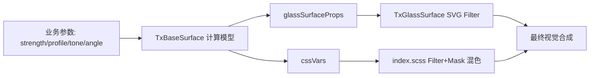

# BaseSurface Refraction 渲染模块分析

## 目标

沉淀 `TxBaseSurface` 在 `refraction` 模式下的渲染机制，明确“参数抽象层 -> 底层混色/位移实现 -> 运动降级恢复”的完整链路，指导后续维护与扩展。

## 涉及文件

- `/packages/tuffex/packages/components/src/base-surface/src/TxBaseSurface.vue`
- `/packages/tuffex/packages/components/src/base-surface/src/style/index.scss`
- `/packages/tuffex/packages/components/src/base-surface/src/types.ts`
- `/packages/tuffex/packages/components/src/glass-surface/src/TxGlassSurface.vue`
- `/packages/tuffex/packages/components/src/card/src/TxCard.vue`

## 模块职责

1. **TxBaseSurface（材质调度层）**
   - 管理 `pure/mask/blur/glass/refraction` 统一模式
   - 在运动中处理 fallback 逻辑
   - 将 refraction 抽象参数映射为 glass/filter/mask 所需变量

2. **TxGlassSurface（折射执行层）**
   - 使用 SVG filter + displacement map 实现 RGB 通道位移折射
   - 在能力不足环境降级为 backdrop blur 或普通半透明背景

3. **Style 层（着色/混色层）**
   - 使用 CSS variables + color-mix + 多重 gradient 组成高光与雾化效果

## 数据与参数流

## Refraction 核心机制

### 1) 强度模型

`refractionStrength` 先归一化，再经 `smoothstep + profile 曲线` 处理，避免低强度突变并增强高强度表现。

### 2) 方向与色散

`refractionAngle` 决定主方向，结合 profile 生成 RGB 通道不同角偏移，形成可控色散与方向感。

### 3) 色调模型

`tone(mist/balanced/vivid)` 输出 tint 权重、对比/亮度增益、halo/streak 权重，并写入 CSS 变量参与 `color-mix` 合成。

### 4) 运动保护

`moving` 或 `autoDetect` 触发时切 fallback（默认 `mask`）；停止运动后走“快速拉起 + 渐进释放”恢复曲线，降低视觉抖动。

## 与 Card 的协作

`TxCard` 将 refraction 参数透传给 `TxBaseSurface`，并扩展了：

- pointer light follow（光源随鼠标）
- spring 平滑参数
- inertia 与 `surfaceMoving` 联动

因此：`TxCard` 负责业务交互，`TxBaseSurface` 负责材质渲染。

## 已知注意点

1. `fallbackMaskOpacity` 在 `types.ts` 已定义，但 `TxBaseSurface` 当前逻辑未显式消费该字段。
2. `refractionRenderer` 已有类型与 class 注入，当前主路径仍以 SVG 渲染为主。

## 相关文档

- `docs/engineering/base-surface-refraction-advanced-rendering.md`
- `apps/nexus/content/docs/dev/components/base-surface.zh.mdc`
