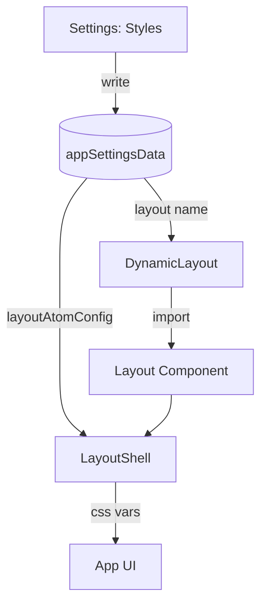

# 布局原子化与动态布局系统

## 目标

1. 让不同 Layout 在预览与实际 UI 中差异明显（不仅是圆角/透明度微调）。
2. 支持多种预设 Layout，并允许用户以“原子配置”方式自由组合。
3. 预留自定义 CSS 扩展点（带保守的安全限制）。

## 现状与入口

- Layout 动态加载入口：`/apps/core-app/src/renderer/src/components/layout/DynamicLayout.vue`
- Layout 切换与缓存：`/apps/core-app/src/renderer/src/modules/layout/useDynamicTuffLayout.ts`
- Layout 注册表：`/apps/core-app/src/renderer/src/modules/layout/layouts-definition.ts`

## 原子化结构

原子配置类型（存储在 AppSettings 中）：\n
- `LayoutAtomConfig`：`/packages/utils/common/storage/entity/layout-atom-types.ts`

原子解析器：\n
- `resolveLayoutAtomsToCSSVars`：`/apps/core-app/src/renderer/src/modules/layout/atoms/atomResolver.ts`

### CSS 变量注入

`LayoutShell` 支持接收 `atomConfig` 并将其解析为 CSS Vars 注入到根节点：\n
- `LayoutShell.vue`：`/apps/core-app/src/renderer/src/views/layout/shared/LayoutShell.vue`

关键变量（示例）：\n
- `--layout-view-radius`\n
- `--layout-header-border`\n
- `--layout-header-fake-opacity`\n
- `--layout-aside-border`\n
- `--layout-aside-opacity`\n
- `--layout-display-nav-width`

### Aside 位置适配

`LayoutShell` 通过 `data-aside-position` 与辅助 class 调整布局：\n
- `aside-hidden`：隐藏侧栏\n
- `aside-right`：侧栏在右侧\n
- `aside-bottom`：Dock 结构（侧栏移动到底部，内容区在上）

## 预设 Layout

原子预设：\n
- `/apps/core-app/src/renderer/src/modules/layout/atoms/presets.ts`

布局组件：\n
- `simple`：`/apps/core-app/src/renderer/src/views/layout/simple/SimpleLayout.vue`\n
- `flat`：`/apps/core-app/src/renderer/src/views/layout/flat/FlatLayout.vue`\n
- `compact`：`/apps/core-app/src/renderer/src/views/layout/compact/CompactLayout.vue`\n
- `minimal`：`/apps/core-app/src/renderer/src/views/layout/minimal/MinimalLayout.vue`\n
- `classic`：`/apps/core-app/src/renderer/src/views/layout/classic/ClassicLayout.vue`\n
- `card`：`/apps/core-app/src/renderer/src/views/layout/card/CardLayout.vue`\n
- `dock`：`/apps/core-app/src/renderer/src/views/layout/dock/DockLayout.vue`\n
- `custom`：复用 `SimpleLayout`（依赖保存的 `layoutAtomConfig.preset === 'custom'`）

## 数据流（简化）

