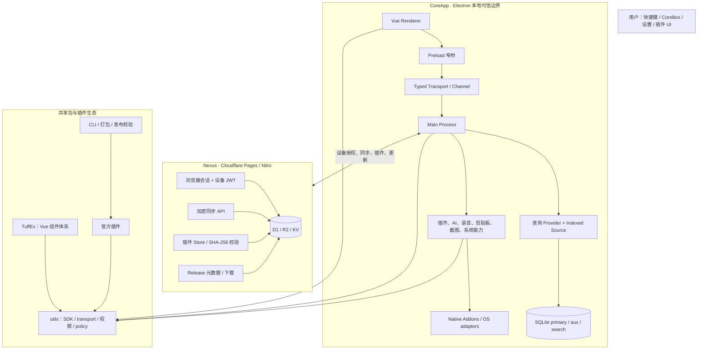

# Tuff 当前架构与演化分析

> **快照日期**：2026-09-04
> **范围**：`master` 工作树、Trellis 任务账本、近期提交、CoreApp、Nexus、共享包与官方插件。
> **证据口径**：源码与配置是架构事实；Trellis 任务状态、审计报告和历史文档只能证明其记录时的计划或证据，不能替代当前运行环境验证。当前工作树存在未提交的语音相关改动；本文不将其视作已发布能力。

## 结论

Tuff 已经不是单体启动器，而是一个由本地可信宿主、共享能力契约、受治理插件生态和云端控制面组成的本地优先桌面平台。其技术骨架基本成立：桌面端持有系统能力、搜索索引、SQLite 和插件执行；Nexus 负责身份、同步、插件和更新分发；`utils`、TuffEx、CLI 与包策略构成跨层契约。

当前瓶颈不在功能覆盖，而在交付可信度与并行工作量：发布/OTA/native addon、搜索分库运行时证据、跨平台能力差异、Nexus 已部署证据以及任务账本漂移尚未收口。全局路线已经明确要求先处理 release/runtime，再处理 search/cross-platform；继续扩大 AI、UI 或新平台能力会稀释最重要的验收资源。[`docs/plan-prd/TODO.md:5-15`](../../plan-prd/TODO.md)

## 产品与系统边界

Tuff 的公开定位是 local-first、AI-native、可扩展的桌面命令中心：用户可通过一个键盘优先表面搜索应用和文件、执行命令与工作流，并连接受治理的 AI provider。桌面端同时拥有剪贴板、截图、自动化与系统能力；插件通过权限受控的 SDK 扩展该宿主。[`README.md:13-36`](../../README.md)

## 架构分层

### CoreApp：本地能力与可信执行面

CoreApp 以 Electron Main 为根。Main 负责生命周期、模块装配、数据库与配置、搜索索引、插件、更新和 OS 能力；Preload 在 context isolation 下暴露窄桥；Renderer 负责 Vue 的 hydration、路由、i18n 和交互。[`apps/core-app/src/main/index.ts:200-245`](../../apps/core-app/src/main/index.ts)、[`apps/core-app/src/main/index.ts:333-425`](../../apps/core-app/src/main/index.ts)、[`apps/core-app/src/preload/index.ts:157-221`](../../apps/core-app/src/preload/index.ts)、[`apps/core-app/src/renderer/src/main.ts:177-235`](../../apps/core-app/src/renderer/src/main.ts)

Main 的窗口安全基线、导航拦截和 sender/plugin identity 解析均集中在宿主侧。这个方向正确：Renderer 与插件不应直接拥有 Electron、数据库或系统权限。[`apps/core-app/src/main/core/window-security-profile.ts:1-71`](../../apps/core-app/src/main/core/window-security-profile.ts)、[`apps/core-app/src/main/core/touch-window.ts:38-126`](../../apps/core-app/src/main/core/touch-window.ts)、[`apps/core-app/src/main/core/channel-core.ts:165-299`](../../apps/core-app/src/main/core/channel-core.ts)

本地数据以 primary、aux、search 三类 SQLite 连接承载业务、辅助数据与可重建索引。搜索分库开关已默认开启，空 search DB 的语义是一次全量重建，`=0` 仅为紧急回退而不是默认路径。[`apps/core-app/src/main/modules/database/index.ts:74-159`](../../apps/core-app/src/main/modules/database/index.ts)、[`apps/core-app/src/main/db/runtime-flags.ts:16-29`](../../apps/core-app/src/main/db/runtime-flags.ts)、[`docs/plan-prd/TODO.md:11-15`](../../plan-prd/TODO.md)

搜索将查询 Provider 与维护数据的 Indexed Source 分离；索引运行时负责 source 注册、任务准入、scan/watch/reconcile 和 drain。这是从“单一搜索函数”向可维护数据管线演进的关键边界。[`apps/core-app/src/main/modules/box-tool/search-engine/search-core.ts:157-205`](../../apps/core-app/src/main/modules/box-tool/search-engine/search-core.ts)、[`apps/core-app/src/main/modules/box-tool/search-engine/indexing-runtime.ts:128-203`](../../apps/core-app/src/main/modules/box-tool/search-engine/indexing-runtime.ts)

### 插件：能力扩展，但非能力所有者

插件通过 `utils` 暴露的 SDK facade 和 typed transport 访问宿主能力，而不是直接 IPC。SDK 版本、权限原因、manifest、签名、文件清单、source/staged/registry package policy 共同构成准入链路。[`packages/utils/plugin/sdk/index.ts:3-51`](../../packages/utils/plugin/sdk/index.ts)、[`packages/utils/plugin/sdk-version.ts:3-190`](../../packages/utils/plugin/sdk-version.ts)、[`packages/utils/plugin/package-policy.ts:407-603`](../../packages/utils/plugin/package-policy.ts)

插件的配置、secret 和 SQLite 访问由 Main 的 storage transport 承接，并按 activation identity 校验。凭据先迁入 secure store，再持久化普通配置；插件不拥有独立的安全存储通道。[`apps/core-app/src/main/modules/plugin/services/plugin-storage-transport-service.ts:43-154`](../../apps/core-app/src/main/modules/plugin/services/plugin-storage-transport-service.ts)

当前 secure store 使用本地加密根密钥。系统 credential storage 关闭或不可用时会显式报告 degraded/unavailable；因此不能默认把其行为等同于 macOS Keychain 或 Windows Credential Manager。[`apps/core-app/src/main/utils/secure-store.ts:9-66`](../../apps/core-app/src/main/utils/secure-store.ts)、[`apps/core-app/src/main/utils/secure-store.ts:599-617`](../../apps/core-app/src/main/utils/secure-store.ts)

### 共享包与构建生态：实际架构地基

pnpm workspace 将 CoreApp、Nexus、TuffEx 嵌套组件包、分析应用、共享 packages 和官方 plugins 纳入同一依赖图，同时排除构建产物和 CoreApp 运行时安装插件目录。[`pnpm-workspace.yaml:2-33`](../../pnpm-workspace.yaml)

`utils` 是 SDK、transport、permission 和 package policy 的基础；TuffEx 与 intelligence 相关包依赖其契约。TuffEx 是跨桌面、Nexus 与插件的 Vue 原语层，变更须同步 Nexus 文档和示例。[`packages/utils/package.json:17-99`](../../packages/utils/package.json)、[`packages/tuffex/package.json:69-105`](../../packages/tuffex/package.json)、[`.trellis/spec/frontend/index.md:74-84`](../../.trellis/spec/frontend/index.md)

插件发布并非单包发布：release registry 显式映射 source、manifest、CoreApp bundled projection 与构建/测试 gate，CLI、unplugin、TuffEx 等还存在前置构建顺序。[`scripts/lib/plugin-release-targets.cjs:25-129`](../../scripts/lib/plugin-release-targets.cjs)、[`scripts/test-plugins.mjs:75-127`](../../scripts/test-plugins.mjs)

### Nexus：云端控制面，而非单纯文档站

Nexus 是 Nuxt/Nitro 的 Cloudflare Pages 应用，使用 D1、R2、KV，承载文档、账户、设备授权、同步、插件 Store 与 release 交付。[`apps/nexus/nuxt.config.ts:75-96`](../../apps/nexus/nuxt.config.ts)、[`apps/nexus/nuxt.config.ts:155-168`](../../apps/nexus/nuxt.config.ts)、[`wrangler.toml:1-72`](../../wrangler.toml)

浏览器 Cookie session 与桌面设备 JWT 明确隔离：浏览器会话审批 device code，桌面轮询后获得 device-bound access/refresh token；设备撤销和 token version 会使旧 token 失效。[`apps/nexus/server/utils/auth.ts:394-557`](../../apps/nexus/server/utils/auth.ts)、[`apps/nexus/server/api/app-auth/device/approve.post.ts:42-169`](../../apps/nexus/server/api/app-auth/device/approve.post.ts)、[`apps/nexus/server/api/app-auth/device/poll.get.ts:5-85`](../../apps/nexus/server/api/app-auth/device/poll.get.ts)

同步 API 使用 bearer、`x-device-id`、`x-sync-token` 和加密 payload/oplog，提供冲突与 cursor 语义。插件下载验证准入、R2 对象与 SHA-256，异常对象会被隔离；Release API 则按平台/架构交付资产。[`apps/nexus/openapi/nexus-sync.yaml:1-24`](../../apps/nexus/openapi/nexus-sync.yaml)、[`apps/nexus/server/api/v1/sync/push.post.ts:17-62`](../../apps/nexus/server/api/v1/sync/push.post.ts)、[`apps/nexus/server/api/store/plugins/[slug]/download.get.ts:42-87`](../../apps/nexus/server/api/store/plugins/[slug]/download.get.ts)、[`apps/nexus/server/api/releases/index.get.ts:11-35`](../../apps/nexus/server/api/releases/index.get.ts)

## 当前结构性债务

### 两个高聚合入口

`PluginModule` 跨插件、Nexus、数据库、语音与多种 host capability；`FileProvider` 跨扫描、watch、reconcile、embedding、worker 与索引写入。二者说明边界尚未失效，但新增需求继续直接注入会持续放大启动、隔离、测试与运行时协调成本。后续拆分应以 capability domain 的启动、停止、健康检查和 ownership 为边界，不能仅按文件长度拆目录。[`apps/core-app/src/main/modules/plugin/plugin-module.ts:55-218`](../../apps/core-app/src/main/modules/plugin/plugin-module.ts)、[`apps/core-app/src/main/modules/box-tool/addon/files/file-provider.ts:35-182`](../../apps/core-app/src/main/modules/box-tool/addon/files/file-provider.ts)

### 交付与文档口径漂移

当前 root 与 CoreApp package 都声明 `2.4.14-beta.23`，README 仍写 beta.2，某个全产品 PRD 又记录 beta.14。版本口径不一致会直接破坏“当前版本已验收”的结论可信度。[`package.json:5`](../../package.json)、[`apps/core-app/package.json:2-4`](../../apps/core-app/package.json)、[`README.md:17-21`](../../README.md)、[`.trellis/tasks/08-23-full-product-completion/prd.md:7-12`](../../.trellis/tasks/08-23-full-product-completion/prd.md)

### 跨平台能力不是同等成熟

Windows、macOS 与 Linux 的文件搜索、应用发现、OCR 与更新安装能力仍不对称。Linux 目前是最弱平台；macOS Intel/Universal 的发行策略尚未形成产品决策；截图/audio native addon 的发布链证据还未完全接入正式 release path。[`.trellis/tasks/07-13-search-crossplatform-audit/prd.md:33-42`](../../.trellis/tasks/07-13-search-crossplatform-audit/prd.md)、[`.trellis/tasks/07-13-search-crossplatform-audit/prd.md:95-115`](../../.trellis/tasks/07-13-search-crossplatform-audit/prd.md)

### 搜索写入模型已修正，但运行时证据未收口

单写者、搜索分库、过滤、usage、MessagePort 等基础问题已有大量已完成的修复记录；剩余风险集中于 isolated-profile runtime parity、残余 writer/statement ownership、reconcile 持久化压测，以及 Linux 的诚实降级反馈。[`.trellis/tasks/07-13-search-crossplatform-audit/prd.md:50-93`](../../.trellis/tasks/07-13-search-crossplatform-audit/prd.md)、[`.trellis/tasks/07-13-search-crossplatform-audit/prd.md:139-147`](../../.trellis/tasks/07-13-search-crossplatform-audit/prd.md)

### Nexus 本地结构成熟，线上证据仍不足

Nexus 的认证、同步和分发边界相对完整，但仓库明确说明本地证据不能替代已部署 OAuth、Dashboard 或 Preview 的实证。R2 缺失时的内存 fallback 对预览开发有价值，但不能被视为多实例生产持久化路径。[`apps/nexus/README.md:122-130`](../../apps/nexus/README.md)、[`apps/nexus/server/utils/pluginPackageStorage.ts:35-120`](../../apps/nexus/server/utils/pluginPackageStorage.ts)、[`apps/nexus/server/utils/releaseAssetStorage.ts:24-69`](../../apps/nexus/server/utils/releaseAssetStorage.ts)

## 演化路线

| 阶段 | 主要动作 | 架构意义 |
|---|---|---|
| 2026-07 | 搜索会话、typed transport、单写者、文件过滤、跨平台审计 | 把隐性并发和数据风险显式为可验证契约 |
| 2026-08 上旬 | 图标崩溃、索引数据安全、native/截图、权限边界、搜索热路径 | 从“功能存在”推进到“本地运行时可证” |
| 2026-08 中下旬 | Nexus 认证/插件发布、TuffEx 与文档、Node 26/pnpm 11 迁移 | 提升控制面与开发体验，但扩大系统耦合 |
| 2026-09 当前 | OTA fallback、Linux musl、搜索 freshness、CoreBox 空态、语音统一候选 | 进入发布可靠性与局部体验并行阶段 |

近期代表提交包括搜索 freshness 与现代应用别名（`cc120aeff`、`dba3d4d80`）、Linux musl runtime closure（`77f87e9d4`）、OTA fallback 与 CoreBox grouping（`296e523ca`、`9adb2ba6b`）、发布回滚 metadata 修复（`32a0d4491`）。提交活跃证明了迭代速度，不证明每个发布目标已有真实环境证据。

## 推荐执行顺序

### 1. 先关闭交付可信度

对同一 SHA 完成三平台发布物、签名/公证、OTA、Native addon、Nexus release metadata 的可追溯闭环。完成标准应是目标平台下载包的真实启动、更新与声明的回滚语义，而不是 CI 通过。

### 2. 再关闭本地数据可靠性

完成 search split 的 isolated-profile parity、残余 writer 迁移、SQLite client/statement owner 收敛、reconcile 持久化实测。该阶段结束前，暂停大规模搜索排序和推荐策略扩展。

### 3. 最后推进 Nexus 与插件生态的真实验收

补齐 deployed OAuth/Dashboard/SSG 证据，随后做官方插件 `.tpex` 上传、签名、下载、安装与权限路径的端到端验证。AI、语音与 UI 改造可以继续存在于明确隔离的 Beta 泳道，但不得占用前两条泳道的验收资源。

## 任务治理结论

当前全局 TODO 定义的顺序是 release/runtime → search/cross-platform；这应高于任何功能扩张。[`docs/plan-prd/TODO.md:5-10`](../../plan-prd/TODO.md)

Trellis 的活动任务统计在不同入口出现不一致：会话上下文列出大量父子任务，而 `task.py list --status in_progress` 的顶层查询只返回 19 项。这个差异本身不表明任务失败，但表明 parent/child/status/evidence 的账本不足以作为单一产品完成事实源。应先清理已完成或空记录、显式标注 blocker 和证据，再继续新增任务树。

## 明确不应抢跑的方向

在发布和数据可靠性基线建立前，不应把移动端、`video.generate`、复杂 Agent 工作流、全新跨平台能力声明或纯 UI 扩张视为主线。现有 roadmap 已把其中大部分归入后置或长期债务。[`docs/plan-prd/TODO.md:36-40`](../../plan-prd/TODO.md)、[`docs/plan-prd/TODO-BACKLOG-LONG-TERM.md:27-46`](../../plan-prd/TODO-BACKLOG-LONG-TERM.md)

## 附录：分析边界

- 本文未执行构建、测试、打包、发布、部署或生产 API 调用。
- 文中“已完成”仅在 Trellis 审计/任务明确标记完成时使用；不等价于当前版本或目标平台验收通过。
- 当前未提交的语音、剪贴板与 Rust session 改动保持原样，不纳入对外能力、架构完成度或发布结论。
