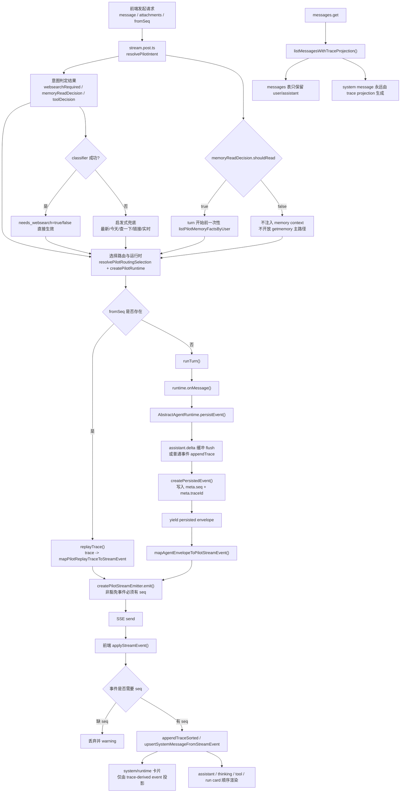

# Pilot 单流运行时说明

> 更新时间: 2026-04-06
> 范围: `apps/pilot` + `packages/tuff-intelligence` 的 Pilot/DeepAgent 主聊天链路

## 1. 目标

Pilot 当前主路径统一采用 trace-first 单流模型：

- 所有可恢复、可重放、可渲染的运行事件，围绕同一条 `traceId + seq` 链工作。
- SSE 只负责传输真实事件，不再额外制造可回放的伪阶段。
- `messages` 表只保存 `user/assistant`，system/runtime 卡片统一由 trace 投影。

这个约束主要解决三个历史问题：

1. live SSE 与 trace 顺序不一致，出现“前端看到了 token，但 trace 没有对应 seq”。
2. intent / memory / websearch / planning 存在 system row、trace、前端本地卡片三轨并行，刷新后容易重复或错序。
3. 记忆读取与联网决策存在 runtime 旁路，classifier 失败时容易和前置判定冲突。

## 1.1 完整流程图

## 2. 单流合同

### 2.1 Trace 是唯一权威源

- 所有可恢复事件必须先写入 trace，获得稳定 `seq` 后，才能进入 live SSE。
- 以下事件允许没有 `seq`，并且不能被当前端可恢复 trace 行使用：
  - `stream.started`
  - `stream.heartbeat`
  - `replay.started`
  - `replay.finished`
  - `run.metrics`
  - `done`
  - `error`
- 其他可重放 / 可恢复事件必须有 `seq`，包括：
  - `assistant.delta`
  - `thinking.delta`
  - `assistant.final`
  - `thinking.final`
  - `intent.*`
  - `memory.*`
  - `websearch.*`
  - `run.audit`
  - `turn.*`
  - 真实 `planning.*`

### 2.2 Runtime 发射顺序

`AbstractAgentRuntime` 的标准顺序如下：

1. engine 产出原始流片段。
2. decision / dispatcher 归一化为 `AgentEnvelope`。
3. runtime 先执行 trace append。
4. trace append 成功后，补全 `meta.traceId/meta.seq`。
5. 再通过 store emit / SSE 向上游发射该事件。

结果是：

- live 事件与 trace 行严格一一对应。
- `assistant.delta` 的 batch flush 边界，和持久化边界完全一致。
- replay 使用 `fromSeq` 时，只会补发缺失的真实事件，不会重放本地伪阶段。
- Pilot stream 在把 runtime envelope 映射成 SSE event 前，会再次校验 `meta.seq + meta.traceId`；未持久化 envelope 会被直接拒绝。

### 2.3 `assistant.delta` 的批处理边界

- runtime 仍允许按 `160ms / 320 chars` 做 delta 合批。
- 但合批后的每个 delta 块，会先持久化为一条 trace，再进入 SSE。
- 如果下一个事件是 `assistant.final` 或其他非 delta 事件，会先 flush 当前 delta，再持久化该事件。

因此最终顺序保证为：

- `assistant.delta(seq=n)` 一定先于对应的 `assistant.final(seq=n+1)`。
- 前端收到的 delta 文本，就是 trace 中同 seq 的真实文本。

### 2.4 服务端与前端的共同合同

- 包层权威源固定为 `@talex-touch/tuff-intelligence/pilot`。
- replay / live / projection 共用同一套：
  - `PilotStreamEvent`
  - `normalizePilotStreamSeq`
  - `shouldPilotStreamEventRequireSeq`
  - `mapPilotReplayTraceToStreamEvent`
  - `projectPilotSystemMessagesFromTraces`
- `apps/pilot` 仅保留 UI 视图模型、输入组件与页面状态，不再维护第二套 Pilot 领域 contract。

## 3. Intent / Tool / Websearch

### 3.1 classifier 成功

- `needs_websearch=true` 时，联网开启。
- `needs_websearch=false` 时，联网关闭。
- `toolDecision.shouldUseTools` 只决定工具暴露，不应覆盖 classifier 已明确给出的联网结论。

### 3.2 classifier 失败

classifier 失败时，Pilot 不再默认 `websearchRequired=false`，而是启用启发式兜底：

- 命中“最新 / 今天 / 今日 / 实时 / 新闻 / 股价 / 汇率 / 天气 / 官网 / 来源 / 链接 / 查一下 / 搜一下”等模式时，判定需要联网。
- 命中 URL 时，默认视为可能需要联网上下文。
- 命中“不要联网 / 不用搜索 / offline only”时，优先关闭联网。

工具启发式与联网启发式共用同一套显式禁用规则，避免出现：

- `websearchRequired=false`
- 但 `toolDecision.shouldUseTools=true`

这种互相打架的状态。

## 4. 记忆策略：严格前置

Pilot 标准路径采用 strict pre-read memory：

- `memoryReadDecision.shouldRead=false`
  - 不预读记忆。
  - 不注入 `memory_context`。
  - 不向 runtime 注册 `getmemory`。
- `memoryReadDecision.shouldRead=true`
  - 仅在 turn 开始前读取一次记忆。
  - 读取结果作为 system context 注入当前轮。
  - runtime 内不再存在绕过判定的二次取记忆路径。
- turn 结束后，仅当 `memoryDecision.shouldStore=true` 时，才执行事实提取与 upsert。

这意味着记忆链路现在分成两个明确阶段：

1. turn 前按 intent 判定决定“是否读”。
2. turn 后按 memory decision 判定决定“是否写”。

runtime 不再拥有额外自治的 memory tool。

## 5. Planning 事件规则

当前 DeepAgent 默认不产生真实 planning 语义，因此：

- 不再注入 synthetic `planning.started / planning.updated / planning.finished`。
- 只有上游 runtime 真正发出 planning 事件时，Pilot 才会透传。
- 这条规则对 LangGraph 保持兼容；未来若 LangGraph 提供真实 planning 阶段，可直接沿单流合同输出。

## 6. Trace / Messages / SSE 职责边界

### 6.1 Trace

- 运行事件唯一持久化权威源。
- 用于 replay、system card projection、quota snapshot、trace drawer。

### 6.2 Messages

- 只保留 `user/assistant` 的会话正文。
- 不再在流过程中 eager 写入 `role=system`。
- 历史 legacy system row 不做破坏性迁移，但读取时总是优先使用 trace projection 覆盖同 id 的旧数据。

### 6.3 SSE

- live transport only。
- 发送的 runtime 事件必须已经拥有稳定 `seq`。
- `fromSeq` 重连时，回放的是 trace 中缺失的真实事件，而不是额外组装的 UI stage。
- replay 的 `assistant.delta / thinking.* / assistant.final` wire shape 与 live SSE 保持一致，前端不需要为 replay 走一套单独字段解析逻辑。

## 7. 前端消费约束

前后端统一复用 `@talex-touch/tuff-intelligence/pilot`：

- `normalizePilotStreamSeq`
- `buildPilotTraceKey`
- `appendPilotTraceSorted`
- `isPilotRuntimeCardEventType`
- `isPilotLifecycleTraceEvent`
- `mapPilotReplayTraceToStreamEvent`
- `projectPilotSystemMessage`
- `projectPilotSystemMessagesFromTraces`
- `projectPilotLegacyRunEventCard`

目标是统一：

- seq 标准化
- replay 去重
- trace 时间线排序
- runtime card 插入规则

同时收紧了前端 seq 合同：

- 非豁免事件缺失 `seq` 时，不再用 `lastSeq / 0 / 1` 本地回填。
- `stream.started / stream.heartbeat / replay.* / run.metrics / done / error` 以外的事件，缺失 `seq` 直接视为合同破坏并丢弃。
- 客户端本地超时/断流不会再写入 synthetic `session.paused` trace 行。

UI 仍然保留运行卡 / 工具卡，但只消费 trace-derived event，不再依赖本地 synthetic stage。

## 8. 当前已知兼容策略

- 历史 `role=system` message 不做破坏性迁移。
- `messages.get` 读取层兼容 legacy system row，但优先使用 trace-projected system message。
- legacy 首页聊天链路继续兼容旧 UI 容器，但事件排序与运行卡映射复用共享单流 helper。

## 9. 审计结论与已知边界

### 9.1 当前审计结论

- 主路径已经满足 trace-first 单流目标，没有发现阻断级双轨回流问题。
- runtime 已经是“先 append trace，再 yield persisted envelope”，live SSE 不再领先于 trace。
- classifier 失败时的联网判定已经改成启发式兜底，“不要联网 / offline only”也会同时压住 tool fallback。
- strict pre-read memory 已经成立，标准 Pilot runtime 主路径不会再自行注入 `getmemory`。
- `messages.get` 已经是 trace projection 优先，system/runtime card 不再依赖 eager system row。

### 9.2 当前仍需注意的边界

1. `apps/pilot/server/utils/pilot-memory-tool.ts`
   - 该文件当前仅为 helper 与测试覆盖，不在标准 Pilot runtime 主路径内。
   - 后续若有人重新把它接回默认 runtime，会破坏 strict pre-read memory 约束。
2. 前端本地状态
   - `paused_disconnect`、`reconnectHint` 等状态仍应只留在 UI 层。
   - 不能再把本地断流/超时伪造成 trace event 或 system card。

## 10. 关键文件

- `packages/tuff-intelligence/src/runtime/agent-runtime.ts`
- `packages/tuff-intelligence/src/business/pilot/stream.ts`
- `packages/tuff-intelligence/src/business/pilot/trace.ts`
- `packages/tuff-intelligence/src/business/pilot/projection.ts`
- `packages/tuff-intelligence/src/business/pilot/legacy-run-event-card.ts`
- `apps/pilot/server/utils/pilot-intent-resolver.ts`
- `apps/pilot/server/utils/pilot-runtime.ts`
- `apps/pilot/server/api/chat/sessions/[sessionId]/stream.post.ts`
- `apps/pilot/server/utils/pilot-system-message-response.ts`
- `apps/pilot/app/composables/usePilotChatPage.ts`
- `apps/pilot/app/composables/api/base/v1/aigc/completion/index.ts`
