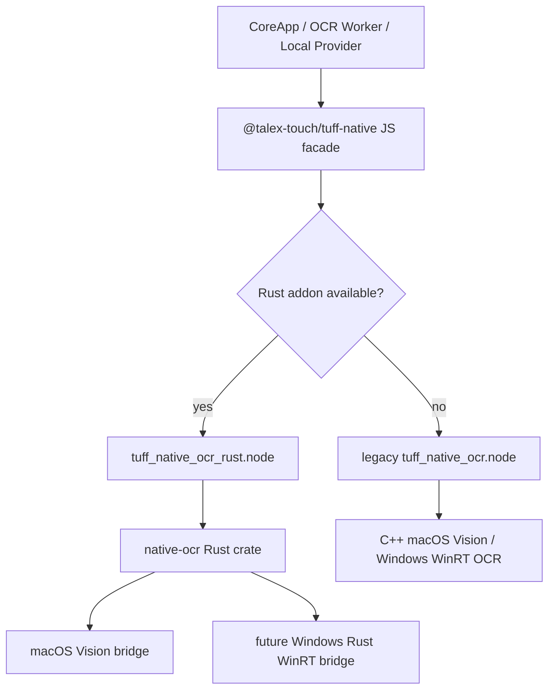

# Tuff Native Rust Runtime Migration Plan PRD

> 更新时间：2026-06-21
> 状态：Planned / Review Backlog
> 推荐目标：2.5.x 后续小切片，不作为 2.5.0 AI Stable blocker
> 范围：`@talex-touch/tuff-native` 原生能力的 Rust-first 收敛，优先 screenshot / OCR，Everything 单独评估

## 1. 背景

`@talex-touch/tuff-native` 当前同时存在 Rust 与 C++ 原生能力：

- screenshot 已由 Rust `native-screenshot` crate 实现，通过 N-API addon 被 Electron / Node 加载；
- OCR 仍由 C++ / Objective-C++ / WinRT 实现，macOS 走 Vision，Windows 走 `Windows.Media.Ocr.OcrEngine`，其它平台走 stub；
- Everything 仍是独立 C++ addon，与 Windows Everything SDK / CLI fallback 绑定较深。

本 PRD 目标不是一次性重写全部 native 模块，而是先把 native runtime 的方向锁定为 Rust-first，并用可回滚的小切片逐步迁移：先稳定 Rust screenshot，再引入 Rust OCR crate，macOS Vision OCR 先落地，Windows OCR 保留现有 C++ WinRT fallback，Everything 暂不混入 OCR 迁移。

## 2. 权限模型结论

Rust 作为 Electron 主进程或 Node `worker_threads` 内加载的 N-API addon 执行时，系统权限通常跟当前 Electron 应用进程 / 签名 bundle 走，而不是跟 Rust 语言或 crate 单独走。

因此：

- Electron / packaged Tuff 已获得 macOS Screen Recording、Accessibility、文件访问等权限时，N-API addon 内的 Rust 系统 API 调用一般继承同一应用身份；
- `worker_threads` 加载 N-API addon 仍属于同一 Node / Electron 进程模型，适合承载 OCR 等 CPU/系统 API 调用；
- 如果后续把 Rust 能力做成 sidecar binary、CLI 或 child process，则 macOS 权限身份可能变成独立二进制，权限提示、签名、notarization 和 TCC 表现都会更复杂；
- 默认策略应优先使用 N-API addon，不把 screenshot / OCR 迁到外部进程，除非存在明确隔离或崩溃恢复收益。

## 3. 最终目标

建立一个 Rust-first native runtime：

- 保持 JS/TS 对外 API 稳定，不破坏 `@talex-touch/tuff-native` 现有调用方；
- native 能力不可用时返回明确 `supported=false` / `reason` / error code，不允许 fake success；
- macOS OCR 优先迁移到 Rust Vision bridge，降低 C++/Objective-C++ addon 维护成本；
- Windows OCR 保留现有 WinRT C++ 实现作为 fallback，避免过早引入不成熟的 Rust WinRT 重写风险；
- screenshot 与 OCR 共用更一致的 support probe、测试报告、packaged evidence 与 build 脚本口径；
- 为后续 Everything 是否迁 Rust 留出边界，但不把 Everything SDK/CLI strategy 与 OCR 迁移耦合。

## 4. 非目标

- 不把 2.5.0 AI Stable 验收改成 Rust migration blocker。
- 不一次性删除 C++ OCR addon。
- 不强行重写 Windows OCR；Windows 当前已有 WinRT OCR，问题是依赖语言包、WinRT 环境和运行 evidence，不是完全没有本地 OCR。
- 不把 Rust native 能力拆成外部 CLI / sidecar 作为默认架构。
- 不用云端 OCR 替代本地 OCR migration。
- 不把图片原文、OCR 文本、截图 payload 写入日志、普通 JSON 或同步载荷。

## 5. 当前能力地图

| 能力 | 当前实现 | 平台 | 迁移建议 |
| --- | --- | --- | --- |
| Screenshot | Rust `native-screenshot` + `xcap` | macOS / Windows / Linux | 保持 Rust，继续补 probe、bounds、packaged evidence |
| OCR macOS | C++ addon + Objective-C++ Vision | macOS | 第一优先迁到 Rust `native-ocr` crate |
| OCR Windows | C++ addon + WinRT `Windows.Media.Ocr` | Windows | 先保留 fallback；后续评估 Rust WinRT |
| OCR unsupported | C++ stub | Linux / unsupported | 保持明确 unsupported reason |
| Everything | C++ addon / SDK / CLI fallback | Windows | 单独计划，不进入 OCR Rust 首批 |

## 6. 推荐架构



JS facade 必须继续提供现有接口：

```ts
getNativeOcrSupport(): NativeOcrSupport
recognizeImageText(options: NativeOcrOptions): Promise<NativeOcrResult>
```

首批实现时可以增加内部 loader 顺序：

1. 优先加载 Rust OCR addon；
2. Rust addon 不存在、导出不匹配或平台未实现时 fallback 到旧 C++ OCR addon；
3. 两者都不可用时返回稳定 degraded reason；
4. `TUFF_DISABLE_NATIVE_OCR=1` 必须继续 fail-closed。

## 7. Phase 0：Screenshot Rust 基线固化

目标：把已经存在的 Rust screenshot 当成 native Rust baseline。

已完成/应保持：

- `getNativeScreenshotSupport()` 不只做平台判断，还要 probe monitor；
- region capture 在 Rust 边界校验 width/height、display bounds、overflow；
- 默认 monitor 优先 primary display；
- Rust unit tests 覆盖 support probe 与 region validation；
- `cargo test`、release addon build、JS contract test 都有报告入口。

后续补强：

- packaged Electron 下采集 screenshot support / capture evidence；
- macOS Screen Recording 未授权时，support/capture reason 必须可见；
- Windows/Linux smoke 只要求 degraded/unsupported reason 与 build/load contract，不作为 release blocker。

## 8. Phase 1：新增 Rust OCR crate（macOS first）

目标：新增 `packages/tuff-native/native-ocr` Rust crate，不替换现有 C++ OCR 的 JS 对外 API。

建议文件结构：

```text
packages/tuff-native/
  native-ocr/
    Cargo.toml
    build.rs
    src/
      lib.rs
      support.rs
      ocr_types.rs
      macos.rs
      windows.rs
      unsupported.rs
  scripts/
    build-ocr-rust.js
```

首批能力：

- `get_native_ocr_support()`：
  - macOS：probe Vision / ImageIO 可用性；
  - Windows：可以先返回 `supported=false, reason="windows-ocr-rust-not-implemented"`，由 JS fallback 到 C++ WinRT；
  - Linux：`platform-not-supported`；
- `recognize_image_text(options)`：
  - 输入 `Buffer`；
  - 支持 `languageHint`；
  - 支持 `includeLayout` / `maxBlocks`；
  - 输出 `text`、`confidence`、`language`、`blocks`、`engine`、`durationMs`；
- macOS engine 标记为 `apple-vision-rust` 或继续兼容 `apple-vision`，需在 PR 前决定是否改变可见 engine string；
- 解码失败、无文本、Vision 请求失败都必须有稳定 error code。

## 9. Phase 2：JS facade 与 fallback

目标：让上层无需感知 Rust/C++ 切换。

改动边界：

- `packages/tuff-native/index.js`：
  - 保持现有 exported API；
  - 新增 Rust-first loader；
  - fallback 到旧 `tuff_native_ocr.node`；
  - support payload 可增加内部 `engine` 字段，但不要破坏现有 `NativeOcrSupport`；
- `packages/tuff-native/index.d.ts`：
  - 如需新增 `engine?: string`，必须同步 CoreApp tests；
- `apps/core-app/src/main/modules/ocr/ocr-worker.ts`：
  - 不直接区分 Rust/C++；
  - 继续只消费 `getNativeOcrSupport()` / `recognizeImageText()`；
- `apps/core-app/src/main/modules/ai/providers/local-provider.ts`：
  - 保持 provider metadata 和 error normalizer 稳定。

验收要求：

- Rust OCR addon 不存在时，旧 C++ OCR 仍可工作；
- Rust OCR addon export mismatch 时，fallback 且 reason 可见；
- `TUFF_DISABLE_NATIVE_OCR=1` 同时禁用 Rust 与 C++ OCR；
- Windows 环境短期仍走 C++ WinRT OCR，不被 Rust 未实现误伤。

## 10. Phase 3：Windows OCR 评估

Windows 不是首批重写目标，但需要明确后续评估口径：

- 当前 C++ WinRT OCR 已使用 `Windows.Media.Ocr.OcrEngine`；
- Windows OCR 可用性依赖系统语言、OCR 语言包、WinRT 初始化、图片 decode 和 packaged runtime；
- Rust 迁移候选是 `windows` crate / WinRT bindings，但要验证：
  - Electron packaged app 下 COM apartment 初始化；
  - OCR language fallback；
  - `SoftwareBitmap` decode 性能与错误语义；
  - x64 / arm64 build matrix；
  - Windows 10/11 支持边界。

在没有真实 Windows evidence 前，不删除 C++ WinRT OCR fallback。

## 11. Phase 4：Everything 独立评估

Everything native 能力不应和 OCR 同一批迁移：

- Everything 涉及 SDK/CLI fallback、Windows-only backend、path filtering、File roots policy、diagnostics 和 performance evidence；
- 迁 Rust 的收益主要是统一 native runtime 和减少 C++ addon；
- 风险是 Windows SDK/IPC 绑定、packaged binary、fallback 诊断和性能回归。

建议后续单独写 Everything Rust feasibility note，再决定是否迁。

## 12. 测试计划

Rust 层：

- `cargo fmt`
- `CARGO_BUILD_JOBS=1 cargo test --manifest-path packages/tuff-native/native-ocr/Cargo.toml -- --nocapture`
- macOS Vision bridge 单元测试优先覆盖 decode、support mapping、error mapping、layout mapping；
- N-API crate 如遇普通 Rust test binary 缺 Node N-API 符号，允许添加 `#[cfg(test)]` test-only stubs，但不得进入 release build。

JS contract：

- `packages/test/src/native/tuff-native-ocr.test.ts`
- 导出函数存在；
- disable env contract；
- Rust-first fallback 到 C++；
- support payload shape 稳定；
- empty image / invalid image fail-closed。

CoreApp focused：

- `apps/core-app/src/main/modules/ocr/ocr-service.test.ts`
- `apps/core-app/src/main/modules/ai/providers/local-provider.test.ts`
- worker OCR route 不因 Rust/C++ 切换改变结果形状；
- provider unavailable、decode failed、no text recognized 均保持固定失败语义。

Evidence：

- macOS packaged Electron OCR success；
- macOS packaged Electron OCR no-text / invalid-image failure；
- Windows packaged Electron 继续走 C++ WinRT fallback 或明确 degraded；
- Rust addon missing/export mismatch fallback evidence。

## 13. 验收清单

- [ ] 新增 `native-ocr` Rust crate，macOS Vision OCR 可通过 `cargo test` 和 release build。
- [ ] JS facade 保持 `getNativeOcrSupport()` / `recognizeImageText()` API 不变。
- [ ] Rust addon 不可用时自动 fallback 到旧 C++ OCR。
- [ ] Windows 不被 Rust 未实现影响，继续使用 C++ WinRT OCR 或返回明确 degraded reason。
- [ ] `TUFF_DISABLE_NATIVE_OCR=1` 禁用所有 native OCR path。
- [ ] OCR worker / LocalProvider focused tests 通过。
- [ ] macOS packaged Electron OCR success/failure evidence 完成。
- [ ] 文档同步 TODO / README / CHANGES 或 Evidence Matrix。

## 14. 风险与缓解

| 风险 | 影响 | 缓解 |
| --- | --- | --- |
| macOS Rust 调 Vision bridge 复杂 | 编译/链接/内存管理风险 | 小切片先做 decode + support，再做 recognize |
| N-API async Promise 语义变化 | OCR worker 调用行为变化 | 保持 JS facade contract，用 focused tests 钉住 |
| Windows Rust OCR 不成熟 | Windows OCR 回归 | 保留 C++ WinRT fallback |
| 权限误判 | packaged app 下 support 假阳性 | support probe + packaged evidence，不只看平台 |
| 错误码漂移 | AI/LocalProvider failure copy 变化 | 统一 error mapping，测试固定错误语义 |
| 构建产物膨胀 | Electron 包体积变大 | builder 排除 target cache，仅 ship `.node` |

## 15. 推荐执行顺序

1. 写 `native-ocr` crate skeleton、Cargo/build script、N-API exports 和 test-only link strategy。
2. 实现 support probe 与 unsupported/windows-not-implemented mapping。
3. 实现 macOS image decode + Vision recognize，先不接 JS facade。
4. 补 Rust unit tests 和 release addon build。
5. 改 JS facade Rust-first + C++ fallback。
6. 补 packages/test native OCR contract。
7. 补 CoreApp OCR worker / LocalProvider focused tests。
8. 采 macOS packaged Electron OCR success/failure evidence。
9. Windows 只做 fallback/degraded evidence，不迁实现。

## 16. 关联入口

- AI 2.5.0 主线：`./ai-2.5.0-plan-prd.md`
- ASR Provider Runtime：`./ai-2.5.8-asr-provider-runtime-prd.md`
- Platform Capability Smoke Matrix：`../04-implementation/Evidence-Matrix-Platform-2026-06-18.md`
- 当前执行清单：`../TODO.md`
- 文档入口：`../README.md`
