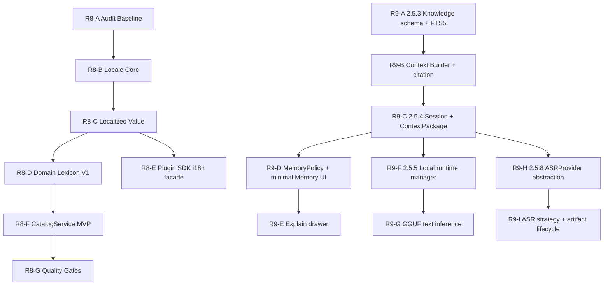

# R8 / R9 Next Stage Execution Plan

> 更新时间：2026-06-24
> 状态：Planning / Next-stage batching
> 范围：R8 i18n / Domain Lexicon / Catalog 2.6.0 与 R9 AI 2.5.x 后续能力。

## 执行口径

- R8 / R9 不抢 R1 Release Integrity、R2 AI Stable、R3 Indexing Runtime 当前稳定化窗口。
- R8 是横向基础设施：先统一 locale、localized value、plugin metadata，再进入 Domain Lexicon、Plugin SDK facade 与 CatalogService。
- R9 是纵向 AI 能力线：先 2.5.3 本地知识检索，再 2.5.4 ContextHygiene，最后 2.5.5 本地模型运行时与 2.5.8 ASR Runtime。
- 每批只处理一个主题；CoreApp、Nexus、packages、plugins 与 docs 不混成同一验证口径。
- SQLite 仍是本地 SoT；Catalog JSON 只允许作为可校验下载载荷，private sync payload 仍必须是密文或引用。

## 优先级

| 优先级 | 批次 | 目标 | 原因 |
| --- | --- | --- | --- |
| P0 | R8-A / R8-B | i18n audit baseline、Locale Core | 给 CoreApp / Nexus / packages / plugins 建立统一 locale 边界，风险低、收益高。 |
| P0 | R8-C | `LocalizedText` / `LocalizedList` 与插件 manifest localized metadata | 为插件商店、CoreBox、Provider UI 与后续 Catalog 铺通兼容结构。 |
| P1 | R9-A / R9-B | 2.5.3 Local Knowledge Retrieval MVP | 2.5.4 ContextPackage 需要 citation / retrieval 来源；先用 SQLite / FTS5 / metadata，不引入向量库作为 MVP。 |
| P1 | R9-C / R9-D | 2.5.4 ContextHygiene P0/P1 | 建立 session / checkpoint / context package / memory policy，避免 AI 后续能力继续堆隐式长上下文。 |
| P1 | R8-D / R8-E | Domain Lexicon V1 与 Plugin SDK facade | 用单位 registry 先验证解析/展示分离，再开放受控 SDK。 |
| P2 | R8-F / R8-G | CatalogService MVP 与质量门禁 | 验签、hash、schema、SQLite import、activate/rollback 都要 fail-closed。 |
| P2 | R9-F / R9-G | 2.5.5 Local Model Runtime | runtime binary、模型下载、设备 smoke 与 fallback 链路长，放在 provider/evidence 体系稳定后。 |
| P2 | R9-H / R9-I | 2.5.8 ASR Provider Runtime | 录音权限、音频 artifact、local/cloud/auto 策略独立推进，不绑定本地 LLM runtime。 |

## 依赖关系

## R8 分批计划

| 批次 | 目标 | 交付物 | 验收边界 |
| --- | --- | --- | --- |
| R8-A Audit Baseline | 扫描 `t(key, 'fallback')`、`locale === 'zh' ? ... : ...`、裸用户可见文案 | 分类清单：UI message、transport message、domain lexicon、plugin metadata、catalog data | 只输出清单，不批量改生产逻辑。 |
| R8-B Locale Core | 在共享包建立 `AppLocale` / `ShortLocale` normalize adapter | locale normalize、fallback chain、CoreApp / Nexus adapter tests | 禁止新增散写 `startsWith('zh')` 的 production UI 适配。 |
| R8-C Localized Value | 增加 `LocalizedText` / `LocalizedList` resolver，manifest loader 兼容 string | resolver tests、plugin manifest compatibility tests、Store / CoreBox / Plugin detail 最小展示切片 | 旧 string 字段继续视为 `default`，不破坏现有插件。 |
| R8-D Domain Lexicon V1 | 先迁单位 registry，建立 `unit.*` canonical id | unit domain lexicon、跨语言 aliases 解析、当前 locale label 展示 | 单位换算解析/展示分离；不迁全部领域词。 |
| R8-E Plugin SDK Facade | 开放 `tuff.i18n.*` 与 `tuff.lexicon.*` 受控 facade | SDK API、permission gate、plugin-scoped `lexicon.register()` tests | 第三方插件不得覆盖 official canonical id。 |
| R8-F CatalogService MVP | baseline pack、manifest/download/verify/import/activate/rollback | catalog tables、hash/signature/schema fail-closed tests、active version diagnostics | 首批只承载 domain lexicon 或 capability/model registry；不承载用户私有数据。 |
| R8-G Quality Gates | locale key 对齐、fallback 禁止、lexicon coverage、catalog 校验 | CI / scripts / focused tests、Quality Baseline 同步 | 已有 fallback 可分期清理，但禁止新增。 |

## R9 分批计划

| 批次 | 版本线 | 目标 | 交付物 | 验收边界 |
| --- | --- | --- | --- | --- |
| R9-A | 2.5.3 | 本地知识 schema 与 FTS5 MVP | `documents` / `chunks` / metadata / FTS5 / source permission foundation | 不引入独立向量数据库；embeddings / rerank 只作为增强项。 |
| R9-B | 2.5.3 | Context Builder | token budget、dedupe、permission/time filters、citation metadata；当前已补 retrieval citation/status/degraded reason 进入 ContextPackage metadata 的桥接 | 未配置 embeddings 时，FTS5 + metadata 可独立召回。 |
| R9-C | 2.5.4 | Session / Checkpoint / ContextPackage P0 | session/checkpoint/package log/tombstone schema、CoreBox AI Ask flag、metadata-only retrieval explain log | 没有 SQLite SoT 或 package log 不能解释 retrieval 降级时不能宣称完成。 |
| R9-D | 2.5.4 | Compression / MemoryPolicy P1 | CompressionSnapshot、MemoryCandidate、MemoryPolicy、最小 Memory CRUD | 自动长期记忆默认不开；secret/sensitive 不进入普通 memory。 |
| R9-E | 2.5.4 | Explain drawer | included / excluded / policy-blocked context 可见 evidence | 只接 embeddings/rerank 但无 permission/citation 不算完成。 |
| R9-F | 2.5.5 | Local runtime manager | 模型目录、下载/删除/health、Ollama optional detection | 模型权重不进安装包、同步载荷、普通日志。 |
| R9-G | 2.5.5 | GGUF text inference | 至少 1 个轻量 GGUF 文本模型、provider fallback、audit metadata | 不默认 7B+；失败必须 `unavailable/degraded + reason`。 |
| R9-H | 2.5.8 | ASRProvider abstraction | `transcribeFile`、health、local/cloud provider strategy、统一错误码 | 不绑定 2.5.5 本地 LLM runtime；不做 TTS。 |
| R9-I | 2.5.8 | ASR local/cloud/auto 策略 | whisper.cpp short audio、cloud-only、auto 隐私策略、artifact lifecycle | `local-only` 不得触发云端请求；音频 artifact 有生命周期管理。 |

## 推荐开工顺序

1. R8-A Audit Baseline：生成迁移清单，风险最低。
2. R8-B Locale Core：统一 `zh-CN/en-US` 与 `zh/en` 边界。
3. R8-C Localized Value：让插件 manifest 和 UI 展示先支持标准 localized shape。
4. R9-A 2.5.3 Knowledge schema / FTS5：先设计与 focused tests，不接 embeddings。
5. R9-B Context Builder：为 2.5.4 提供 citation / retrieval 输入；已补 citation/status/degraded reason 到 ContextPackage metadata 的服务层桥接。
6. R9-C ContextHygiene P0：继续建立可解释 prompt 组装边界，下一步补最近路径 integration 与 explain drawer evidence。

## 非目标

- 不在 R8 首批实现翻译管理后台、第三语言或 catalog delta patch。
- 不把所有 UI 文案一次性迁完；高频生产路径先迁，demo/docs 示例后置。
- 不在 2.5.3 MVP 引入独立向量数据库服务。
- 不在 2.5.4 默认开启自动长期记忆保存。
- 不在 2.5.5 静默安装 Ollama、Python、CUDA 或大型外部依赖。
- 不在 2.5.8 做 TTS、语音唤醒或实时 streaming ASR Stable。

## 文档同步要求

- R8 批次改动必须同步 `i18n-lexicon-catalog-2.6.0-prd.md`、`PRD-QUALITY-BASELINE.md`、`CHANGES.md` 与入口索引。
- R9 批次改动必须同步对应 `ai-2.5.x` PRD、`TODO.md`、`Roadmap-vNext-2026-06-18.md`、`CHANGES.md` 与入口索引。
- 目标或质量门禁变化必须同步 Roadmap 与 Quality Baseline。
- 只有代码、测试、evidence 与文档都闭环后，才能把某批状态从 planning/partial 改为 passed/closed。
