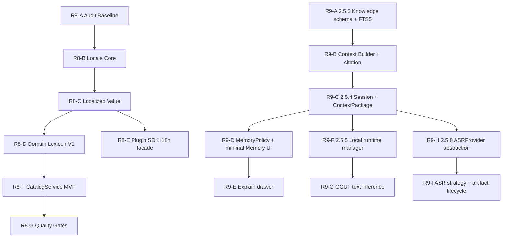

# R8 / R9 Next Stage Execution Plan

> 更新时间：2026-07-13
> 状态：R8-E Plugin SDK facade implemented / R8-F CatalogService MVP next
> 范围：R8 i18n / Domain Lexicon / Catalog 2.6.0 与 R9 AI 2.5.x 后续能力。

## 执行口径

- R8 / R9 继续按 related-only 切片推进，不混入 R1/R2/R3 的迁移或 release evidence；R8 Phase 0-4、R9.1 与 R9.2 P0/P1 closure 已落，下一主批次为 R8-F CatalogService MVP，再进入 R8-G；R9.3/R9.4 与 R9.2 real-profile follow-up 继续后置。
- R8 是横向基础设施：locale、localized value、plugin metadata、Domain Lexicon V1 与受控 Plugin SDK facade 已落；下一步建设签名/SQLite-backed CatalogService。
- R9 是纵向 AI 能力线：先 2.5.3 本地知识检索，再 2.5.4 ContextHygiene，最后 2.5.5 本地模型运行时与 2.5.8 ASR Runtime。
- 每批只处理一个主题；CoreApp、Nexus、packages、plugins 与 docs 不混成同一验证口径。
- SQLite 仍是本地 SoT；Catalog JSON 只允许作为可校验下载载荷，private sync payload 仍必须是密文或引用。

## 优先级

| 优先级 | 批次        | 目标                                                                 | 原因                                                                                                       |
| ------ | ----------- | -------------------------------------------------------------------- | ---------------------------------------------------------------------------------------------------------- |
| P0     | R8-A / R8-B | i18n audit baseline、Locale Core                                     | 给 CoreApp / Nexus / packages / plugins 建立统一 locale 边界，风险低、收益高。                             |
| P0     | R8-C        | `LocalizedText` / `LocalizedList` 与插件 manifest localized metadata | 为插件商店、CoreBox、Provider UI 与后续 Catalog 铺通兼容结构。                                             |
| P1     | R9-A / R9-B | 2.5.3 Local Knowledge Retrieval MVP                                  | 2.5.4 ContextPackage 需要 citation / retrieval 来源；先用 SQLite / FTS5 / metadata，不引入向量库作为 MVP。 |
| P1     | R9-C / R9-D | 2.5.4 ContextHygiene P0/P1                                           | 建立 session / checkpoint / context package / memory policy，避免 AI 后续能力继续堆隐式长上下文。          |
| P1     | R8-D        | Domain Lexicon V1（completed 2026-07-13）                            | 单位 registry 已验证跨语言解析、locale 展示与共享 conversion source。                                      |
| P1     | R8-E        | Plugin SDK facade（completed 2026-07-13）                            | typed main/renderer facade、verified identity、三项 permission 与 plugin namespace/isolation 已闭合。      |
| P2     | R8-F / R8-G | CatalogService MVP（next）与质量门禁                                 | 验签、hash、schema、SQLite import、activate/rollback 都要 fail-closed。                                    |
| P2     | R9-F / R9-G | 2.5.5 Local Model Runtime                                            | runtime binary、模型下载、设备 smoke 与 fallback 链路长，放在 provider/evidence 体系稳定后。               |
| P2     | R9-H / R9-I | 2.5.8 ASR Provider Runtime                                           | 录音权限、音频 artifact、local/cloud/auto 策略独立推进，不绑定本地 LLM runtime。                           |

## 依赖关系

## R8 分批计划

| 批次                                           | 目标                                                                         | 交付物                                                                                                               | 验收边界                                                                     |
| ---------------------------------------------- | ---------------------------------------------------------------------------- | -------------------------------------------------------------------------------------------------------------------- | ---------------------------------------------------------------------------- |
| R8-A Audit Baseline                            | 扫描 `t(key, 'fallback')`、`locale === 'zh' ? ... : ...`、裸用户可见文案     | 分类清单：UI message、transport message、domain lexicon、plugin metadata、catalog data                               | 只输出清单，不批量改生产逻辑。                                               |
| R8-B Locale Core                               | 在共享包建立 `AppLocale` / `ShortLocale` normalize adapter                   | locale normalize、fallback chain、CoreApp / Nexus adapter tests                                                      | 禁止新增散写 `startsWith('zh')` 的 production UI 适配。                      |
| R8-C Localized Value                           | 增加 `LocalizedText` / `LocalizedList` resolver，manifest loader 兼容 string | resolver tests、plugin manifest compatibility tests、Store / CoreBox / Plugin detail 最小展示切片                    | 旧 string 字段继续视为 `default`，不破坏现有插件。                           |
| R8-D Domain Lexicon V1（completed 2026-07-13） | 单位 registry 已迁为 `unit.*` canonical ids                                  | 53-entry unit domain lexicon、跨语言 aliases 解析、当前 locale label 展示、共享 conversion core                      | 单位换算解析/展示分离已通过；未迁其他领域词。                                |
| R8-E Plugin SDK Facade（completed 2026-07-13） | `sdkapi 260713` 开放 `context.utils.i18n/lexicon` 与 renderer exports        | typed events、verified context、permission gates、plugin namespace/provenance、atomic bounds、disable/unload cleanup | 第三方插件不能覆盖 official 或读取其他 plugin overlay；不持久化 entries。    |
| R8-F CatalogService MVP（next）                | baseline pack、manifest/download/verify/import/activate/rollback             | catalog tables、hash/signature/schema fail-closed tests、active version diagnostics                                  | 首批只承载 domain lexicon 或 capability/model registry；不承载用户私有数据。 |
| R8-G Quality Gates                             | locale key 对齐、fallback 禁止、lexicon coverage、catalog 校验               | CI / scripts / focused tests、Quality Baseline 同步                                                                  | 已有 fallback 可分期清理，但禁止新增。                                       |

## R9 分批计划

| 批次 | 版本线 | 目标                                     | 交付物                                                                                                                                                    | 验收边界                                                                                                     |
| ---- | ------ | ---------------------------------------- | --------------------------------------------------------------------------------------------------------------------------------------------------------- | ------------------------------------------------------------------------------------------------------------ |
| R9-A | 2.5.3  | 本地知识 schema 与 FTS5 MVP              | `documents` / `chunks` / metadata / FTS5 / source permission foundation                                                                                   | 不引入独立向量数据库；embeddings / rerank 只作为增强项。                                                     |
| R9-B | 2.5.3  | Context Builder                          | token budget、dedupe、permission/time filters、citation metadata；当前已补 retrieval citation/status/degraded reason 进入 ContextPackage metadata 的桥接  | 未配置 embeddings 时，FTS5 + metadata 可独立召回。                                                           |
| R9-C | 2.5.4  | Session / Checkpoint / ContextPackage P0 | session/checkpoint/package log/tombstone schema、CoreBox AI Ask flag、metadata-only retrieval explain log                                                 | 没有 SQLite SoT 或 package log 不能解释 retrieval 降级时不能宣称完成。                                       |
| R9-D | 2.5.4  | Compression / MemoryPolicy P1            | CompressionSnapshot validator/CAS/checkpoint/latest consumption、MemoryPolicy、手动 Memory CRUD、搜索/来源审计、编辑后重评估与原子 replace+tombstone 已落 | 自动长期记忆默认不开；secret/sensitive 不进入普通 memory；workspace/project 缺 `scopeRef` 继续 fail-closed。 |
| R9-E | 2.5.4  | Explain / entrypoint evidence            | included/excluded/policy-blocked/tombstone metadata、CoreBox/OmniPanel/Workflow/Assistant contracts、分级 evidence manifest                               | packaged context metadata 已覆盖 CoreBox + Assistant + Workflow + OmniPanel；real-profile 仍开放。           |
| R9-F | 2.5.5  | Local runtime manager                    | 模型目录、下载/删除/health、Ollama optional detection                                                                                                     | 模型权重不进安装包、同步载荷、普通日志。                                                                     |
| R9-G | 2.5.5  | GGUF text inference                      | 至少 1 个轻量 GGUF 文本模型、provider fallback、audit metadata                                                                                            | 不默认 7B+；失败必须 `unavailable/degraded + reason`。                                                       |
| R9-H | 2.5.8  | ASRProvider abstraction                  | `transcribeFile`、health、local/cloud provider strategy、统一错误码                                                                                       | 不绑定 2.5.5 本地 LLM runtime；不做 TTS。                                                                    |
| R9-I | 2.5.8  | ASR local/cloud/auto 策略                | whisper.cpp short audio、cloud-only、auto 隐私策略、artifact lifecycle                                                                                    | `local-only` 不得触发云端请求；音频 artifact 有生命周期管理。                                                |

## 推荐开工顺序

1. R8-A Audit Baseline：生成迁移清单，风险最低。
2. R8-B Locale Core：统一 `zh-CN/en-US` 与 `zh/en` 边界。
3. R8-C Localized Value：让插件 manifest 和 UI 展示先支持标准 localized shape。
4. R9-A 2.5.3 Knowledge schema / FTS5：先设计与 focused tests，不接 embeddings。
5. R9-B Context Builder：为 2.5.4 提供 citation / retrieval 输入；已补 citation/status/degraded reason 到 ContextPackage metadata 的服务层桥接。
6. R9-C / R9-D / R9-E ContextHygiene P0/P1：closure `6/6`、inactive session summary continuation、tombstone explain、Workflow runtime/context lifecycle 与 OmniPanel packaged context follow-up 已完成；后续只跟踪 real-profile evidence，以及需单独确认的 `scopeRef` migration。
7. R8-D Domain Lexicon V1：53-entry 单位 baseline、共享 conversion core 与 host locale projection 已完成。
8. R8-E Plugin SDK Facade：typed facade、三项 permission、host namespace/provenance、跨插件隔离与 lifecycle cleanup 已完成。
9. R8-F CatalogService MVP：下一主批次，先设计签名 manifest、SQLite import/activate/rollback 与 failure atomicity。

## 当前进度快照

| 批次     | 状态                      | 已完成                                                                                                                                                                                                                                                                                                                                 | 剩余 TODO                                                                     |
| -------- | ------------------------- | -------------------------------------------------------------------------------------------------------------------------------------------------------------------------------------------------------------------------------------------------------------------------------------------------------------------------------------- | ----------------------------------------------------------------------------- |
| R8-A/B/C | mostly landed             | locale core、LocalizedText/List、插件 manifest localized metadata loader / display path                                                                                                                                                                                                                                                | 兼容回归与散落 UI/domain 文案审计继续开放。                                   |
| R8-D     | completed                 | 只读 DomainLexiconRegistry、53-entry unit baseline、跨语言 aliases、locale label、PreviewSDK/CoreApp/QuickOps 共享 conversion source                                                                                                                                                                                                   | 不外推到 currency/timezone 等领域。                                           |
| R8-E     | completed                 | `sdkapi 260713` main/renderer i18n+lexicon facade、typed transport、verified identity、`i18n.read`/`lexicon.read`/`lexicon.register`、plugin-scoped atomic overlay 与 lifecycle cleanup                                                                                                                                                | overlay 不持久化；R8-F CatalogService MVP 为下一批。                          |
| R9-A/B   | foundation consumed       | SQLite / FTS5 / metadata / citation；host assembler 与 controlled/packaged Provider payload 已证明 ContextPackage 参与模型输入                                                                                                                                                                                                         | 真实用户 profile、permission/citation 广覆盖与 embeddings/rerank 增强仍开放。 |
| R9-C/D/E | P0/P1 closure implemented | session/checkpoint/package logs、host assembler、CoreBox controls、Memory governance/Review、CompressionSnapshot、多入口 isolation、inactive summary continuation、metadata-only tombstone explain 与 evidence verifier 已落；Workflow `new / session` 与 OmniPanel `new / light` packaged owner/scope/single-dispatch evidence 已闭合 | real-profile 与 `scopeRef` migration follow-up。                              |

## R9.2 Closure Task Tree

| 顺序 | Trellis 子任务                          | 状态                             | 核心交付                                                                                                                                |
| ---: | --------------------------------------- | -------------------------------- | --------------------------------------------------------------------------------------------------------------------------------------- |
|    1 | `07-10-r9-2-memory-governance-scope`    | completed                        | disabled/tombstone/TTL/privacy/scope 精确过滤；plugin-facing 与 host-only Memory capability；缺 `scopeRef` fail-closed。                |
|    2 | `07-10-r9-2-context-execution-corebox`  | completed                        | host-owned ContextPackage assembler/context-aware invoke；CoreBox new/continue/stateless；retrieval/memory 真实进入 provider messages。 |
|    3 | `07-10-r9-2-memory-review-management`   | completed                        | 搜索/筛选/来源 metadata、编辑后重评估、版本冲突与原子 replace+tombstone。                                                               |
|    4 | `07-10-r9-2-compression-snapshot`       | completed                        | 结构化 snapshot、source turn range、checkpoint、summary CAS、失败不删 turns。                                                           |
|    5 | `07-10-r9-2-entrypoints-evidence`       | completed with real-profile open | CoreBox/OmniPanel/Workflow/Assistant contract isolation与四入口 packaged context metadata；分级 manifest 与隐私扫描。                   |
|    6 | `07-11-corebox-ai-dispatch-idempotency` | completed                        | active widget 单次 search/provider dispatch、latest-request-wins、one-shot entrypoint context execute 前重绑与后续清理。                |

父任务：`.trellis/tasks/07-10-r9-2-context-hygiene-p0-p1-closure/`。SQLite schema/data migration 不包含在默认授权内；若 `scopeRef` 或 CAS 需要迁移，必须先完成 preflight、旧数据策略、rollback 并单独确认。

Follow-up：`07-11-context-archived-continuation` 已完成。inactive/missing explicit continue 使用新 session id，仅带入受治理 snapshot/legacy summary，并通过 metadata-only SDK/widget reason 解释边界；未采集 packaged/real-profile evidence。
Follow-up：`07-12-context-tombstone-explain` 已完成。Audit inline/drawer 单独统计 tombstoned memory，使用中英文 reason/notice，excluded item 保持 metadata-only；未采集 packaged/real-profile evidence。
Follow-up：`07-12-workflow-run-structured-clone` 已完成。Workflow outbound definition 不再携带 Vue proxy；新建/内置派生 workflow 使用 scoped step ID 并同步 remap `previousStep`。fresh-profile packaged run 已穿过持久化并进入 provider boundary；该次 smoke 未采 owner/scope context metadata，故当时 R9-E Workflow context packaged level 继续 open；随后由下一项 closure 关闭。
Follow-up：`07-12-workflow-context-packaged-evidence` 已完成。修复 Workflow 首个 chat step 对不存在 session 直接 `continue` 导致 missing-continuation degradation、且多 model step 可能漂移 session 的问题；现在每 run 首步 `new / session`、后续步骤 `continue` 同一 session。isolated package 两次 visible run 均 completed，两个独立 Workflow session/package log、两次受控 Provider 调用与 metadata-only privacy scan 已闭合；该时点 OmniPanel/real-profile 仍 open，OmniPanel 随后由下一项关闭。
Follow-up：`07-13-omnipanel-context-packaged-evidence` 已完成。isolated packaged Electron 通过受控 Local/Ollama-compatible Provider 从 visible OmniPanel 执行 built-in `AI 解释`，取得 `owner=omni-panel`、`mode=new`、`scope=light`、单 session/package log、单次 `/api/chat` 与 Ready result；artifact/manifest privacy scan passed。四入口 packaged context level 已闭合，real-profile 继续 open。

## 非目标

- 不在 R8 首批实现翻译管理后台、第三语言或 catalog delta patch。
- 不把所有 UI 文案一次性迁完；高频生产路径先迁，demo/docs 示例后置。
- 不在 2.5.3 MVP 引入独立向量数据库服务。
- 不在 2.5.4 默认开启自动长期记忆保存。
- 不在 2.5.5 静默安装 Ollama、Python、CUDA 或大型外部依赖。
- 不在 2.5.8 做 TTS、语音唤醒或实时 streaming ASR Stable。

## 文档同步要求

- R8 批次改动必须同步 `i18n-lexicon-catalog-2.6.0-prd.md`、`PRD-QUALITY-BASELINE.md`、`CHANGES.md` 与入口索引。
- R9 批次改动必须同步对应 `ai-2.5.x` PRD、`TODO.md`、`Roadmap-vNext-2026-06-18.md`、`CHANGES.md` 与入口索引。
- 目标或质量门禁变化必须同步 Roadmap 与 Quality Baseline。
- 只有代码、测试、evidence 与文档都闭环后，才能把某批状态从 planning/partial 改为 passed/closed。
