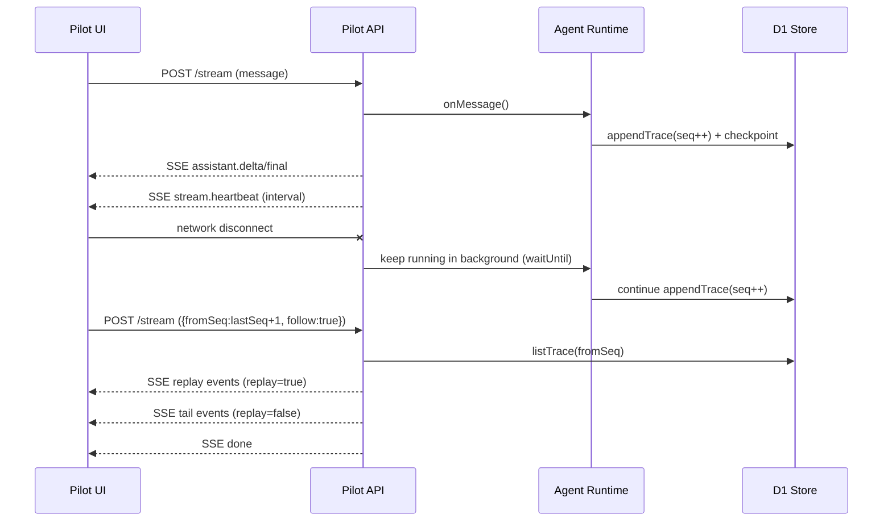

# Pilot × Intelligence API / 事件契约（V1）

> 更新时间：2026-03-09  
> 适用范围：`apps/pilot`、`packages/tuff-intelligence`

## 1. 目标与范围

- V1 定位：Chat-first（类似 ChatGPT Web），不开放写操作工具执行。
- 运行模型：SSE + checkpoint/replay，优先保障长对话与断线恢复。
- 协议基线：内部事件以 `aep/1` 为核心，服务端流式层做最小包装。

## 2. 存储模型（D1/R2）

- D1 SoT（会话/消息/trace/checkpoint/附件元数据）
  - `pilot_chat_sessions`
  - `pilot_chat_messages`
  - `pilot_chat_trace`
  - `pilot_chat_checkpoints`
  - `pilot_chat_attachments`
- R2：附件二进制对象。
- 规则：业务明文不通过 JSON 文件落地同步，遵循 SoT 约束。

## 3. HTTP API

### 3.1 会话

- `POST /api/pilot/chat/sessions`
  - 入参：`{ sessionId?: string }`
  - 出参：`{ session }`

- `GET /api/pilot/chat/sessions?limit=`
  - 出参：`{ sessions }`

### 3.2 消息与追踪

- `GET /api/pilot/chat/sessions/:sessionId/messages`
  - 出参：`{ messages, attachments }`
  - 约定：
    - `messages[].metadata.attachments?`：当前用户消息携带的附件快照（无 `dataUrl` 大字段）。
    - `attachments[]`：会话附件清单，包含 `ref`（`memory://` 或 `r2://`）与 `previewUrl`（受控预览地址）。

- `GET /api/pilot/chat/sessions/:sessionId/trace?fromSeq=&limit=`
  - 出参：`{ traces }`

### 3.3 附件

- `POST /api/pilot/chat/sessions/:sessionId/uploads`
  - 入参：`{ name, mimeType, size, contentBase64 }`
  - 约束：若运行环境为本地/私网且未配置 MinIO（或未配置可用公网 Base URL），接口返回 `400` 并拒绝附件上传。
  - 出参：
    - `attachment`（D1 元数据，含 `previewUrl`）
    - `upload`（签名 URL 元信息）
    - `directUploaded`（本次请求已写入对象存储）

- `GET /api/pilot/chat/sessions/:sessionId/attachments/:attachmentId/content`
  - 返回附件二进制内容（鉴权 + 会话归属校验）
  - 用途：前端预览与模型读取桥接
  - 支持签名访问参数：`?exp=<ms>&sig=<hmac>`（用于模型侧无登录态拉取）

#### 3.3.1 附件输入边界（V1）

- 图片附件：服务端优先转 `data URL`，在模型侧按多模态输入（`image_url` / `input_image`）注入。
- 当附件存储为 MinIO（`s3://`）且存在可访问对象 URL 时，优先使用 URL 注入，避免大图 `data URL` 膨胀。
- 非图片附件：当前仅注入结构化元数据（`name/mimeType/size/ref`），不做 PDF/Office/OCR 通用解析。
- 存储迁移位：当前支持 `memory` 与 `R2`，通过统一 `ref` 协议兼容后续 MinIO（S3 兼容）迁移。

#### 3.3.2 本地 MinIO 联调（新增）

- 支持 `PILOT_ATTACHMENT_PROVIDER=s3|minio|auto`。
- MinIO 所需变量：
  - `PILOT_MINIO_ENDPOINT`
  - `PILOT_MINIO_BUCKET`
  - `PILOT_MINIO_ACCESS_KEY`
  - `PILOT_MINIO_SECRET_KEY`
  - 可选：`PILOT_MINIO_REGION`（默认 `us-east-1`）、`PILOT_MINIO_FORCE_PATH_STYLE`（默认 `true`）
  - 可选：`PILOT_MINIO_PUBLIC_BASE_URL`（推荐为 bucket root URL，用于直接返回模型可访问 URL）
- 无 MinIO 时可仅配置 `PILOT_ATTACHMENT_PUBLIC_BASE_URL`，系统会返回签名的附件内容 URL（`/attachments/:id/content?exp&sig`）。
- 支持运行时动态配置（D1 持久化）：
  - `GET /api/pilot/admin/storage-config`
  - `POST /api/pilot/admin/storage-config`
  - 页面入口：`/admin/storage`

### 3.4 会话控制

- `POST /api/pilot/chat/sessions/:sessionId/pause`
  - 入参：`{ reason }`
  - `reason`：`client_disconnect | heartbeat_timeout | manual_pause | system_preempted`

### 3.5 流式

- `POST /api/pilot/chat/sessions/:sessionId/stream`
  - Header：`Accept: text/event-stream`
  - 入参：
    - 发起新轮次：`{ message, attachments?, metadata? }`
      - `attachments[]`：`{ id, type, ref, name?, mimeType?, previewUrl? }`
    - 补播并追尾：`{ fromSeq, follow?: boolean }`
      - `follow` 默认 `true`（仅 `fromSeq` 模式生效）
      - `follow=true`：先 replay，再持续追尾直到会话结束
      - `follow=false`：仅 replay 后立即 `done`

### 3.6 Core-App IPC 推流（兼容新增）

- 旧接口保留：`intelligence:agent:session:stream`
  - 语义：一次性查询 trace（数组返回），用于兼容已有调用方。
- 新接口新增：`intelligence:agent:session:subscribe`
  - 语义：基于 Transport `stream/onStream` 的实时订阅。
  - 入参：`{ sessionId, fromSeq?, limit?, level?, type? }`
  - 行为：
    - 首帧 `stream.started`
    - 若传入 `fromSeq`，先下发 `replay.started -> replay events(replay=true) -> replay.finished`
    - 然后进入实时 trace 推送
    - keepalive 事件：`stream.heartbeat`（10s）
    - 客户端断开仅中断当前订阅，不强制写入 `paused_disconnect`

## 4. SSE 事件契约

每个 SSE `data:` 行是 JSON 对象，核心字段：

- `type: string`
- `sessionId: string`
- `turnId?: string`
- `seq?: number`
- `timestamp: number`

### 4.1 事件类型（V1）

- `stream.started`
  - 字段：`payload.hasMessage`、`payload.fromSeq`、`payload.keepaliveMs`
- `stream.heartbeat`
  - 字段：`payload.ts`
- `planning.started`
  - 字段：`payload.strategy`
- `planning.updated`
  - 字段：`payload.todos`
- `planning.finished`
  - 字段：`payload.todoCount`
- `turn.started`
  - 字段：`payload.messageChars`、`payload.attachmentCount`
- `turn.finished`
  - 字段：`payload.durationMs`
- `replay.started`
  - 字段：`payload.fromSeq`、`payload.limit`
- `replay.finished`
  - 字段：`payload.replayCount`
- `assistant.delta`
  - 字段：`delta`
- `assistant.final`
  - 字段：`message`
- `run.audit`
  - 字段：`payload.auditType`（如 `upstream.request` / `upstream.response` / `upstream.network_error` / `upstream.response_error`）
- `run.metrics`
  - 字段：`payload.eventType`、`payload.envelopeSeq`
- `session.paused`
  - 字段：`reason`
- `error`
  - 字段：`message`、`detail`
- `done`
  - 流式结束标记

### 4.2 replay 语义

- 调用 `stream` 且携带 `fromSeq` 时，服务端会先回放 `seq >= fromSeq` 的 trace。
- 回放事件包含 `replay: true`。
- 前端应按 `seq` 去重并更新本地游标。
- 当请求仅包含 `fromSeq`（无 `message`）时，服务端按只读补播处理，不会新增 trace `seq` 记录。
- 当 `follow=true` 时，replay 完成后会持续追尾新 trace（`replay=false`）直到会话从 `executing/planning` 退出。

## 5. 状态机

- `idle`
- `planning`
- `executing`
- `paused_disconnect`
- `completed`
- `failed`

状态转移关键点：

- 新消息进入 `executing`
- 客户端断开默认不再立即 `pause`；优先保持后台继续执行
- 正常完成进入 `completed`
- 异常进入 `failed`

## 6. 时序（断线恢复）

## 7. 错误码建议（服务端）

- `400`：参数缺失或格式非法（如 `message/fromSeq` 同时为空）
- `401`：未认证
- `404`：会话不存在（可选，当前实现会自动创建）
- `499`：客户端中断当前 SSE 订阅（会话可继续后台执行）
- `500`：运行时内部错误

## 8. 默认模型配置（V1 当前默认）

- `runtimeConfig.pilot.upstreamResponsesModel = "gpt-5.4"`
- 当未显式覆盖模型时，Pilot runtime fallback 同步使用 `gpt-5.4`

## 9. 幂等建议（V1.1）

当前 V1 已保留策略位，建议在后续版本统一引入幂等键：

- `idempotencyKey = sessionId + turnId + actionId`
- 适用范围：写操作 capability、附件写入、外部副作用调用

## 10. 与 `tuff-intelligence` 的边界

- `packages/tuff-intelligence`：Protocol/Runtime/Registry/Policy/Store 抽象与默认实现。
- DeepAgent 最小实现（LangChain engine + Responses 调用 + 审计/错误类型）统一由 `packages/tuff-intelligence/src/adapters/deepagent-engine.ts` 提供。
- `apps/pilot`：HTTP 入口、SSE 桥接、页面交互、Edge 运行时适配。
- 约束：业务层禁止直接依赖 OpenAI/Anthropic 原始响应格式，统一通过 DecisionAdapter 归一化。

## 11. 统一事件契约（Pilot/Nexus/Core）

- 生命周期事件统一：`stream.started` / `stream.heartbeat` / `replay.started` / `replay.finished` / `error` / `done`
- 业务事件统一：沿用 trace `type` 原样透传（如 `session.started`、`plan.created`、`execution.*`、`tool.*`、`reflection.completed`、`state.snapshot`）
- 核心字段统一：
  - `sessionId: string`
  - `timestamp: number`
  - `seq?: number`（单调递增，用于 `fromSeq` 恢复）
  - `replay?: boolean`
  - `payload?: object`

## 12. Legacy 兼容清单（当前保留项）

| 层级 | 兼容项 | 当前策略 | 清理前置条件 |
| --- | --- | --- | --- |
| Core IPC | `intelligence:agent:session:stream` | 保留旧查询语义（数组返回） | 全量调用方迁移至 `...:subscribe` |
| Core IPC | `intelligence:agent:session:subscribe` | 新增实时推流主通道 | 无（目标主通道） |
| Trace 存储 | 老 trace 无 `seq` | 运行时加载时自动补齐 `seq` | 历史会话完成离线迁移并验证 |
| SDK | `agentSessionStream(payload)` | 继续暴露兼容入口 | SDK major 升级窗口 |
| SDK | `agentSessionSubscribe(payload, options)` | 新增 stream 入口 | 无（推荐默认） |
| Runtime | `engine.run()` | 作为 `runStream()` 不可用时的回退路径 | DeepAgent/引擎流式覆盖率稳定 |
| Pilot 前端 | `assistant.final` 全量消息 | 保留并补充去重拼接，兼容“仅 final”与“delta+final”两种后端 | 后端统一为 delta-first 且 final 仅标记 |

补充说明：
- 兼容策略遵循“新增不破坏旧接口”：先双写/双读，再按调用覆盖率下线旧路径。
- 下线顺序建议：调用方迁移完成率 > 95% 且连续两个迭代周期无回退。
