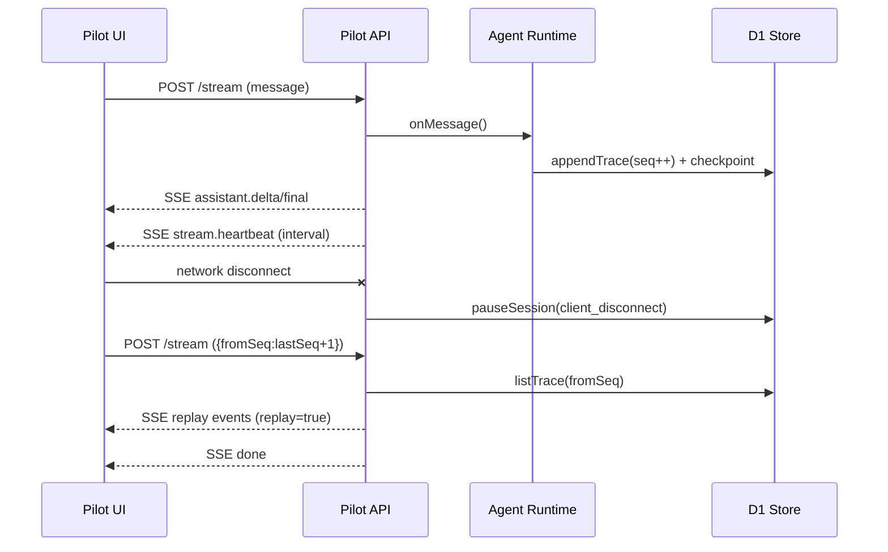

# Pilot × Intelligence API / 事件契约（V1）

> 更新时间：2026-03-07  
> 适用范围：`apps/pilot`、`packages/tuff-intelligence`

## 1. 目标与范围

- V1 定位：Chat-first（类似 ChatGPT Web），不开放写操作工具执行。
- 运行模型：SSE + checkpoint/replay，优先保障长对话与断线恢复。
- 协议基线：内部事件以 `aep/1` 为核心，服务端流式层做最小包装。

## 2. 存储模型（D1/R2）

- D1 SoT（会话/消息/trace/checkpoint/附件元数据）
  - `pilot_chat_sessions`
  - `pilot_chat_messages`
  - `pilot_chat_trace`
  - `pilot_chat_checkpoints`
  - `pilot_chat_attachments`
- R2：附件二进制对象。
- 规则：业务明文不通过 JSON 文件落地同步，遵循 SoT 约束。

## 3. HTTP API

### 3.1 会话

- `POST /api/pilot/chat/sessions`
  - 入参：`{ sessionId?: string }`
  - 出参：`{ session }`

- `GET /api/pilot/chat/sessions?limit=`
  - 出参：`{ sessions }`

### 3.2 消息与追踪

- `GET /api/pilot/chat/sessions/:sessionId/messages`
  - 出参：`{ messages, attachments }`

- `GET /api/pilot/chat/sessions/:sessionId/trace?fromSeq=&limit=`
  - 出参：`{ traces }`

### 3.3 附件

- `POST /api/pilot/chat/sessions/:sessionId/uploads`
  - 入参：`{ name, mimeType, size, contentBase64? }`
  - 出参：
    - `attachment`（D1 元数据）
    - `upload`（签名 URL 元信息）
    - `directUploaded`（是否直接写入 R2）

### 3.4 会话控制

- `POST /api/pilot/chat/sessions/:sessionId/pause`
  - 入参：`{ reason }`
  - `reason`：`client_disconnect | heartbeat_timeout | manual_pause | system_preempted`

### 3.5 流式

- `POST /api/pilot/chat/sessions/:sessionId/stream`
  - Header：`Accept: text/event-stream`
  - 入参：
    - 发起新轮次：`{ message, attachments?, metadata? }`
    - 仅补播：`{ fromSeq }`

## 4. SSE 事件契约

每个 SSE `data:` 行是 JSON 对象，核心字段：

- `type: string`
- `sessionId: string`
- `turnId?: string`
- `seq?: number`
- `timestamp: number`

### 4.1 事件类型（V1）

- `stream.started`
  - 字段：`payload.hasMessage`、`payload.fromSeq`、`payload.keepaliveMs`
- `stream.heartbeat`
  - 字段：`payload.ts`
- `planning.started`
  - 字段：`payload.strategy`
- `planning.updated`
  - 字段：`payload.todos`
- `planning.finished`
  - 字段：`payload.todoCount`
- `turn.started`
  - 字段：`payload.messageChars`、`payload.attachmentCount`
- `turn.finished`
  - 字段：`payload.durationMs`
- `replay.started`
  - 字段：`payload.fromSeq`、`payload.limit`
- `replay.finished`
  - 字段：`payload.replayCount`
- `assistant.delta`
  - 字段：`delta`
- `assistant.final`
  - 字段：`message`
- `run.audit`
  - 字段：`payload.auditType`（如 `upstream.request` / `upstream.response` / `upstream.network_error` / `upstream.response_error`）
- `run.metrics`
  - 字段：`payload.eventType`、`payload.envelopeSeq`
- `session.paused`
  - 字段：`reason`
- `error`
  - 字段：`message`、`detail`
- `done`
  - 流式结束标记

### 4.2 replay 语义

- 调用 `stream` 且携带 `fromSeq` 时，服务端会先回放 `seq >= fromSeq` 的 trace。
- 回放事件包含 `replay: true`。
- 前端应按 `seq` 去重并更新本地游标。
- 当请求仅包含 `fromSeq`（无 `message`）时，服务端按只读补播处理，不会新增 trace `seq` 记录。

## 5. 状态机

- `idle`
- `planning`
- `executing`
- `paused_disconnect`
- `completed`
- `failed`

状态转移关键点：

- 新消息进入 `executing`
- 客户端断开或内部保活中断进入 `paused_disconnect`
- 正常完成进入 `completed`
- 异常进入 `failed`

## 6. 时序（断线恢复）

## 7. 错误码建议（服务端）

- `400`：参数缺失或格式非法（如 `message/fromSeq` 同时为空）
- `401`：未认证
- `404`：会话不存在（可选，当前实现会自动创建）
- `408/499`：客户端断开（由 `session.paused` 语义体现）
- `500`：运行时内部错误

## 8. 默认模型配置（V1 当前默认）

- `runtimeConfig.pilot.upstreamResponsesModel = "gpt-5.4"`
- 当未显式覆盖模型时，Pilot runtime fallback 同步使用 `gpt-5.4`

## 9. 幂等建议（V1.1）

当前 V1 已保留策略位，建议在后续版本统一引入幂等键：

- `idempotencyKey = sessionId + turnId + actionId`
- 适用范围：写操作 capability、附件写入、外部副作用调用

## 10. 与 `tuff-intelligence` 的边界

- `packages/tuff-intelligence`：Protocol/Runtime/Registry/Policy/Store 抽象与默认实现。
- DeepAgent 最小实现（LangChain engine + Responses 调用 + 审计/错误类型）统一由 `packages/tuff-intelligence/src/adapters/deepagent-engine.ts` 提供。
- `apps/pilot`：HTTP 入口、SSE 桥接、页面交互、Edge 运行时适配。
- 约束：业务层禁止直接依赖 OpenAI/Anthropic 原始响应格式，统一通过 DecisionAdapter 归一化。
