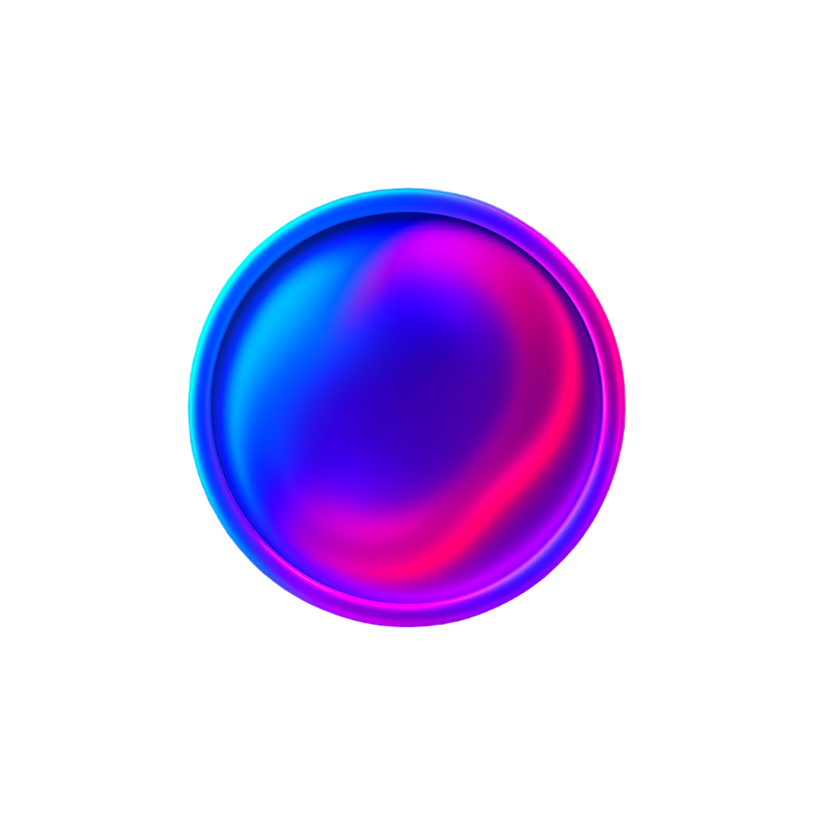

# TouchX UI

<p align="center">
  
  
  
  
  
  
  
</p>

<p align="center">
  <strong>🎭 可触摸的美丽动效 · 生动如生命般的组件库</strong>
</p>

<p align="center">
  一个专注于<strong>触感体验</strong>和<strong>流畅动效</strong>的现代化 Vue3 组件库<br/>
  让每一次交互都充满生命力，为用户带来前所未有的沉浸式体验
</p>

<p align="center">
  <a href="#快速开始">快速开始</a> ·
  <a href="#组件预览">组件预览</a> ·
  <a href="#设计理念">设计理念</a> ·
  <a href="#技术架构">技术架构</a> ·
  <a href="#文档">在线文档</a>
</p>

<p align="center">
  <a href="README.md">English</a> | <strong>简体中文</strong>
</p>

---

## ✨ 核心特性

**🎭 生动触感体验**
通过精密物理引擎实现生命般的触摸反馈。弹性响应和阻尼效果让每次交互都自然生动。

**🌊 丝滑动效系统**
基于贝塞尔曲线和物理动画的 60fps 流畅体验。智能缓动根据交互强度自适应，确保视觉连贯性。

**💎 现代视觉语言**
玻璃态美学配合毛玻璃效果、动态光影和材质模拟，为数字界面带来真实质感。

**⚡ 性能优化**
Vue3 Composition API 配合 Tree Shaking 支持，减少 50%+ 包体积。虚拟化渲染和智能缓存确保稳定性。

**🎨 企业级设计系统**
完整 Design Tokens 体系支持无缝主题切换。遵循 WCAG 2.1 AA 无障碍标准，美观且包容。

**📱 跨平台就绪**
响应式设计适配所有设备。PWA 和 SSR 友好，一套代码适配全平台。

## 🚀 快速开始

### 📦 安装

选择您喜欢的包管理器：

```bash
# npm
npm install @talex-touch/touchx-ui

# yarn
yarn add @talex-touch/touchx-ui

# pnpm (推荐)
pnpm add @talex-touch/touchx-ui
```

### 🔧 完整引入

```typescript
import { createApp } from 'vue'
import TouchXUI from '@talex-touch/touchx-ui'
import '@talex-touch/touchx-ui/dist/style.css'

const app = createApp(App)
app.use(TouchXUI)
app.mount('#app')
```

### 🎯 按需引入 (推荐)

```typescript
import { createApp } from 'vue'
import { TxButton, TxAvatar } from '@talex-touch/touchx-ui'
import '@talex-touch/touchx-ui/dist/style.css'

const app = createApp(App)
app.use(TxButton)
app.use(TxAvatar)
```

### 🎨 自定义主题 (暂不支持)

```typescript
import { createApp } from 'vue'
import TouchXUI from '@talex-touch/touchx-ui'
import '@talex-touch/touchx-ui/dist/style.css'

const app = createApp(App)

// 自定义主题配置
app.use(TouchXUI, {
  theme: {
    primaryColor: '#6366f1',
    borderRadius: '12px',
    animationDuration: '0.3s'
  }
})
```

### 💡 快速体验

```vue
<template>
  <div class="demo">
    <!-- 触感按钮 -->
    <TxButton type="primary" @click="handleClick">
      点击感受触感
    </TxButton>

    <!-- 流动头像 -->
    <TxAvatar
      src="https://example.com/avatar.jpg"
      size="large"
      glow
    />

    <!-- 玻璃卡片 -->
    <TxCard glass blur>
      <h3>TouchX UI</h3>
      <p>让每一次交互都充满生命力</p>
    </TxCard>
  </div>
</template>

<script setup>
const handleClick = () => {
  console.log('感受到了吗？这就是 TouchX ！')
}
</script>
```

## 🎯 设计理念

TouchX UI 体现了一种**交互哲学** —— 界面应该充满生命力，温暖地响应用户。

**触感至上** - 通过温暖的质感反馈系统让每次交互都有灵魂。
**生命力** - 组件会呼吸、表达情感，并预测用户意图。
**流动美学** - 功能性动画引导用户，保持视觉连贯性。
**质感体验** - 数字界面应拥有真实的材质感受和纹理。

## 🎨 组件生态

> 🚧 **Beta 版本** - 当前为 Beta 测试版，更多组件即将推出！

### 基础组件
- **TxButton** - 具有弹性反馈和涟漪效果的触感按钮
- **TxAvatar** - 拥有动态光晕和呼吸效果的流动头像
- **TxForm** - 实时验证的丝滑表单交互体验

### 布局组件
- **TxCard** - 多层次阴影系统的玻璃态卡片
- **TxContainer** - 智能栅格系统的流体容器

### 交互组件
- **TxSlider** - 具有阻尼效果的物理反馈滑块
- **TxSwitch** - 液体般流动效果的切换开关

### 数据展示
- **TxChart** - 渐进式入场动画的动态图表

### 反馈组件
- **TxToast** - 智能定位的情感化消息提示

*🚀 更多组件正在积极开发中...*

## 🏗️ 技术架构

基于现代前端技术栈构建，确保高性能和可维护性：

- **Vue 3.4+** 配合 Composition API 和 `<script setup>`
- **TypeScript 5.x** 提供完整类型安全
- **Vite 5.x** 实现极速开发体验
- **Vitest** 现代化单元测试
- **CSS Variables** 支持动态主题
- **Tree Shaking** 优化包体积

## 📖 文档

- **[在线文档](https://touchx-ui.talex.cn)** - 完整的组件文档和 API 参考
- **[在线演示](https://touchx-ui.talex.cn/playground)** - 交互式组件演示
- **[设计系统](https://touchx-ui.talex.cn/design-system)** - 设计令牌和指南

## 🛠️ 开发

```bash
# 克隆和设置
git clone https://github.com/talex-touch/touchx-ui.git
cd touchx-ui
pnpm install

# 开发
pnpm docs:dev          # 启动文档服务器
pnpm comp:play         # 启动组件演示
pnpm test              # 运行测试
pnpm build             # 构建库
```

## 🤝 参与贡献

我们欢迎所有形式的贡献！请阅读我们的 [贡献指南](CONTRIBUTING.md) 了解详情。

- 🐛 [报告问题](https://github.com/talex-touch/touchx-ui/issues)
- 💡 [功能建议](https://github.com/talex-touch/touchx-ui/discussions)
- 🔧 [提交 PR](https://github.com/talex-touch/touchx-ui/pulls)

## 📄 开源协议

[MIT License](LICENSE) © 2025 TalexDreamSoul

---

<p align="center">
  
</p>

<p align="center">
  <strong>🎭 让每一次触摸都充满生命力</strong><br/>
  <em>TouchX UI - 可触摸的美丽动效</em>
</p>

<p align="center">
  <a href="https://touchx-ui.talex.cn">📖 文档</a> ·
  <a href="https://github.com/talex-touch/touchx-ui">⭐ GitHub</a> ·
  <a href="https://www.npmjs.com/package/@talex-touch/touchx-ui">📦 NPM</a> ·
  <a href="https://github.com/talex-touch/touchx-ui/discussions">💬 讨论</a>
</p>
