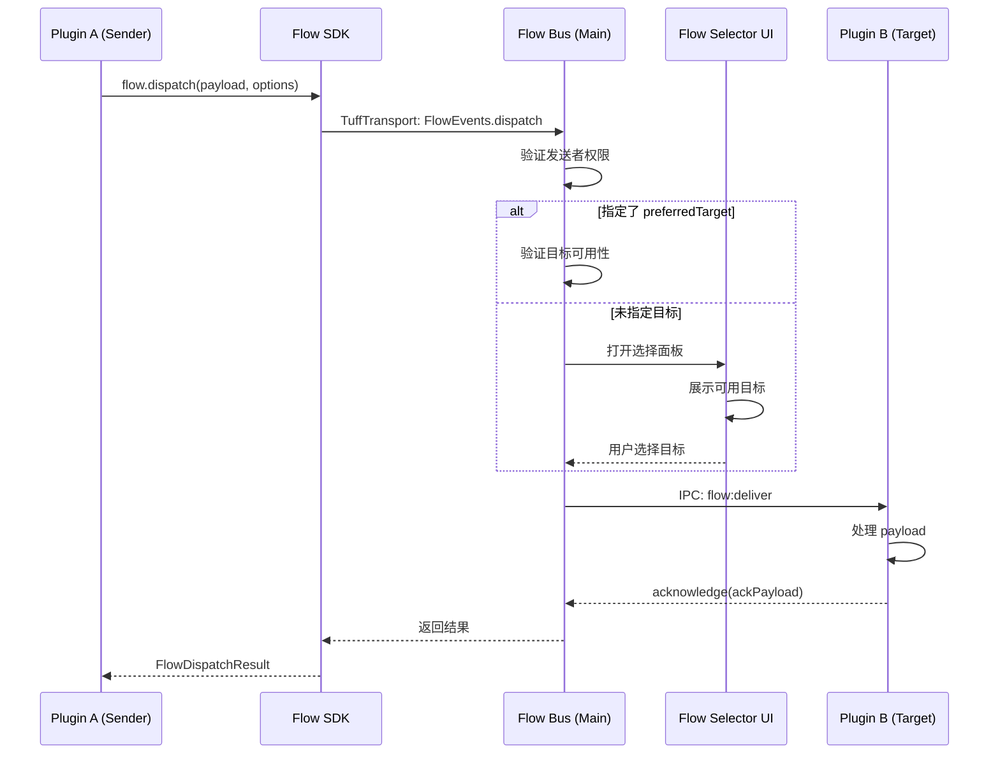

# PRD: Flow Transfer 插件间流转能力 - 详细设计 (v1.1)

## 1. 概述

Flow Transfer 是一个插件间数据流转系统，允许插件 A 将结构化数据（TuffQuery 类似物）传递给插件 B 的指定 Feature/Action 进行处理。类似于移动端的"分享"功能，但更加强大和灵活。

### 1.1 核心价值

- **跨插件协作**: 打破插件孤岛，实现数据在插件间无缝流转
- **用户效率提升**: 减少复制粘贴，一键完成跨插件工作流
- **生态扩展性**: 为插件生态提供标准化的协作接口

### 1.2 与现有系统的关系

```
┌─────────────────────────────────────────────────────────────┐
│                      CoreBox (搜索/启动器)                    │
│  ┌─────────────┐  ┌─────────────┐  ┌─────────────┐          │
│  │  Plugin A   │  │  Plugin B   │  │  Plugin C   │          │
│  │  (Sender)   │──│  (Target)   │──│  (Target)   │          │
│  └─────────────┘  └─────────────┘  └─────────────┘          │
│         │                │                │                  │
│         └────────────────┼────────────────┘                  │
│                          ▼                                   │
│                   ┌─────────────┐                            │
│                   │  Flow Bus   │  ← 主进程调度中心           │
│                   └─────────────┘                            │
│                          │                                   │
│         ┌────────────────┼────────────────┐                  │
│         ▼                ▼                ▼                  │
│  ┌─────────────┐  ┌─────────────┐  ┌─────────────┐          │
│  │DivisionBox  │  │ CoreBox UI  │  │ Plugin View │          │
│  └─────────────┘  └─────────────┘  └─────────────┘          │
└─────────────────────────────────────────────────────────────┘
```

## 2. 核心概念

### 2.1 Flow Payload（流转载荷）

发起插件提交的标准化数据包：

```typescript
interface FlowPayload {
  /** 载荷类型 */
  type: 'text' | 'image' | 'files' | 'json' | 'html' | 'custom'
  
  /** 主要数据内容 */
  data: string | object
  
  /** 数据的 MIME 类型（可选） */
  mimeType?: string
  
  /** 上下文元信息 */
  context?: {
    /** 来源插件 ID */
    sourcePluginId: string
    /** 来源 Feature ID */
    sourceFeatureId?: string
    /** 原始查询（如果有） */
    originalQuery?: TuffQuery
    /** 自定义元数据 */
    metadata?: Record<string, any>
  }
}
```

### 2.2 Flow Target（流转目标）

接收端在 manifest 中声明的可接收 Flow 的端点：

```typescript
interface FlowTarget {
  /** 目标唯一 ID（插件内唯一） */
  id: string
  
  /** 显示名称 */
  name: string
  
  /** 描述 */
  description?: string
  
  /** 支持的载荷类型 */
  supportedTypes: FlowPayloadType[]
  
  /** 图标 */
  icon?: string
  
  /** 关联的 Feature ID（可选，用于直接触发 Feature） */
  featureId?: string
  
  /** 关联的 Action ID（可选，用于直接触发 Action） */
  actionId?: string
  
  /** 是否需要用户确认 */
  requireConfirm?: boolean
  
  /** 能力要求 */
  capabilities?: {
    /** 是否需要认证 */
    requiresAuth?: boolean
    /** 允许的发送者白名单（插件 ID） */
    allowedSenders?: string[]
  }
}
```

### 2.3 Flow Session（流转会话）

一次完整的流转操作：

```typescript
interface FlowSession {
  /** 会话唯一 ID */
  sessionId: string
  
  /** 会话状态 */
  state: FlowSessionState
  
  /** 发起插件 ID */
  senderId: string
  
  /** 目标插件 ID */
  targetPluginId: string
  
  /** 目标端点 ID */
  targetId: string
  
  /** 载荷数据 */
  payload: FlowPayload
  
  /** 创建时间 */
  createdAt: number
  
  /** 更新时间 */
  updatedAt: number
  
  /** 确认响应（如果有） */
  ackPayload?: any
  
  /** 错误信息（如果失败） */
  error?: FlowError
}

type FlowSessionState = 
  | 'INIT'           // 初始化
  | 'TARGET_SELECTING' // 用户选择目标中
  | 'TARGET_SELECTED'  // 目标已选择
  | 'DELIVERING'       // 投递中
  | 'DELIVERED'        // 已投递
  | 'PROCESSING'       // 目标处理中
  | 'ACKED'            // 已确认完成
  | 'FAILED'           // 失败
  | 'CANCELLED'        // 已取消
```

## 3. API 设计

### 3.1 发起方 API（SDK）

```typescript
// packages/utils/plugin/sdk/flow.ts

interface FlowDispatchOptions {
  /** 显示标题（用于选择面板） */
  title?: string
  
  /** 显示描述 */
  description?: string
  
  /** 首选目标（bundleId.targetId 或 tuffItemId） */
  preferredTarget?: string
  
  /** 是否跳过选择面板（需要指定 preferredTarget） */
  skipSelector?: boolean
  
  /** 超时时间（毫秒，默认 30000） */
  timeout?: number
  
  /** 失败时的回退操作 */
  fallbackAction?: 'copy' | 'none'
  
  /** 是否需要确认响应 */
  requireAck?: boolean
}

interface FlowDispatchResult {
  /** 会话 ID */
  sessionId: string
  
  /** 最终状态 */
  state: FlowSessionState
  
  /** 确认响应数据 */
  ackPayload?: any
}

// SDK 接口
interface IFlowSDK {
  /**
   * 发起流转
   * @param payload 载荷数据
   * @param options 配置选项
   */
  dispatch(payload: FlowPayload, options?: FlowDispatchOptions): Promise<FlowDispatchResult>
  
  /**
   * 获取可用目标列表
   * @param payloadType 载荷类型（用于过滤）
   */
  getAvailableTargets(payloadType?: FlowPayloadType): Promise<FlowTargetInfo[]>
  
  /**
   * 监听会话状态变化
   */
  onSessionUpdate(sessionId: string, handler: (session: FlowSession) => void): () => void
  
  /**
   * 取消流转
   */
  cancel(sessionId: string): Promise<void>
}
```

### 3.2 接收方 API（SDK）

```typescript
// 接收方在 Feature 触发时通过 query 参数接收 Flow 数据
interface TuffQuery {
  text: string
  inputs?: TuffQueryInput[]
  
  /** Flow 来源信息（当通过 Flow 触发时存在） */
  flow?: {
    sessionId: string
    payload: FlowPayload
    senderId: string
    senderName?: string
  }
}

// 接收方可以发送确认响应
interface IFlowReceiverSDK {
  /**
   * 发送确认响应
   * @param sessionId 会话 ID
   * @param ackPayload 响应数据
   */
  acknowledge(sessionId: string, ackPayload?: any): Promise<void>
  
  /**
   * 报告处理失败
   * @param sessionId 会话 ID
   * @param error 错误信息
   */
  reportError(sessionId: string, error: string): Promise<void>
}
```

### 3.3 Manifest 声明

```json
{
  "name": "my-plugin",
  "version": "1.0.0",
  
  "capabilities": {
    "flowSender": true
  },
  
  "flowTargets": [
    {
      "id": "quick-note",
      "name": "快速记录",
      "description": "将内容保存为笔记",
      "supportedTypes": ["text", "html", "image"],
      "icon": "ri:sticky-note-line",
      "featureId": "create-note"
    },
    {
      "id": "translate",
      "name": "翻译",
      "description": "翻译选中的文本",
      "supportedTypes": ["text"],
      "icon": "ri:translate",
      "featureId": "translate-text"
    }
  ]
}
```

## 4. 交互流程

### 4.1 标准流转流程



### 4.2 快捷流转（Command+D）

当用户在 CoreBox 中选中一个结果项时，按 Command+D 可以：
1. 将当前项分离到 DivisionBox 独立窗口
2. 或触发 Flow 选择面板，将当前项的数据流转到其他插件

## 5. 实现计划

### Phase 1: 基础设施（本次实现）

1. **类型定义** (`packages/utils/types/flow.ts`)
   - FlowPayload, FlowTarget, FlowSession 等核心类型
   - FlowError 错误类型

2. **Flow Bus 主进程模块** (`apps/core-app/src/main/modules/flow-bus/`)
   - `flow-bus.ts`: 核心调度逻辑
   - `target-registry.ts`: 目标注册表
   - `session-manager.ts`: 会话管理
   - `ipc.ts`: IPC 通道注册

3. **SDK 扩展** (`packages/utils/plugin/sdk/flow.ts`)
   - dispatch, getAvailableTargets, onSessionUpdate, cancel
   - acknowledge, reportError

4. **Command+D 快捷键** (渲染进程)
   - 在 `useKeyboard.ts` 中添加 Command+D 处理
   - 触发 DivisionBox 或 Flow 选择面板

### Phase 2: UI 与体验（后续迭代）

1. Flow 选择面板组件
2. 授权对话框
3. 历史记录与推荐

### Phase 3: 高级功能（远期）

1. 自动化 Flow 规则
2. Flow 模板
3. 审计日志

## 6. 验收标准

### 6.1 基础功能

- [ ] 插件可通过 `flow.dispatch()` 发起流转
- [ ] 插件可在 manifest 中声明 `flowTargets`
- [ ] Flow Bus 正确路由载荷到目标插件
- [ ] 目标插件可通过 `query.flow` 接收数据
- [ ] Command+D 可触发分离窗口或 Flow 选择

### 6.2 错误处理

- [ ] 未启用的插件无法作为目标
- [ ] 超时自动标记失败
- [ ] 失败时执行 fallbackAction

### 6.3 性能指标

- 目标列表加载 ≤ 200ms
- 消息投递延迟 ≤ 100ms

## 7. 文件结构

```
packages/utils/
├── types/
│   └── flow.ts                    # Flow 类型定义
└── plugin/
    └── sdk/
        └── flow.ts                # Flow SDK

apps/core-app/src/main/modules/
└── flow-bus/
    ├── index.ts                   # 模块入口
    ├── flow-bus.ts                # 核心调度
    ├── target-registry.ts         # 目标注册
    ├── session-manager.ts         # 会话管理
    └── ipc.ts                     # IPC 通道

apps/core-app/src/renderer/src/
├── modules/box/adapter/hooks/
│   └── useKeyboard.ts             # 添加 Command+D
└── components/flow/
    └── FlowSelector.vue           # 选择面板（Phase 2）
```
