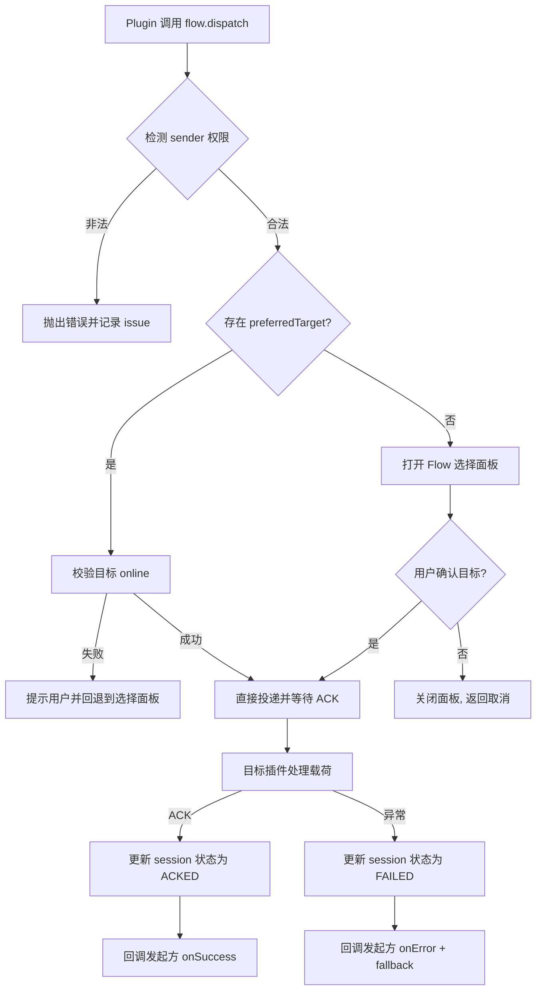

# PRD: 插件系统 "Flow Transfer" 流转能力 (v1.0)

## 1. 背景与目标

- **插件间协同缺口**: 目前插件只能各自处理用户输入，缺乏将一个插件产生的上下文快速复用到另一个插件的方式，导致用户在多个插件间复制粘贴、重复配置。
- **统一的流动通道**: 需要提供一个安全、标准化的“流转”机制，让插件可以发起“分享”请求，并将结构化数据流向指定的插件内部应用或 feature。
- **效率与可扩展性**: 通过系统级流转能力，提升跨插件流程效率，构建可扩展的应用内工作流生态。

## 2. 核心概念定义

- **Flow Payload（流转载荷）**: 发起插件提交的标准化数据包，包含 `type`、`data`、`context` 元信息，用于描述要流转的实体（文本、文件、结构化对象等）。
- **Flow Target（流转目标）**: 在插件 manifest 中声明的接收端，代表插件内部某个可消费该载荷的“应用”或视图，具备唯一 `targetId` 与支持的 `payloadType`。
- **Flow Session（流转会话）**: 一次流转操作的完整生命周期，从发起、目标选择、确认到回调，拥有唯一 `sessionId` 并可追踪状态。
- **Flow Bus（流转总线）**: Launcher 主进程维护的调度层，负责校验权限、投递载荷、记录日志以及向收发双方提供事件回调。

## 3. 用户场景

- **翻译结果流转到写作插件**: 用户在“多源翻译”插件中生成译文，点击“流转”，选择“写作助手/草稿箱”作为目标，译文自动填充到目标插件的输入区域。
- **截图插件流转到图片标注工具**: 截图插件捕获图片后，通过流转将图片和备注发送给“白板/标注”插件继续处理。
- **任务管理串联**: AI 总结插件生成待办事项，一键流转到“任务看板”插件，自动创建卡片并附带上下文。

## 4. 功能需求

### 4.1 流转发起 API

- 新增 `plugin.utils.flow.dispatch(payload, options)` API：
  - `payload`: 必须包含 `type` (`text` | `file` | `json` | `custom`) 与 `data`。
  - `options`: 支持 `title`、`description`、`metadata`、`preferredTargets`、`requireAck`。
- 发起方需在 manifest 中声明能力 `capabilities.flowSender: true`，未声明的插件调用时抛出错误。
- 支持同步检查（若无可用目标返回带原因的 rejection），并返回 `sessionId`。

### 4.2 目标注册与发现

- Manifest 增加 `flowTargets` 数组，结构示例：
  ```json
  {
    "id": "notes.quick-capture",
    "name": "快捷记录",
    "description": "快速将文本保存为笔记",
    "supportedTypes": ["text", "json"],
    "capabilities": { "requiresAuth": false }
  }
  ```
- 插件启动时向 Flow Bus 注册目标，主进程维护目标索引（含插件状态、授权信息、最近使用分数）。
- 支持运行时 enable/disable 目标（例如用户关闭插件某子模块）。

### 4.3 流转选择面板

- 当发起方未指定单一目标时，系统弹出全局 Flow 选择面板：
  - 展示最近使用 / 推荐目标，支持搜索和按 `payloadType` 过滤。
  - 支持在面板内预览载荷摘要（截断文本、显示文件缩略图）。
  - 用户确认后进入会话阶段，取消则回调发起方 `onCancel`。
- UI 在主窗口内悬浮展示，支持快捷键导航，满足无障碍要求。

### 4.4 会话与回调

- Flow Bus 为每个 session 维护状态机（`INIT` → `TARGET_SELECTED` → `DELIVERED` → `ACKED` | `FAILED`）。
- 支持发起方监听事件 `flow.onSessionUpdate(sessionId, handler)`，接收确认/失败等通知。
- 目标插件消费后可回传 `ackPayload`（如新生成的资源 ID），返回给发起方。
- 超时（默认 30s，无响应）需自动标记失败，并通知发起方。

### 4.5 权限与安全

- Flow Target 可配置 `allowedSenders`（白名单）或基于 `payloadType` 自动放行。
- 首次流转到目标插件时弹出授权对话框，允许用户记住选择（按目标粒度记忆）。
- 对 `file`、`custom` 类型载荷启用大小与类型校验；超过限制直接拒绝。
- 所有流转操作写入审计日志：`timestamp`、`fromPlugin`、`targetId`、`result`。

### 4.6 错误处理与回退

- 若 Flow Bus 检测到目标插件不可用（未启用、崩溃），应提示用户，并提供重新选择目标的选项。
- 插件若抛出错误，需在面板中显示友好提示，并记录 `PluginIssue`。
- 支持发起方配置 `fallbackAction`（如复制到剪贴板），在失败时自动执行。

### 4.7 可观察性与分析

- 提供统计接口：查询最近流转次数、失败比例、热门目标等，用于产品分析。
- 与 Usage Tracking 体系打通（session ID 关联），便于后续智能推荐目标。

## 5. 非功能需求

- **性能**: 面板启动与目标列表加载 ≤ 200ms；消息投递延迟 ≤ 100ms（同机）。
- **可靠性**: 任何单个插件异常不得影响 Flow Bus；保证消息投递至少一次，失败明确反馈。
- **扩展性**: 支持 100+ 插件目标并保持响应；API 设计向后兼容。
- **安全性**: 默认最小权限；跨插件数据必须走受控通道，避免直接访问文件路径等敏感信息。

## 6. 技术方案概述

### 6.1 API 与 SDK 扩展

- `packages/utils/plugin/sdk/system.ts` 增加 `flow` 工具模块，暴露 `dispatch`、`onSessionUpdate`、`cancel` 等方法。
- `system.ts` 内部通过 `channel.send('flow:dispatch', ...)` 调用主进程。
- TypeScript 类型定义扩展 `FlowPayload`, `FlowDispatchOptions`, `FlowSessionUpdate`。

### 6.2 主进程 Flow Bus

- 在 `apps/core-app/src/main/plugins/` 新增 `flow-bus.ts`：
  - 维护 `targetsRegistry` (Map<targetId, FlowTargetDescriptor>)。
  - 负责与插件实例交互，验证 manifest 声明与权限。
  - 处理 UI 请求（面板打开、搜索）和 session 状态更新。
- 与 `CoreBoxManager` 集成，使 Flow 面板可在任何模式下弹出。

### 6.3 UI 层实现

- 前端新增 `FlowSelector` 组件，展示目标卡片、预览载荷；
- 接收 Flow Bus 传入的 `payloadDigest`（自动生成标题、截断内容）。
- 支持后续 embed 到插件视图或独立窗口。

### 6.4 数据与配置存储

- 用户授权记忆存储在 `~/.talex-touch/config/flow-consent.json`，按 `targetId`+`senderId` 存储。
- 近期使用频次写入 `flow-usage.sqlite`，用于排序与推荐。

### 6.5 开发与调试支持

- Dev Tools 内提供 Flow Debug 面板，可模拟 payload、查看事件日志。
- 在源码开发模式下，允许通过热更新刷新目标列表。

### 6.6 伪代码示例

```ts
// 主进程 Flow Bus: 分发请求
async function dispatchFlow(payload: FlowPayload, options: DispatchOptions) {
  assertSenderCapability(options.senderId, 'flowSender')
  const target = options.preferredTarget ?? await promptUserSelectTarget(payload)
  if (!target)
    return { status: 'CANCELLED' }

  const session = createSession(payload, target)
  try {
    const ack = await sendToTarget(session)
    updateSession(session.id, 'ACKED', ack)
    return { status: 'ACKED', ack }
  }
  catch (error) {
    updateSession(session.id, 'FAILED', error)
    throw error
  }
}
```

## 7. 交互流程图



## 8. 实施计划

1. **[ ] Manifest & 类型定义**: 扩展 `PluginManifest`、`IPluginDev`、新增 Flow 类型。
2. **[ ] Flow Bus 核心**: 主进程注册/调度模块与 IPC 通道。
3. **[ ] SDK & API**: 在插件 SDK 中提供 `flow` 模块及类型。
4. **[ ] UI 面板**: 构建 Flow Selector 组件、授权对话框。
5. **[ ] 会话 & 日志**: 实现 session 状态跟踪、审计日志、失败回退逻辑。
6. **[ ] 测试插件**: 构建至少一个发送插件、一个接收插件验证端到端；提供 Demo。
7. **[ ] 文档与示例**: 编写开发者指南、payload schema 示例。

## 9. 验收标准

- 插件能够调用 `flow.dispatch` 并成功向声明目标传递文本/JSON/File 三类载荷。
- 无交互阻塞：流转面板操作流畅、取消/失败反馈清晰。
- 权限控件有效：未经授权的插件无法向受限目标发送数据。
- Session 状态在日志中可追踪，异常均可重现并被记录。
- Demo 插件完成端到端验证并通过 CI 自动化测试。

## 10. 风险与待决问题

- **Payload 标准化程度**: 是否需要引入 JSON Schema 校验？建议 MVP 阶段提供可选 schema，后续迭代。
- **文件传输能力**: 大文件 (>10MB) 的传输机制与存储位置需明确，当前设定限制为 5MB。
- **冲突与并发**: 同一目标短时间内接收大量流转请求的节流策略待定。
- **跨平台兼容**: Windows/Linux 平台的文件句柄、安全策略需评估。
- **推荐算法**: Flow 面板的排序策略初版采用“最近 + 手动排序”，智能推荐延后。

## 11. 成功指标

- DAU 中使用流转的用户占比 ≥ 25%。
- 流转成功率 ≥ 95%，平均响应时间 < 400ms。
- Top 3 目标的复用率 ≥ 60%，证明跨插件流程得到实际使用。
- 每个会话平均节省 2 次以上手动复制粘贴行为（通过调研/遥测佐证）。

## 12. 后续迭代方向

- 引入自动化 Flow（无需手动选择目标，根据上下文自动推送）。
  - 支持条件规则：如“当 payload.type = text 且包含 URL 时 → 推送到 收藏夹”。
- 打通云同步与团队协作，实现跨设备、跨成员流转。
- 提供 Flow Template 市场，让开发者共享常用跨插件流程组合。
