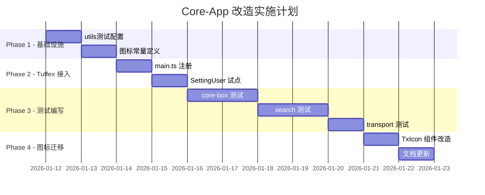

# Core-App 改造实施计划

>日期: 2026-01-11  
> 版本: 1.0  
> 状态: 待审核

## 概述

本计划涵盖三个改造点：
1. **Tuffex 克制接入** - 在设置页面等非核心 UI逐步使用 tuffex 组件库
2. **packages/utils 测试框架** - 引入 vitest 测试，优先覆盖 core-box、search、transport
3. **Tuffex Icons + UnoCSS** - 统一图标方案，使用 UnoCSS icones

---

## 一、Tuffex 克制接入策略

### 1.1 现状分析

**当前情况**：
- `apps/core-app/package.json` 已包含 `@talex-touch/tuffex` 依赖
- `main.ts` 未引入 tuffex
- 设置页面使用的是自定义组件（`~/components/tuff/`），命名与tuffex 相似但并非同一套

**Tuffex 可用组件**（基于 `packages/tuffex/components.json`）：
- `TxButton` - 触感按钮
- `TxAvatar` - 流动头像
- `TxForm` - 丝滑表单

**Tuffex 组件源码**（更多可用）：
- `TxCard` / `TxFlex` / `TxGrid` - 布局组件
- `TxInput` / `TxSearchInput` - 输入组件
- `TxTabs` / `TxTabBar` - 标签组件
- `TxSkeleton` / `TxEmpty` - 状态组件
- `TxTransition` - 过渡动画组件

### 1.2 接入策略

```
Phase 1: 设置页面试点（低风险区）
├── SettingUser.vue - 用户设置（TxButton, TxAvatar）
├── SettingLanguage.vue - 语言设置（TxCard）
└── SettingAbout.vue - 关于页面（TxCard, TxFlex）

Phase 2: 新功能优先使用
├── 所有新增的设置组件
├── 新增的弹窗/Dialog
└── 新增的表单页面

Phase 3: 逐步替换（可选）
├── 非核心功能区的按钮组件
└── 列表/卡片展示组件
```

### 1.3 实施步骤

#### Step 1: 注册 Tuffex 插件
```typescript
// apps/core-app/src/renderer/src/main.ts
import TuffUI from '@talex-touch/tuffex'
import '@talex-touch/tuffex/style.css'

// 在registerCorePlugins 中添加
app.use(TuffUI)
```

#### Step 2: 按需引入（推荐）
```typescript
// 或者按需引入，减少包体积
import { TxButton, TxAvatar, TxCard } from '@talex-touch/tuffex'
```

#### Step 3: 试点改造 SettingUser.vue
- 替换 `FlatButton` → `TxButton`
- 使用 `TxAvatar` 展示用户头像

### 1.4 注意事项

-⚠️ 不要一次性大规模替换，每次只改造一个组件/页面
- ⚠️ 保留现有 `~/components/tuff/` 组件，它们是专门为设置页面设计的
- ⚠️ tuffex 组件和现有组件样式可能冲突，需要逐一测试

---

## 二、packages/utils 测试框架

### 2.1 现状分析

**当前情况**：
- `packages/utils/package.json` 无测试配置
- 根目录 `package.json` 已有 `vitest: ^3.2.4`
- tuffex 内部已有测试示例：`packages/tuffex/packages/utils/__tests__/vibrate.test.ts`

**优先测试模块**：
1. `core-box/` - 搜索结果构建器、DSL
2. `search/` - 模糊匹配、特征匹配
3. `transport/` - 事件传输、类型定义

### 2.2 目录结构设计

```
packages/utils/
├── __tests__/# 测试目录
│   ├── core-box/
│   │   ├── tuff-builder.test.ts
│   │   └── recommendation.test.ts
│   ├── search/
│   │   ├── fuzzy-match.test.ts
│   │   ├── feature-matcher.test.ts
│   │   └── levenshtein-utils.test.ts
│   └── transport/
│       ├── event-builder.test.ts
│       └── types.test.ts
├── vitest.config.ts# 测试配置
└── package.json                # 添加测试脚本
```

### 2.3 配置文件

#### vitest.config.ts
```typescript
import { defineConfig } from 'vitest/config'

export default defineConfig({
  test: {
    globals: true,
    environment: 'node',
    include: ['__tests__/**/*.test.ts'],
    coverage: {
      provider: 'v8',
      reporter: ['text', 'json', 'html'],
      include: ['core-box/**', 'search/**', 'transport/**']
    }
  }
})
```

#### package.json更新
```json
{
  "scripts": {
    "test": "vitest run",
    "test:watch": "vitest",
    "test:coverage": "vitest run --coverage"
  },
  "devDependencies": {
    "vitest": "^3.2.4"
  }
}
```

### 2.4 测试用例示例

#### fuzzy-match.test.ts
```typescript
import { describe, it, expect } from 'vitest'
import { fuzzyMatch, calculateScore } from '../search/fuzzy-match'

describe('fuzzyMatch', () => {
  it('should match exact strings', () => {
    expect(fuzzyMatch('hello', 'hello')).toBe(true)
  })

  it('should match partial strings', () => {
    expect(fuzzyMatch('hlo', 'hello')).toBe(true)
  })

  it('should return false for non-matching', () => {
    expect(fuzzyMatch('xyz', 'hello')).toBe(false)
  })
})

describe('calculateScore', () => {
  it('should score exact match highest', () => {
    const score = calculateScore('hello', 'hello')
    expect(score).toBeGreaterThan(0.9)
  })
})
```

### 2.5 CI/CD 集成

```yaml
# .github/workflows/test-utils.yml
name: Test Utils Package

on:
  push:
    paths:
      - 'packages/utils/**'
  pull_request:
    paths:
      - 'packages/utils/**'

jobs:
  test:
    runs-on: ubuntu-latest
    steps:
      - uses: actions/checkout@v4
      - uses: pnpm/action-setup@v2
      - uses: actions/setup-node@v4
        with:
          node-version: '22'
          cache: 'pnpm'
      - run: pnpm install
      - run: pnpm -F @talex-touch/utils test
```

### 2.6 根package.json 更新

```json
{
  "scripts": {
    "utils:test": "pnpm -F @talex-touch/utils test",
    "utils:test:coverage": "pnpm -F @talex-touch/utils test:coverage"
  }
}
```

---

## 三、Tuffex Icons + UnoCSS 图标方案

### 3.1 现状分析

**core-app UnoCSS 配置** (`apps/core-app/uno.config.ts`)：
```typescript
presetIcons({
  collections: {
    'ri': ri,              // Remix Icon
    'simple-icons': simpleIcons,
    'carbon': carbonIcons, // 主要使用},
})
```

**tuffex 图标现状**：
- 使用自定义 SVG 组件方案
- 文档中有详细的图标设计规范

### 3.2 统一方案设计

#### 方案：tuffex 采用 UnoCSS icones，utils 定义常用图标集

```
packages/
├── utils/
│   └── icons/
│       ├── index.ts           # 图标常量导出
│       ├── navigation.ts      # 导航图标
│       ├── action.ts          # 操作图标
│       ├── status.ts          # 状态图标
│       └── types.ts           # 图标类型定义
└── tuffex/
    └── docs/
        └── icons/
            └── index.md       # 更新为UnoCSS 用法
```

### 3.3 图标常量定义

#### packages/utils/icons/index.ts
```typescript
/**
 * 标准图标集定义
 * 使用 UnoCSS preset-icons 格式: i-{collection}-{icon-name}
 */

// 导航图标
export const NavIcons = {
  HOME: 'i-carbon-home',
  BACK: 'i-carbon-arrow-left',
  FORWARD: 'i-carbon-arrow-right',
  MENU: 'i-carbon-menu',
  SETTINGS: 'i-carbon-settings',
  SEARCH: 'i-carbon-search',
} as const

// 操作图标
export const ActionIcons = {
  ADD: 'i-carbon-add',
  EDIT: 'i-carbon-edit',
  DELETE: 'i-carbon-trash-can',
  COPY: 'i-carbon-copy',
  DOWNLOAD: 'i-carbon-download',
  UPLOAD: 'i-carbon-upload',
  REFRESH: 'i-carbon-renew',
  CLOSE: 'i-carbon-close',
} as const

// 状态图标
export const StatusIcons = {
  SUCCESS: 'i-carbon-checkmark-filled',
  WARNING: 'i-carbon-warning',
  ERROR: 'i-carbon-close-filled',
  INFO: 'i-carbon-information',
  LOADING: 'i-carbon-circle-dash',
} as const

// 品牌图标
export const BrandIcons = {
  TUFF: 'i-simple-icons-t',// 需要自定义
  GITHUB: 'i-simple-icons-github',
  DISCORD: 'i-simple-icons-discord',
} as const

export type IconName = 
  | typeof NavIcons[keyof typeof NavIcons]
  | typeof ActionIcons[keyof typeof ActionIcons]
  | typeof StatusIcons[keyof typeof StatusIcons]
  | typeof BrandIcons[keyof typeof BrandIcons]
```

### 3.4 Tuffex TxIcon 组件改造

```vue
<!-- packages/tuffex/packages/components/src/icon/TxIcon.vue -->
<template>
  <span :class="iconClass" :style="iconStyle" />
</template>

<script setup lang="ts">
import { computed } from 'vue'

interface Props {
  icon: string        // UnoCSS 图标类名，如 'i-carbon-home'
  size?: number | string
  color?: string
}

const props = withDefaults(defineProps<Props>(), {
  size: 24
})

const iconClass = computed(() => [
  props.icon,
  'tx-icon'
])

const iconStyle = computed(() => ({
  fontSize: typeof props.size === 'number' ? `${props.size}px` : props.size,
  color: props.color
}))
</script>

<style scoped>
.tx-icon {
  display: inline-block;
  vertical-align: middle;
}
</style>
```

### 3.5 Tuffex UnoCSS 配置

```typescript
// packages/tuffex/uno.config.ts (新建)
import { defineConfig } from 'unocss'
import presetIcons from '@unocss/preset-icons'

export default defineConfig({
  presets: [
    presetIcons({
      scale: 1.2,
      warn: true,
      extraProperties: {
        'display': 'inline-block',
        'vertical-align': 'middle',
      },
      collections: {
        // 按需配置，与 core-app 保持一致
      }
    })
  ]
})
```

---

## 四、实施顺序



---

## 五、风险与注意事项

### 5.1 风险点

| 风险 | 影响 | 缓解措施 |
|------|------|----------|
| tuffex 样式与现有样式冲突 | 中| 在隔离页面先试点，使用 CSS Scoped |
| 测试覆盖不全导致发版失败 | 中 | 先覆盖核心函数，逐步增加覆盖率 |
| 图标迁移遗漏 | 低 | 创建图标映射表，批量查找替换 |

### 5.2 回滚策略

- tuffex 组件可通过 git revert 快速回滚
- 测试失败不阻塞发版（初期设置为 warning）
- 图标改动保持向后兼容

---

## 六、验收标准

- [ ] tuffex 在SettingUser.vue 中正常工作
- [ ] `pnpm utils:test` 测试通过
- [ ] 图标常量可从 `@talex-touch/utils` 导入使用
- [ ] 无控制台错误和样式异常

---

## 七、参考资源

- [UnoCSS Icons 文档](https://unocss.dev/presets/icons)
- [Iconify Carbon 图标集](https://icon-sets.iconify.design/carbon/)
- [Vitest 文档](https://vitest.dev/)
- [Tuffex README](./packages/tuffex/README_ZHCN.md)