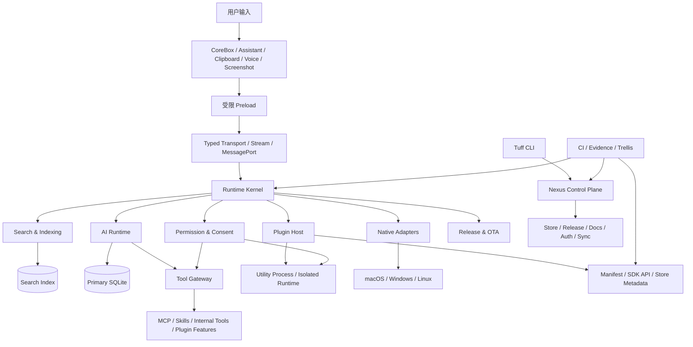

# Tuff 全新产品与架构路线图

> 文件名：`roadmap-brand-new.md`
> 定位：全新的产品、架构与工程演化基线。
> 维护边界：本文描述长期方向、阶段依赖和退出门禁；不复制两周任务、实时 Trellis 状态、本地分支、工作区状态或固定版本号。
> 当前事实源：版本读取根目录 `package.json` 与 `apps/core-app/package.json`；实时执行顺序读取 `docs/plan-prd/TODO.md`；任务状态读取 `.trellis/tasks/`；完成事实读取 `CHANGES.md` 与对应 Evidence Matrix。

## 0. 总体判断

Tuff 的下一阶段不应继续被定义为“更强的快捷启动器”，也不应被定义为“给桌面应用加一个 AI 聊天框”。它正在形成一种更明确的产品形态：

> **本地优先、受权限治理、可验证执行的 AI 桌面指令中心。**

用户从 CoreBox、Assistant、Clipboard、Voice、Screenshot 或插件进入系统；系统在本地完成搜索、上下文收集、工具调用、文件操作和插件协作；AI 负责理解和编排，但权限、数据、写入、跨进程通信和最终执行仍由宿主控制。

路线顺序必须从“能力扩张”切换为“可信闭环”：

```text
真实完成基线
    ↓
运行时内核收敛
    ↓
搜索与索引质量
    ↓
插件生命周期
    ↓
AI 工具执行
    ↓
原生跨平台能力
    ↓
Nexus 控制面与生态分发
    ↓
上下文自动化与长期差异化
```

当前最重要的风险不是缺少功能，而是：

- 当前源码能力、发布产物和验收证据不能始终证明同一个版本；
- 搜索、数据库、插件和 AI 的架构拆分仍存在半迁移边界；
- 插件 SDK 有较宽能力面，但安装、授权、更新、卸载和回滚的完整生态闭环仍不足；
- macOS、Windows、Linux 的能力和发布证据不对称；
- AI、MCP、Skills、Workflow 的扩展速度可能超过权限、成本、隐私和恢复机制的收敛速度。

## 1. 产品北极星

### 1.1 用户承诺

用户可以用一个入口完成四类动作：

1. **找到**：应用、文件、书签、历史记录、插件能力和知识内容。
2. **理解**：让 AI 根据当前输入、选区、文件、窗口或会话上下文给出可解释结果。
3. **执行**：调用系统动作、文件操作、插件能力或外部工具。
4. **复核**：在敏感动作前确认，在执行后看到结果、来源、错误和可恢复路径。

### 1.2 产品定位边界

Tuff 不以以下目标作为第一优先级：

- 成为体积最小的 launcher；
- 复制 Raycast 或 uTools 的插件数量；
- 以“支持三端”替代真实的平台能力矩阵；
- 在权限、成本和恢复机制未收口前提供完全自主的 Agent；
- 用云端服务取代本地数据事实源；
- 用新的抽象层掩盖旧 writer、旧 channel 或旧 storage protocol。

### 1.3 成功定义

Tuff 的成功不是功能清单最长，而是以下链路稳定可复现：

```text
自然输入
→ 高质量召回
→ 可解释理解
→ 最小权限确认
→ 受控执行
→ 持久结果
→ 可取消 / 可恢复 / 可审计
```

## 2. 目标架构

### 2.1 五个边界

| 边界 | 职责 | 不应承担的职责 |
| --- | --- | --- |
| Desktop Surface | CoreBox、Assistant、Clipboard、Voice、Screenshot、设置与窗口角色 | 直接持有数据库写权限或 provider secret |
| Runtime Kernel | Electron 生命周期、窗口、transport、模块依赖、任务取消与资源释放 | 复制产品组件逻辑 |
| Capability Plane | Search、File、Native、Plugin、AI、Tool Gateway、Permission | 绕过宿主权限直接访问系统资源 |
| Data Plane | Primary SQLite、Aux SQLite、Search Index、会话和 usage | 把 JSON、localStorage 或远程缓存当作本地 SoT |
| Control Plane | Nexus、Store、Release、Auth、Docs、Sync、Admin、Evidence | 替代桌面端本地运行时和本地事务 |

### 2.2 目标数据流



### 2.3 核心不变量

以下不变量贯穿所有阶段：

- SQLite 是本地事实源；JSON 只能作为密文同步载荷或可校验下载载荷。
- 一个持久化数据域只能有明确的 writer owner；不能由多个隐式 fallback 同时写入。
- 一个插件激活实例必须绑定自己的 generation、identity、key、资源和清理生命周期。
- Renderer、Plugin View、Utility Process 和 Main Process 之间必须使用类型化协议，不新增 raw/legacy 绕过通道。
- 缺失权限、缺失能力、平台不支持、provider 不可用、配额不足和版本不匹配必须返回可解释的 fail-closed 状态。
- 真实 Provider、真实签名产物、真实运行环境和真实部署证据不能由 mock、dry-run、preflight 或 swallowed exception 替代。
- 所有长任务必须支持取消、超时、终态持久化和恢复或明确不可恢复原因。

## 3. 全新阶段地图

路线阶段不是日期承诺，而是有依赖关系的工程门禁。阶段完成以退出标准为准，不以代码数量或任务勾选数量为准。

| 阶段 | 名称 | 核心目标 | 依赖 |
| --- | --- | --- | --- |
| G0 | Truth & Release Baseline | 建立当前版本、产物、运行环境和证据的一致基线 | 无 |
| G1 | Runtime Kernel Convergence | 收敛窗口、transport、module、storage、permission 和 lifecycle 所有权 | G0 |
| G2 | Search & Indexing Quality | 将搜索从“架构可用”推进到“质量和一致性可证明” | G1 |
| G3 | Plugin Ecosystem | 将插件从 SDK 能力推进到可发布、可安装、可更新、可回滚生态 | G1 |
| G4 | Governed AI Command Center | 将 AI 对话推进到可控工具执行和可复核结果 | G1、G2、G3 的稳定合同 |
| G5 | Native Cross-Platform | 以能力矩阵和降级原因完成三端原生能力 | G1 |
| G6 | Nexus Control Plane | 完成 Store、Release、Docs、Auth、Sync 和 Admin 的生产闭环 | G0、G3 |
| G7 | Context Automation | 在前述闭环稳定后扩展超级面板、Skills、Workflow 和上下文自动化 | G2、G3、G4、G5、G6 |

推荐执行关系：

```text
G0 → G1 → ┬→ G2 ─┐
          ├→ G3 ─┼→ G4 → G7
          ├→ G5 ─┤
          └→ G6 ─┘
```

G2、G3、G5 可以在 G1 的稳定接口完成后并行推进；G6 依赖 G0 和 G3 的插件生命周期合同；G4、G7 仍不得共享未定义的 writer、permission 或 transport 边界。

## 4. 阶段详细路线

### G0：Truth & Release Baseline

#### 目标

先证明“当前产品到底是什么”，再继续扩大产品能力。所有完成结论必须绑定精确版本、精确 SHA、精确产物和精确运行环境。

#### 交付范围

- manifest、CoreApp、Nexus 和文档中的版本事实同步；
- 当前版本的 macOS、Windows、Linux 产物清单；
- 签名、公证、校验和、更新清单和下载矩阵的同版本关联；
- OTA 从检查、下载、校验、安装到健康检查的完整生命周期；
- 更新失败的网络错误、协议错误、校验错误、目标不支持和用户取消分类；
- 测试中未处理异常不得被吞掉；
- 入口文档只保存稳定边界，实时任务和完成证据回到各自 SoT。

#### 退出门禁

- 同一 SHA 可以追溯到源代码、构建产物、签名、公证、manifest 和 Nexus 元数据；
- current-version evidence 不允许继承历史 beta 或其他 tag 的结果；
- 至少完成一次真实安装、更新、失败恢复和回滚路径验证；
- 文档不再声称过期版本、过期 Node/pnpm 或过期平台矩阵；
- 所有 P0/P1 完成结论都有代码、自动化验证和运行环境证据。

#### 不在本阶段扩展

- 新增 AI provider；
- 新增插件能力；
- 移动端产品线；
- 新的全局状态管理抽象。

### G1：Runtime Kernel Convergence

#### 目标

把 CoreApp 从“多个功能模块的集合”收敛为一个可解释的本地运行时内核。重点是所有权，不是继续拆文件。

#### 交付范围

1. **Window and Surface**
   - 明确 Main、CoreBox、DivisionBox、Assistant、Screenshot、OmniPanel 的窗口角色；
   - 统一 attach/detach、destroy、focus、visibility 和 sender identity 生命周期；
   - 窗口角色不能通过隐式全局状态互相污染。

2. **Transport**
   - 保留 typed request、event、stream、MessagePort 和 cancellation；
   - 删除或迁移 legacy/raw channel；
   - 明确 renderer、plugin view、utility process、main process 的 transport ownership；
   - 统一 request id、deadline、attachments、tombstone 和 teardown 行为。

3. **Module lifecycle**
   - 让启动顺序、依赖关系和 teardown 顺序可检查；
   - 将副作用集中在 module owner；
   - 降低超大 module 作为“所有服务接线板”的职责密度。

4. **Storage ownership**
   - Primary、Aux、Search 三类数据域分别明确 owner；
   - 普通写入、索引写入、usage 写入和同步写入不互相 fallback；
   - 读路径和写路径使用同一数据契约。

5. **Permission and capability**
   - capability definition、permission decision、resource owner 和 audit event 分层；
   - 缺失 permission 时 fail-closed；
   - 不把用户 token、API key、敏感上下文放入普通 storage、日志或 argv。

#### 退出门禁

- 每个核心数据域只有一个可识别的写入 owner；
- 所有跨进程调用都有 typed contract、timeout、cancellation 和终态处理；
- 窗口和插件激活销毁后没有残留 listener、port、stream、timer 或 resource；
- 不新增 legacy/raw channel、旧 storage protocol 或 SDK bypass；
- Diagnostics 能区分启动失败、权限拒绝、能力缺失、provider 失败和数据错误。

### G2：Search & Indexing Quality

#### 目标

将搜索系统从“有较完整的 provider 和 index runtime”推进为可度量、可恢复、无静默数据损失的产品质量系统。

#### 交付范围

- SearchProvider 生命周期、注册、健康状态、取消和超时统一；
- Fast / Deferred gather 的顺序、优先级和 session isolation 固化；
- Search Index SQLite / FTS5 的 writer、store、progress 和 reset 路径完整收口；
- source-scoped scan progress、watch、reconcile 和 durable job history 统一；
- completion、usage、pin、recency、semantic score 的排序合同统一；
- 语义结果不仅追加，还能在明确合同下影响已渲染结果排序；
- 空查询推荐必须展示来源、理由和可解释降级；
- macOS Spotlight、Windows Everything、Linux 文件扫描分别标注 supported/degraded/unsupported 和原因。

#### 质量基准

固定 benchmark 至少覆盖：

- 中英文精确匹配；
- 拼音、缩写、错拼和大小写；
- 应用名、文件名、书签名冲突；
- 语义召回和语义重排；
- provider 超时、取消、重复请求和陈旧 session；
- 大目录扫描、重启恢复、权限撤销和索引重置；
- completion 权重、pin 和 recency 不被后续 sorter 绕过。

#### 退出门禁

- 搜索 benchmark 有固定输入、期望排序、版本化结果和可复现命令；
- 索引写入、进度、重置、恢复和关闭均经过 focused test 与真实 profile smoke；
- 不存在跨 source、跨 session 或跨版本的静默数据损失；
- first-result、full-result、冷启动、热启动和大目录行为有 p50/p95 记录；
- 平台能力矩阵不使用笼统的“三端支持”表述。

### G3：Plugin Ecosystem

#### 目标

把插件系统从“宿主已经具备很宽的 SDK 和隔离能力”推进到“第三方可以安全完成整个生命周期”。

#### 交付范围

```text
开发
→ manifest 校验
→ sdkapi / permission 检查
→ 构建与签名
→ Nexus 上传
→ 审核与发布
→ CoreApp 安装
→ 用户授权
→ 激活与运行
→ 更新
→ 卸载与清理
→ 回滚
```

具体包括：

- Manifest、package、SDK API、platform capability 和 Nexus 元数据一致性；
- plugin activation identity、generation、key、resource registry 和 teardown 完整；
- Utility Process、WebContentsView、Plugin View 和 host channel 的边界稳定；
- shell、OS、network、fs、clipboard、browser data、intelligence、voice 等权限逐项 fail-closed；
- secret cleanup UX，不让 API key、Token 和隐私数据落入普通存储；
- Widget、Surface、CoreBox item 和 search provider 的资源隔离；
- 官方插件按当前 SDK 逐个验证，不用旧 manifest 或旧构建产物代表当前能力。

#### 退出门禁

- 一个最小第三方插件可以从构建到安装、授权、激活、更新、卸载和回滚完整跑通；
- 权限拒绝、版本不匹配、平台不支持、崩溃和超时都有可解释反馈；
- 插件无法访问宿主未授权资源；
- 插件销毁后 callback、stream、port、timer 和临时文件均可证明清理；
- Store 状态、manifest 状态和客户端安装状态可以按同一个版本追踪。

### G4：Governed AI Command Center

#### 目标

让 AI 从“能流式回答”进化为“能够安全地理解和执行桌面任务”，同时保持 Stable、Beta 和 unavailable 的真实边界。

#### 稳定主线

- CoreBox `text.chat`；
- 显式 OCR → `text.chat`；
- Local / Ollama / Nexus / OpenAI-compatible provider routing；
- delta、reasoning、tool、source、usage、end 等消息部分；
- 取消、超时、provider unavailable、quota exceeded、model unsupported、permission denied；
- conversation persistence 和刷新恢复；
- 敏感输出清洗和 usage 记录。

#### 受控扩展

- Tool Gateway 的用户确认；
- 文件、搜索、系统动作和插件工具；
- Pi Agent 或其他 Agent runtime 的宿主化执行；
- MCP 和 Skills；
- Widget、Form、Chart、Preview 等可交互结果；
- Workflow 和可恢复的长任务。

#### 明确保持 Beta 或 unavailable 的边界

- 自主高权限 Agent；
- 无确认的系统级批量动作；
- 未完成成本、配额和审计闭环的 Workflow；
- 未具备完整 runtime 合同的 `video.generate` 或其他媒体生成能力。

#### 退出门禁

- 使用真实 Provider 验证成功和失败路径；
- 工具调用必须经过 capability、permission 和必要的用户确认；
- 取消后不会继续写入错误会话或产生孤儿任务；
- Token、API key、用户隐私和 provider 原始响应不会进入错误边界；
- 每个 AI surface 明确标注 Stable、Beta 或 unavailable；
- 任何“AI 已完成”的结论同时具备真实调用、UI 结果、数据持久化和失败路径证据。

### G5：Native Cross-Platform

#### 目标

把原生能力从“某个平台存在实现”推进为“每个平台都有诚实的能力等级、降级原因和发布证据”。

#### 能力域

- OCR；
- Screenshot；
- native audio / ASR；
- Windows Everything；
- Spotlight / file metadata；
- window activation；
- clipboard / selection capture；
- update install、permission recovery 和 app lifecycle。

#### 平台合同

每项能力只能使用以下状态：

```text
supported
partial
unsupported
unavailable
```

每个非 supported 状态必须说明：

- 缺少哪个系统 API 或原生模块；
- 是构建缺失、运行时缺失还是产品未承诺；
- 用户看到什么降级行为；
- 是否有替代路径；
- 如何通过测试或 smoke 证明。

#### 退出门禁

- macOS、Windows、Linux 分别拥有能力矩阵；
- Rust / native addon 的源码、构建、加载、运行和发布产物一致；
- native failure 不会被伪装成空结果或成功；
- 更新、签名、公证、架构和安装目标之间没有未解释冲突；
- Linux 不再通过“有一个 fallback”被描述为完整支持。

### G6：Nexus Control Plane

#### 目标

将 Nexus 明确为云端控制面，而不是第二个不透明的产品运行时。它负责发布、文档、认证、商店、同步和管理，但不取代 CoreApp 的本地数据事实源。

#### 交付范围

- Plugin Store：manifest、版本、审核、发布、撤回和安装元数据；
- Release：asset、sha256、signature、download、版本和回滚元数据；
- Docs：内容索引、SEO、localized route、静态 HTML body 和客户端导航；
- Auth：回调 origin、session、权限和敏感数据边界；
- Sync：加密 payload、幂等 cursor、D1 batch 和冲突处理；
- Admin：provider registry、quota、audit、data backfill 和权限控制；
- Analytics：事件契约、隐私披露、去重、时间口径和生产/预览隔离。

#### 退出门禁

- Preview 与 Production evidence 不混用；
- 当前版本和当前资源不会继承旧版本的 release metadata；
- docs 页面首屏是否有正文可以通过生产 HTML 直接验证；
- auth、Store、Release、Sync、Admin API 的鉴权和敏感数据边界可复现；
- D1 / object storage / provider quota 的失败路径不会伪造成功；
- CoreApp 仍以本地 SQLite 作为本地事实源。

### G7：Context Automation

#### 目标

只有前六阶段完成后，才扩展真正体现 Tuff 差异化的上下文自动化。

#### 交付方向

- 选区、当前窗口、文件、剪贴板和会话上下文的统一 context envelope；
- CoreBox 与 Assistant 之间的上下文接力；
- 以证据说明推荐理由的空态和超级面板；
- Skills 的声明式输入、权限、工具和输出合同；
- 可暂停、可恢复、可审计的 Workflow；
- 常用动作的局部自动化，而非无边界自主 Agent；
- 通过用户实际重复使用验证产品价值，而不是只验证 UI 是否能展示。

#### 退出门禁

- context 不跨用户、跨窗口、跨 plugin activation 泄漏；
- 自动化任务有明确的权限、确认、取消、恢复和回滚边界；
- 推荐和自动化都能解释使用了哪些信号；
- 任务失败不会留下无法清理的状态或隐式副作用；
- 真实用户主流程的重复使用率、取消率和错误率优于手工路径，才算产品完成。

## 5. 产品表面目标

| 表面 | 目标定位 | 稳定合同 |
| --- | --- | --- |
| CoreBox | 最快的统一检索与动作入口 | 输入、召回、排序、键盘导航、执行和错误反馈可预测 |
| Assistant | 面向当前上下文的轻量 AI 入口 | 不抢焦点、不泄漏上下文、可回到原窗口 |
| Clipboard | 输入与动作之间的本地桥梁 | 内容分类、敏感数据处理、自动粘贴和撤销边界明确 |
| Voice | 全局语音输入与会话 | session owner 唯一、开始/停止/错误/最终文本一致 |
| Screenshot | 视觉输入和 OCR handoff | 截图、编辑、OCR、AI 发送和文件生命周期可恢复 |
| Plugin | 可扩展能力和用户自定义动作 | Manifest、权限、隔离、版本、安装和回滚闭环 |
| AI | 受宿主治理的理解和执行层 | provider、tool、permission、quota、storage、audit 一致 |
| Nexus | 发布和治理控制面 | Store、Release、Docs、Auth、Sync、Admin 证据可复现 |

## 6. 竞品对比与取舍

仓库内已有的公开能力矩阵用于横向参考：

`docs/plan-prd/03-features/search/RAYCAST-UTOOLS-CAPABILITY-GAP-MATRIX.md`

| 维度 | Tuff 应采取的判断 |
| --- | --- |
| 与 Raycast | 不先追逐扩展数量；重点建立本地能力、权限治理、工具执行和可验证生命周期 |
| 与 uTools | 不只复制超级面板；重点解决能力来源、权限、数据和插件信任边界 |
| 与 Wox | 不只追逐开源和轻量；重点补足 native depth、AI runtime 和发布治理 |
| 与 Vicinae | 不立刻重写成 C++/Qt；先降低 Tuff 自身运行时复杂度，验证产品价值后再评估壳层替换 |
| 与 PowerToys | 不局限于单平台系统工具；保持跨平台，但必须诚实标注能力差异 |
| 与 Spotlight / Alfred | 不以 OS 原生或脚本工作流作为唯一模型；提供可治理的 AI、插件和上下文执行 |

Tuff 不应同时参加两个不利竞争：

1. **最小体积竞争**：Electron、多窗口、AI、插件和 native helper 决定了 Tuff 不会是最小 launcher。
2. **最大生态竞争**：Raycast 和 uTools 已有生态先发优势；Tuff 应先证明安全、可维护、可回滚的插件生命周期。

Tuff 最有机会建立的差异化是：

```text
本地数据事实源
+ 可扩展插件能力
+ 宿主治理的 AI 工具调用
+ 跨平台 native adapter
+ 可追溯发布与回滚
```

## 7. 统一质量指标

G0 建立基线，后续各阶段只比较同一口径的改善。不能在没有基线时随意承诺固定数字。

### Runtime

- 冷启动和热启动；
- CoreBox 首个可用结果和完整结果；
- renderer / main / plugin host idle memory；
- 多窗口创建和销毁耗时；
- stream cancellation 和 teardown 完成率；
- crash-free 与未处理异常数量。

### Search / Index

- 精确查询命中率和首位命中率；
- 语义召回有效率和重排稳定性；
- 首帧 p50/p95；
- 大目录索引吞吐和恢复时间；
- index 与 source 的一致性；
- 权限撤销后的可见性；
- reset、reconcile、watch 和 restart recovery 成功率。

### Plugin

- 安装成功率；
- 首次授权完成率；
- 激活到首个结果耗时；
- permission deny 的正确 fail-closed 比例；
- 崩溃、超时和取消后的清理率；
- update、uninstall、rollback 成功率。

### AI

- 真实 provider 成功率；
- stream 完整终态率；
- tool confirmation 正确率；
- quota、permission、model、network failure 可解释率；
- 敏感数据泄漏事件数；
- 任务取消后孤儿写入数；
- 真实用户重复使用率与人工路径相比的节省程度。

### Release / Nexus

- 同 SHA 产物追溯率；
- signature / checksum / manifest 一致性；
- 安装、更新、回滚成功率；
- Production 与 Preview evidence 混用数；
- 文档首屏正文和 API 响应正确率；
- release metadata 跨版本继承数。

## 8. 风险排序与控制措施

| 风险 | 影响 | 控制措施 |
| --- | --- | --- |
| 证据与版本漂移 | 把历史绿色误认为当前完成 | G0；所有 evidence 强制 current-version |
| 半迁移 writer / channel | 数据损失、幽灵状态、维护成本 | G1/G2；单一 owner 和迁移后删除旧路径 |
| CoreApp 继续膨胀 | 新功能互相影响、启动顺序不可解释 | 先定义边界和 ownership，不以拆文件作为完成标准 |
| 插件权限过宽 | 用户数据和 Token 泄漏 | activation-bound identity、permission fail-closed、secret cleanup |
| AI 扩展过快 | 成本、权限、失败恢复不可控 | Stable/Beta/unavailable 分层，Tool Gateway 作为唯一执行门 |
| 平台能力不对称 | 用户预期和真实行为不一致 | capability matrix、degraded reason、每端 packaged smoke |
| Nexus 成为第二 SoT | 本地状态、云端状态和发布状态冲突 | SQLite 本地 SoT；Nexus 只承担控制面职责 |
| 任务并发过多 | “做过”替代“完成” | Trellis task-local PRD、阶段退出门禁和 Evidence Matrix |

## 9. 明确非目标

在 G0–G4 的可信基线建立前，以下事项不进入主路线：

- 将 Electron 全量重写为 Tauri、Qt、C++ 或其他桌面壳；
- 扩展移动端或新的非桌面产品线；
- 在没有真实 provider、权限和成本证据时扩展更多 AI provider；
- 在没有插件生命周期闭环时继续增加官方插件数量；
- 把 local mock、dry-run、preflight、截图展示或 UI 占位写成产品完成；
- 通过 fallback 隐藏平台不支持、网络错误、签名错误或权限拒绝；
- 新增第二套全局 Roadmap、第二套当前执行计划或重复的版本事实源。

## 10. 执行合同

本文只描述长期路线，不替代执行账本。

每个阶段必须拆成独立、可验证、可回退的任务，并至少包含：

1. 代码 owner 和边界；
2. 数据、transport、permission 或 UI 合同；
3. 受影响的调用方和迁移范围；
4. focused tests 或 behavioral smoke；
5. 真实运行环境证据；
6. 失败、取消、恢复和回滚路径；
7. 文档、CHANGES 和 Evidence Matrix 更新；
8. 明确的 unavailable / partial / blocked 原因。

文档职责保持分离：

| 问题 | 应查看 |
| --- | --- |
| 项目长期路线 | `roadmap-brand-new.md` |
| 当前两周做什么 | `docs/plan-prd/TODO.md` |
| 某个任务由谁执行 | `.trellis/tasks/` 与任务元数据 |
| 已经发生了什么 | `docs/plan-prd/01-project/CHANGES.md` |
| 某项是否真的完成 | 对应 Evidence Matrix 或 `docs/engineering/reports/` |
| 当前代码版本 | 根目录与 `apps/core-app/package.json` |
| 项目文档入口 | `docs/INDEX.md` |

阶段完成的最低标准：

```text
实现完成
+ 调用方迁移完成
+ 测试通过
+ 真实 smoke 通过
+ 失败路径可解释
+ 证据与当前版本绑定
+ 文档事实源同步
```

## 11. 参考入口

- 项目架构与当前能力：`CLAUDE.md`
- 文档事实源边界：`docs/INDEX.md`
- 现有路线和历史阶段：`ROADMAP.md`
- 现有实施路线：`docs/plan-prd/04-implementation/Roadmap-vNext-2026-06-18.md`
- 全链路完成要求：`.trellis/tasks/08-23-full-product-completion/prd.md`
- 搜索与跨平台审计：`.trellis/tasks/07-13-search-crossplatform-audit/prd.md`
- AI Stable 与产品化专题：`docs/plan-prd/TODO-AI.md`
- Search / Indexing 专题：`docs/plan-prd/TODO-R3.md`
- 工程报告与证据索引：`docs/engineering/reports/README.md`

> 迁移说明：本文件是全新的路线图基线。现有 `ROADMAP.md` 在本次变更中保留，不自动删除、不自动改写，也不在没有单独核准的情况下切换为新的入口事实源。若后续决定正式替换，应另行完成入口链接、事实源说明和历史路线迁移。
